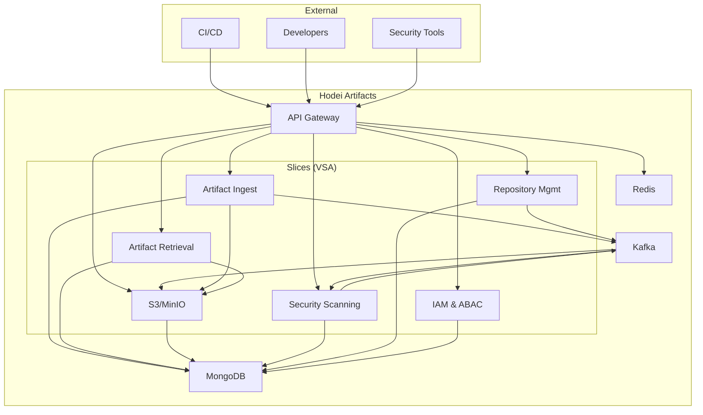

# Hodei Artifacts

[](LICENSE)
[](#)
[](docs/openapi/openapi.yaml)
[](https://<org>.github.io/<repo>/)

Next‑generation artifact repository, Rust‑native, focused on high performance, software supply‑chain security, and scalability. Inspired by Nexus/Artifactory, designed as an evolutionary modular monolith using Vertical Slice Architecture (VSA), Hexagonal Architecture, and Event‑Driven Architecture (EDA).

> Documentation index: [docs/README.md](docs/README.md). Source docs: [docs/prd.md](docs/prd.md), [docs/arquitectura-sistema.md](docs/arquitectura-sistema.md), [docs/domain.md](docs/domain.md), [docs/feature-style-guide.md](docs/feature-style-guide.md).

## Key features

- High performance (Tokio, Rust) with PRD‑defined p95/p99 latency targets.
- Binary storage on S3/MinIO and metadata in MongoDB.
- Embedded search (Tantivy) and dependency analysis (roadmap).
- Security by design: ABAC with Cedar, SBOM, signing, and auditing.
- Contract‑first: `openapi.yaml` as the single source of truth for APIs.
- Observability: Prometheus metrics, tracing (OpenTelemetry), structured logs.

## Getting started with docs

1. Read the PRD: [docs/prd.md](docs/prd.md)
2. Review the domain model: [docs/domain.md](docs/domain.md)
3. Dive into architecture: [docs/arquitectura-sistema.md](docs/arquitectura-sistema.md)
4. To implement features: [docs/feature-style-guide.md](docs/feature-style-guide.md)

## High‑level architecture



- Vertical slices with ports/adapters (Hexagonal).
- Asynchronous event communication (Kafka) across slices.

## Repository structure (monorepo)

```
crates/
  shared/        # Shared types/errors/utilities (DTOs, common domain types)
  artifact/      # Artifact BC (upload/download/metadata/events)
  repository/    # Data access ports/adapters (Mongo, shared repository contracts)
  supply-chain/  # (WIP) SBOM, attestations, chain verification (SLSA, in‑toto)
  search/        # Search & indexing BC (Tantivy)
  security/      # (WIP) ABAC, signing, compliance and verifications
  analytics/     # (WIP) analytics/security
  integration/   # Integration testing utilities and shared E2E scenarios
  distribution/  # (WIP) distribution/CDN
  iam/           # (WIP) identities & ABAC policies
  infra-mongo/   # MongoDB client/helpers and testing utilities
src/             # main binary and bootstrap (axum, wiring)
docs/            # PRD, architecture, guides, event catalog
e2e/             # end‑to‑end tests with Playwright (APIs)
openapi.yaml     # synchronous API contract
```

- Per‑crate details: see the README in each folder (`crates/*/README*.md`).

## Crates

- __shared__: Shared types, errors and utilities for cross‑cutting consistency. Path: `crates/shared/`.
- __artifact__: Binary artifact management: upload, download, metadata, idempotency and event publishing. Path: `crates/artifact/`.
- __repository__: Data access abstractions and adapters (MongoDB and repository contracts). Path: `crates/repository/`.
- __supply-chain__: (WIP) Software supply chain: SBOM, attestations, provenance and verification (SLSA/in‑toto on roadmap). Path: `crates/supply-chain/`.
- __search__: Search and indexing with Tantivy; query APIs and index management; consumes `artifact` events. Path: `crates/search/`.
- __security__: (WIP) Security: ABAC with Cedar, signature validation (Cosign on roadmap), SBOM/attestation verification. Path: `crates/security/`.
- __analytics__: (WIP) Analytics and advanced security. Path: `crates/analytics/`.
- __integration__: Integration testing and reusable E2E helpers across crates. Path: `crates/integration/`.
- __distribution__: (WIP) Distribution/CDN. Path: `crates/distribution/`.
- __iam__: (WIP) Identities, roles and ABAC policies. Path: `crates/iam/`.
- __infra-mongo__: MongoDB infrastructure: client, helpers and testing utilities (`test-util`). Path: `crates/infra-mongo/`.

## Requirements

- Recent stable Rust
- Docker + Docker Compose (for local deps)
- MongoDB, MinIO and Kafka (recommended via Testcontainers in tests)

## Getting started (development)

1. Clone and install Rust toolchain.
2. Build:
   ```bash
   cargo build
   ```
3. Run tests (unit + integration):
   ```bash
   cargo test
   ```
4. Run the binary (HTTP service):
   ```bash
   cargo run
   ```

### Troubleshooting Testcontainers on Linux (Deepin, Ubuntu, etc.)

If you experience `StartupTimeout` errors when running integration tests, it is very likely due to your container engine setup, especially on distributions that have started to adopt **Podman**.

#### Background: Docker vs. Podman

Historically, Docker has been the de facto standard. However, for security and architectural reasons (Podman does not require a daemon), more modern distributions are migrating to or giving priority support to Podman. This is the case for:

- **Deepin (v23+):** Uses Podman as the default engine, which can create conflicts if Docker is installed or if tools expect a Docker socket by default.
- **RHEL derivatives (Fedora, CentOS):** Have adopted Podman as their main engine.
- **Ubuntu/Debian:** Although they do not have a default engine, Podman is available in their official repositories and its popularity is growing.

`testcontainers-rs` looks for the Docker socket by default, and if it is not found or if there is a conflict with a Podman service, the tests may fail with timeouts.

#### Solution: Configure `testcontainers-rs` to use Podman

The cleanest and recommended solution is to configure `testcontainers-rs` to use Podman directly.

1.  **Enable the Podman API service:**
    This command starts a service that listens for API requests, similar to how the Docker daemon does.
    ```bash
    podman system service --time=0 &
    ```

2.  **Create a configuration file for `testcontainers-rs`:**
    Create the file `~/.testcontainers.properties` and add the following content to tell the library the path to the Podman socket and how to manage the cleanup container (Ryuk):
    ```properties
    docker.host=unix://${XDG_RUNTIME_DIR}/podman/podman.sock
    ryuk.container.privileged=true
    ```

With this configuration, the tests should run correctly using Podman as the container engine, avoiding conflicts and timeouts.

- Integration tests use `testcontainers`; no local services required if you run tests.
 
## How to run tests

### Backend (Rust)

#### Unit Testing Strategy

To ensure fast feedback and agile development, we prioritize exhaustive unit tests for business logic (`use_case`) and API endpoints (`api`). These tests must mock all external dependencies (repositories, storage, event publishers) to ensure complete isolation and fast execution.

- **Location**: Unit tests are located alongside the code they test, in files with the `_test.rs` suffix (e.g., `use_case_test.rs`, `api_test.rs`).
- **Mocks**: We use mocks for all interfaces (traits/ports) that interact with the infrastructure.
- **Execution**: You can run unit tests for a specific crate as follows:
  ```bash
  cargo test -p <crate_name> --lib
  ```
  Or for a specific module:
  ```bash
  cargo test -p <crate_name> <module_test_name>
  ```

#### Integration Tests (Rust)

Integration tests validate the interaction between components and with real infrastructure (Docker containers). They are slower but crucial for verifying the complete flow.

- **Location**: They are located in the `tests/` folder of each crate (e.g., `crates/artifact/tests/it_upload_artifact.rs`).
- **Execution**: To run only integration tests (which require Docker/Podman), use:
  ```bash
  cargo test -p <crate_name> --features integration -- --ignored
  ```
  (Note: the `--ignored` flag is necessary because these tests are marked with `#[ignore]` so they don't run by default).

#### General Test Execution

- __All tests (unit + integration)__:
  ```bash
  cargo test
  ```
- __Show test output/logs__:
  ```bash
  RUST_LOG=info cargo test -- --nocapture
  ```
- __Run per crate__:
  ```bash
  cargo test -p <crate_name>
  ```
- __Unit tests only (lib/bin) across workspace__:
  ```bash
  cargo test --lib --bins
  ```
- __Integration tests only (folder `tests/`)__::
    ```bash
    cargo test --tests
    ```
  - Doc tests only:
    ```bash
    cargo test --doc
    ```
  - Filter by test name:
    ```bash
    cargo test <pattern>
    ```
  - A specific integration test file (inside a crate):
    ```bash
    cargo test -p <crate_name> --test <file_without_.rs>
    ```
  - (Optional) Using nextest:
    ```bash
    cargo nextest run
    ```
    - Equivalents: `cargo nextest run --tests`, `--lib`, `-p <crate>`

- __End-to-End (Playwright)__ in `e2e/`:
  ```bash
  cd e2e
  npm ci
  npx playwright install --with-deps
  npx playwright test
  ```
  - Set `BASE_URL` if your HTTP service doesn't use the default from config.

## APIs

- Primary contract: `docs/openapi/openapi.yaml`.
- Handlers in `src/infrastructure/api.rs` and slices in `crates/*/features`.
 - Modular spec: `docs/openapi/openapi.yaml`.
 - HTML documentation (GitHub Pages): https://<org>.github.io/<repo>/

### Quick links (key endpoints)

- Repositories
  - `GET /v1/repositories` — List repositories
  - `POST /v1/repositories` — Create repository
  - `GET /v1/repositories/{id}` — Get repository
  - `PUT /v1/repositories/{id}` — Update repository
  - `DELETE /v1/repositories/{id}` — Delete repository
- Artifacts
  - `POST /v1/artifacts` — Upload artifact (multipart)
  - `GET /v1/artifacts/{id}` — Download artifact or presigned URL (`?presigned=true`)
- Search
  - `GET /v1/search` — Basic search (`q`, `limit`, `offset`)
- Ecosystems
  - Maven
    - `GET /v1/maven/{groupId}/{artifactId}/{version}/{artifactFile}` — Download JAR/POM
    - `GET /v1/maven/metadata?groupId=..&artifactId=..` — maven-metadata.xml
  - npm
    - `GET /v1/npm/{package}` — Package metadata
    - `GET /v1/npm/{package}/-/{tarball}` — Download tarball
  - PyPI
    - `GET /v1/pypi/{package}/json` — Package metadata
    - `GET /v1/pypi/{package}/{version}/json` — Version metadata
    - `GET /v1/pypi/{package}/{version}/download?file=...` — Download distribution

## Security

- ABAC with Cedar (policies and PEP at API Gateway).
- SBOM, signing with Cosign (roadmap), `cargo-audit` in CI.

## Observability

- `/metrics` endpoint (Prometheus).
- Traces and logs with `tracing` + OpenTelemetry.

## Contributing

- Conventions and style: `docs/feature-style-guide.md`, `docs/commits.md`, `docs/rust-best-practices.md`.
- Pull Requests: follow PRD `docs/prd.md` and tasks `docs/implementation-tasks.md`.

## Roadmap (excerpt)

- Phase 1: Ingest/Retrieve, Maven/npm formats, basic auth.
- Phase 2: Security & dependency analysis, dashboard, events.
- Phase 3: SSO/Federation, advanced cloud‑native deploy, more formats.

See `docs/plan.md` and `docs/epicas.md` for details.

## License

MIT. See the `LICENSE` file at the repository root.

## Resources

- Documentation index: [docs/README.md](docs/README.md)
- PRD: [docs/prd.md](docs/prd.md) — Product requirements and objectives
- Architecture: [docs/arquitectura-sistema.md](docs/arquitectura-sistema.md) — Technical specifications
- Domain: [docs/domain.md](docs/domain.md) — Domain model and entities
- Epics: [docs/epicas.md](docs/epicas.md) — Roadmap and features
- Event catalog: [docs/evento-catalog.md](docs/evento-catalog.md) — 120+ events and contracts
- Feature implementation guide: [docs/feature-style-guide.md](docs/feature-style-guide.md) — VSA + Hexagonal patterns
- Testing: [docs/testing-organization.md](docs/testing-organization.md) — Strategy & org; [docs/test-containers.md](docs/test-containers.md) — Testcontainers usage

Relevant CI:
- OpenAPI Drift check: .github/workflows/openapi-drift.yml
