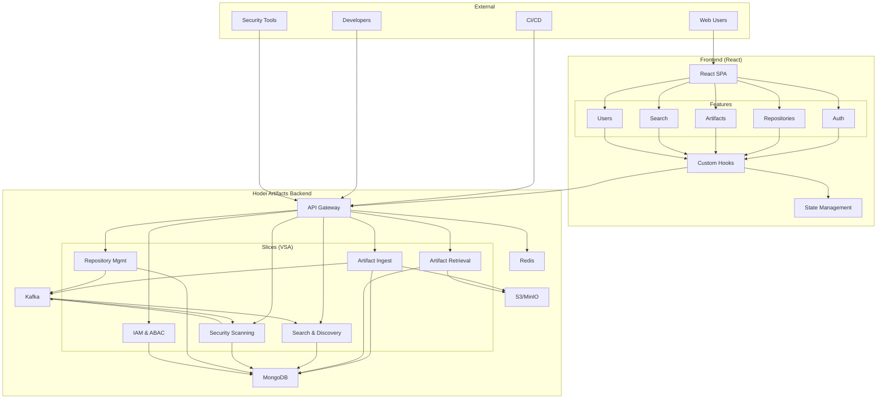

# Hodei Artifacts

[](LICENSE)
[](#)
[](docs/openapi/openapi.yaml)
[](https://<org>.github.io/<repo>/)

Repositorio de artefactos de nueva generación, nativo en Rust, orientado a alto rendimiento, seguridad de la cadena de suministro y escalabilidad. Inspirado en Nexus/Artifactory, diseñado como monolito modular evolutivo con Vertical Slice Architecture (VSA), Arquitectura Hexagonal y Event-Driven Architecture (EDA).

> Índice de documentación: [docs/README.md](docs/README.md). Documentación fuente: [docs/prd.md](docs/prd.md), [docs/arquitectura-sistema.md](docs/arquitectura-sistema.md), [docs/domain.md](docs/domain.md), [docs/feature-style-guide.md](docs/feature-style-guide.md).

## Características clave

- Alto rendimiento (Tokio, Rust) y latencias objetivo p95/p99 definidas en PRD.
- Almacenamiento de binarios en S3/MinIO y metadatos en MongoDB.
- Búsqueda embebida (Tantivy) y análisis de dependencias (roadmap).
- Seguridad by design: ABAC con Cedar, SBOM, firma y auditoría.
- Contract-first: `docs/openapi/openapi.yaml` como fuente de verdad de APIs.
- Observabilidad: métricas Prometheus, tracing (OpenTelemetry), logs estructurados.

## Empezar con la documentación

1. Lee el PRD: [docs/prd.md](docs/prd.md)
2. Revisa el modelo de dominio: [docs/domain.md](docs/domain.md)
3. Profundiza en arquitectura: [docs/arquitectura-sistema.md](docs/arquitectura-sistema.md)
4. Para implementar features: [docs/feature-style-guide.md](docs/feature-style-guide.md)

## Vista de arquitectura (alto nivel)



### Arquitectura Backend
- Organización por slices verticales con puertos/adaptadores (Hexagonal)
- Comunicación asíncrona vía eventos (Kafka) entre slices

### Arquitectura Frontend
- **Component-Based Architecture** con Atomic Design (atoms, molecules, organisms)
- **Feature-Based Organization** por dominio de negocio (auth, repositories, artifacts)
- **State Management** híbrido: Zustand (global) + React Query (servidor)
- **Custom Hooks** para lógica de negocio reutilizable

## Estructura del repositorio (monorepo)

```
crates/
  shared/        # Tipos/errores/utilidades compartidas (DTOs, tipos comunes)
  artifact/      # BC de artefactos (subida/descarga/metadatos/eventos)
  repository/    # Puertos/adaptadores de acceso a datos (Mongo, contratos comunes)
  supply-chain/  # (WIP) SBOM, attestations, verificación de cadena (SLSA, in‑toto)
  search/        # BC de búsqueda e indexación (Tantivy)
  security/      # (WIP) ABAC, firmas, cumplimiento y verificaciones
  analytics/     # (WIP) analítica/seguridad
  integration/   # Utilidades y escenarios de tests de integración multi-crate
  distribution/  # (WIP) distribución/CDN
  iam/           # (WIP) identidades y políticas ABAC
  infra-mongo/   # Cliente/helpers MongoDB y utilidades de test
src/             # binario principal y bootstrap (axum, wiring)
frontend/        # aplicación React con arquitectura moderna
  src/
    app/         # configuración global (providers, router)
    components/  # design system (atoms, molecules, organisms)
    features/    # organización por dominio (auth, repositories, artifacts)
    pages/       # route components
    shared/      # hooks, stores, utils, types compartidos
docs/            # PRD, arquitectura, guías, catálogo de eventos
e2e/             # tests end-to-end con Playwright (APIs + UI)
openapi.yaml     # contrato de APIs síncronas
```

- Detalles por crate: ver los README en cada carpeta (`crates/*/README*.md`).

## Crates

- __shared__: Tipos, errores y utilidades compartidas para consistencia transversal. Ruta: `crates/shared/`.
- __artifact__: Gestión de artefactos binarios: subida, descarga, metadatos, idempotencia y publicación de eventos. Ruta: `crates/artifact/`.
- __repository__: Abstracciones y adaptadores de acceso a datos (MongoDB y contratos de repositorio). Ruta: `crates/repository/`.
- __supply-chain__: (WIP) Cadena de suministro: SBOM, attestations, provenance y verificaciones (SLSA/in‑toto en roadmap). Ruta: `crates/supply-chain/`.
- __search__: Búsqueda e indexación con Tantivy; APIs de consulta y gestión de índices; consumo de eventos de `artifact`. Ruta: `crates/search/`.
- __security__: (WIP) Seguridad: ABAC con Cedar, validación de firmas (Cosign en roadmap), verificación de SBOM/attestations. Ruta: `crates/security/`.
- __analytics__: (WIP) Analítica y seguridad avanzada. Ruta: `crates/analytics/`.
- __integration__: Testing de integración y helpers E2E reutilizables entre crates. Ruta: `crates/integration/`.
- __distribution__: (WIP) Distribución/CDN. Ruta: `crates/distribution/`.
- __iam__: (WIP) Identidades, roles y políticas ABAC. Ruta: `crates/iam/`.
- __infra-mongo__: Infraestructura MongoDB: cliente, helpers y utilidades de test (`test-util`). Ruta: `crates/infra-mongo/`.

## Requisitos

### Backend
- Rust estable reciente
- Docker + Docker Compose (para dependencias locales)
- MongoDB, MinIO y Kafka (recomendado lanzar con Testcontainers en tests)

### Frontend
- Node.js 18+ y npm
- Browser moderno con soporte ES2022

### Desarrollo
- Git
- Playwright (para tests E2E)
- Opcional: Storybook para desarrollo de componentes

## Puesta en marcha (desarrollo)

### Backend (Rust)
1. Clonar e instalar toolchain Rust y cargo
2. Construir:
   ```bash
   cargo build
   ```
3. Ejecutar tests (unit + integración):
   ```bash
   cargo test
   ```
4. Ejecutar binario (servicio HTTP):
   ```bash
   cargo run
   ```

### Solución de problemas de Testcontainers en distribuciones Linux (Deepin, Ubuntu, etc.)

Si experimentas errores de `StartupTimeout` al ejecutar los tests de integración, es muy probable que se deba a la configuración de tu motor de contenedores, especialmente en distribuciones que han empezado a adoptar **Podman**.

#### Contexto: Docker vs. Podman

Históricamente, Docker ha sido el estándar de facto. Sin embargo, por razones de seguridad y arquitectura (Podman no requiere un demonio o *daemon*), distribuciones más modernas están migrando o dando soporte prioritario a Podman. Este es el caso de:

- **Deepin (v23+):** Usa Podman como motor por defecto, lo que puede crear conflictos si Docker está instalado o si las herramientas esperan un socket de Docker por defecto.
- **Derivados de RHEL (Fedora, CentOS):** Han adoptado Podman como su motor principal.
- **Ubuntu/Debian:** Aunque no tienen un motor por defecto, Podman está disponible en sus repositorios oficiales y su popularidad está creciendo.

`testcontainers-rs` busca por defecto el socket de Docker, y si no lo encuentra o hay un conflicto con un servicio de Podman, los tests pueden fallar con timeouts.

#### Solución: Configurar `testcontainers-rs` para usar Podman

La solución más limpia y recomendada es configurar `testcontainers-rs` para que use Podman directamente.

1.  **Habilita el servicio de API de Podman:**
    Este comando inicia un servicio que "escucha" peticiones de API, de forma similar a como lo hace el demonio de Docker.
    ```bash
    podman system service --time=0 &
    ```

2.  **Crea un fichero de configuración para `testcontainers-rs`:**
    Crea el fichero `~/.testcontainers.properties` y añade el siguiente contenido. Esto le indica a la librería la ruta del socket de Podman y cómo gestionar el contenedor de limpieza (Ryuk):
    ```properties
    docker.host=unix://${XDG_RUNTIME_DIR}/podman/podman.sock
    ryuk.container.privileged=true
    ```

Con esta configuración, los tests deberían ejecutarse correctamente usando Podman como motor de contenedores, evitando los conflictos y timeouts.

### Frontend (React)
1. Navegar al directorio frontend:
   ```bash
   cd frontend
   ```
2. Instalar dependencias:
   ```bash
   npm install
   ```
3. Ejecutar en modo desarrollo:
   ```bash
   npm run dev
   ```
4. Ejecutar tests:
   ```bash
   npm test
   ```
5. Construir para producción:
   ```bash
   npm run build
   ```

### Storybook (Design System)
```bash
cd frontend
npm run storybook
```

- Tests de integración backend usan `testcontainers`; no necesitas servicios locales si usas los tests
- Frontend se conecta por defecto al backend en `http://localhost:8080`

## Cómo ejecutar los tests

### Backend (Rust)

#### Estrategia de Tests Unitarios

Para asegurar un feedback rápido y un desarrollo ágil, priorizamos los tests unitarios exhaustivos para la lógica de negocio (`use_case`) y los endpoints de la API (`api`). Estos tests deben mockear todas las dependencias externas (repositorios, almacenamiento, publicadores de eventos) para garantizar un aislamiento completo y una ejecución veloz.

- **Ubicación**: Los tests unitarios se encuentran junto al código que prueban, en archivos con el sufijo `_test.rs` (ej. `use_case_test.rs`, `api_test.rs`).
- **Mocks**: Utilizamos mocks para todas las interfaces (traits/ports) que interactúan con la infraestructura.
- **Ejecución**: Puedes ejecutar los tests unitarios de un crate específico de la siguiente manera:
  ```bash
  cargo test -p <nombre_crate> --lib
  ```
  O para un módulo específico:
  ```bash
  cargo test -p <nombre_crate> <nombre_modulo_test>
  ```

#### Tests de Integración (Rust)

Los tests de integración validan la interacción entre componentes y con la infraestructura real (contenedores Docker). Son más lentos pero cruciales para verificar el flujo completo.

- **Ubicación**: Se encuentran en la carpeta `tests/` de cada crate (ej. `crates/artifact/tests/it_upload_artifact.rs`).
- **Ejecución**: Para ejecutar solo los tests de integración (que requieren Docker/Podman), usa:
  ```bash
  cargo test -p <nombre_crate> --features integration -- --ignored
  ```
  (Nota: el flag `--ignored` es necesario porque estos tests están marcados con `#[ignore]` para no ejecutarse por defecto).

#### Ejecución General de Tests

- __Todos los tests (unitarios + integración)__:
  ```bash
  cargo test
  ```
- __Ver salida/logs del test__:
  ```bash
  RUST_LOG=info cargo test -- --nocapture
  ```
- __Ejecutar por crate__:
  ```bash
  cargo test -p <nombre_crate>
  ```
- __Solo unit tests (lib/bin) en todo el workspace__:
  ```bash
  cargo test --lib --bins
  ```
- __Solo tests de integración (carpeta `tests/`)__::
    ```bash
    cargo test --tests
    ```
  - Solo doc tests:
    ```bash
    cargo test --doc
    ```
  - Filtrar por nombre de test:
    ```bash
    cargo test <patron>
    ```
  - Solo un fichero de integración concreto (dentro de un crate):
    ```bash
    cargo test -p <nombre_crate> --test <fichero_sin_.rs>
    ```
  - (Opcional) Usando nextest:
    ```bash
    cargo nextest run
    ```
    - Equivalentes: `cargo nextest run --tests`, `--lib`, `-p <crate>`

### Frontend (React)
- __Tests unitarios y de integración__:
  ```bash
  cd frontend
  npm test
  ```
- __Tests con coverage__:
  ```bash
  npm run test:coverage
  ```
- __Tests de componentes con Storybook__:
  ```bash
  npm run test-storybook
  ```

### End-to-End (Playwright)
- __Tests de API__ en `e2e/api/`:
  ```bash
  cd e2e
  npm ci
  npx playwright install --with-deps
  npx playwright test api/
  ```
- __Tests de UI__ en `e2e/ui/`:
  ```bash
  npx playwright test ui/
  ```
- __Todos los tests E2E__:
  ```bash
  npx playwright test
  ```
  - Define `BASE_URL` si tu servicio HTTP no usa el valor por defecto del config
  - Define `FRONTEND_URL` para tests de UI (por defecto: `http://localhost:5173`)

## APIs

- Contrato principal: `docs/openapi/openapi.yaml`.
- Handlers en `src/infrastructure/api.rs` y slices en `crates/*/features`.
- Especificación modular: `docs/openapi/openapi.yaml`.
- Documentación HTML (GitHub Pages): https://<org>.github.io/<repo>/

### Enlaces rápidos (endpoints principales)

- Repositorios
  - `GET /v1/repositories` — Listar repositorios
  - `POST /v1/repositories` — Crear repositorio
  - `GET /v1/repositories/{id}` — Obtener repositorio
  - `PUT /v1/repositories/{id}` — Actualizar repositorio
  - `DELETE /v1/repositories/{id}` — Eliminar repositorio
- Artefactos
  - `POST /v1/artifacts` — Subir artefacto (multipart)
  - `GET /v1/artifacts/{id}` — Descargar artefacto o URL presignada (`?presigned=true`)
- Búsqueda
  - `GET /v1/search` — Búsqueda básica (`q`, `limit`, `offset`)
- Ecosistemas
  - Maven
    - `GET /v1/maven/{groupId}/{artifactId}/{version}/{artifactFile}` — Descargar JAR/POM
    - `GET /v1/maven/metadata?groupId=..&artifactId=..` — maven-metadata.xml
  - npm
    - `GET /v1/npm/{package}` — Metadata paquete
    - `GET /v1/npm/{package}/-/{tarball}` — Descargar tarball
  - PyPI
    - `GET /v1/pypi/{package}/json` — Metadata paquete
    - `GET /v1/pypi/{package}/{version}/json` — Metadata versión
    - `GET /v1/pypi/{package}/{version}/download?file=...` — Descargar distribución

## Seguridad

- ABAC con Cedar (políticas y PEP en API Gateway).
- SBOM, firma con Cosign (roadmap), `cargo-audit` en CI.

## Observabilidad

- Endpoint `/metrics` (Prometheus).
- Trazas y logs con `tracing` + OpenTelemetry.

## Contribución

- Convenciones y estilo: `docs/feature-style-guide.md`, `docs/commits.md`, `docs/rust-best-practices.md`.
- Pull Requests: seguir PRD `docs/prd.md` y tareas `docs/implementation-tasks.md`.

## Roadmap (extracto)

- Fase 1: Ingesta/Recuperación, formatos Maven/npm, auth básica.
- Fase 2: Seguridad y análisis de dependencias, dashboard, eventos.
- Fase 3: SSO/Federación, despliegue cloud-native avanzado, más formatos.

Ver detalles en `docs/plan.md` y `docs/epicas.md`.

## Licencia

MIT. Ver archivo `LICENSE` en la raíz del repositorio.

## Recursos

### Documentación General
- Índice de documentación: [docs/README.md](docs/README.md)
- PRD: [docs/prd.md](docs/prd.md) — Requisitos de producto y objetivos
- Arquitectura: [docs/arquitectura-sistema.md](docs/arquitectura-sistema.md) — Especificaciones técnicas completas
- Dominio: [docs/domain.md](docs/domain.md) — Modelo de dominio y entidades
- Épicas: [docs/epicas.md](docs/epicas.md) — Roadmap y features
- Catálogo de eventos: [docs/evento-catalog.md](docs/evento-catalog.md) — 120+ eventos y contratos

### Documentación Backend
- Guía de implementación de features: [docs/feature-style-guide.md](docs/feature-style-guide.md) — Patrones VSA + Hexagonal
- Testing: [docs/testing-organization.md](docs/testing-organization.md) — Estrategia y organización; [docs/test-containers.md](docs/test-containers.md) — Uso de Testcontainers

### Documentación Frontend
- Arquitectura Frontend: [docs/frontend/architecture.md](docs/frontend/architecture.md) — Patrones React modernos
- Estructura del Proyecto: [docs/frontend/project-structure.md](docs/frontend/project-structure.md) — Organización por features
- Biblioteca de Componentes: [docs/frontend/component-library.md](docs/frontend/component-library.md) — Design System
- Integración con APIs: [docs/frontend/api-integration.md](docs/frontend/api-integration.md) — React Query + TypeScript

CI relevante:
- OpenAPI Drift check: .github/workflows/openapi-drift.yml
