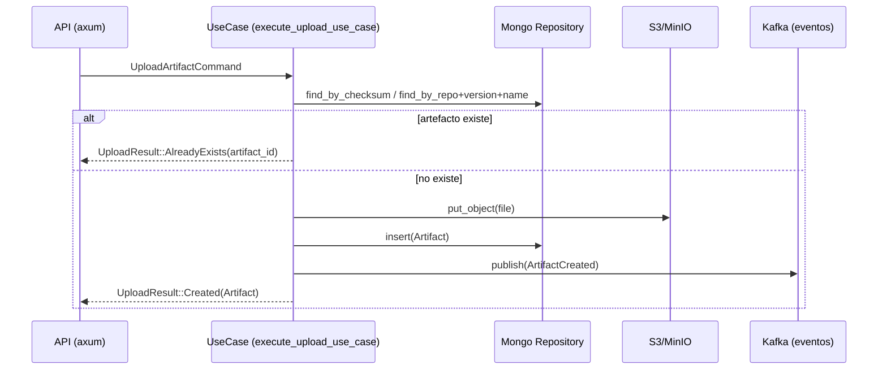
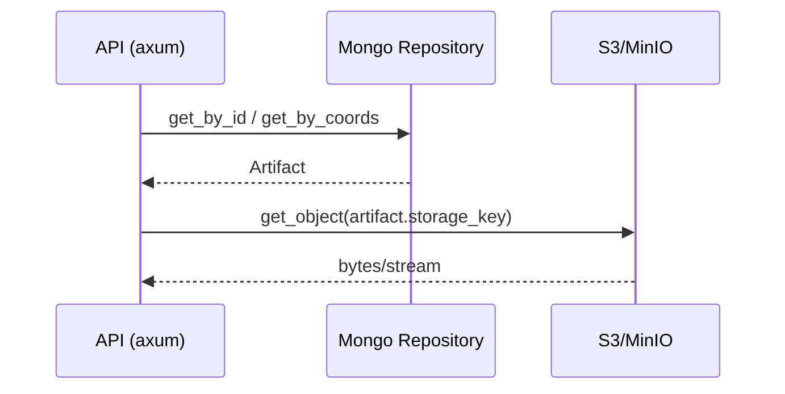

# Crate `artifact`

Este crate implementa el bounded context de gestión de artefactos binarios.
Se responsabiliza de: alta/subida, descarga, metadatos, idempotencia y publicación de eventos.

- Directorio: `crates/artifact/`
- Capas: `domain/`, `application/`, `features/`, `infrastructure/`, `error.rs`
- Features principales:
  - `features/upload_artifact/`
  - `features/download_artifact/`

## Objetivo

- Persistir metadatos de artefactos (`MongoDB`).
- Almacenar el binario en `S3/MinIO`.
- Garantizar idempotencia en la subida (no duplicar artefactos).
- Publicar eventos a `Kafka` (p.ej. para indexación en otros BCs como `search`).

## Arquitectura y dependencias

- Almacenamiento: `aws-config`, `aws-sdk-s3`.
- Persistencia: `mongodb`, `infra-mongo`.
- Mensajería/eventos: `rdkafka`.
- Web/API: `axum` (handlers en la capa de `application`/`infrastructure`).
- Utilidades: `serde`, `thiserror`, `tracing`, `uuid`, `chrono`.

## Entidades y lógica clave

- Entidad `Artifact` en `domain::model`.
- Caso de uso de subida: `features/upload_artifact/logic/use_case.rs`
  - Decide entre crear y ya existente (`UploadResult::{Created,AlreadyExists}`).
  - Valida comando (`validate.rs`).

## Diagramas (Mermaid)

### Subida de artefacto (`upload_artifact`)

### Descarga de artefacto (`download_artifact`)

## Relación con otros crates

- Comparte modelos/IDs desde `shared/` (p.ej. `shared::ArtifactId`).
- No depende de `search`, pero publica eventos que `search` puede consumir para indexar.

## Testing

- Tests unitarios por slice en `features/.../tests`.
- Tests de integración en `crates/artifact/tests/` con `testcontainers` (Mongo, LocalStack/MinIO, Kafka).
