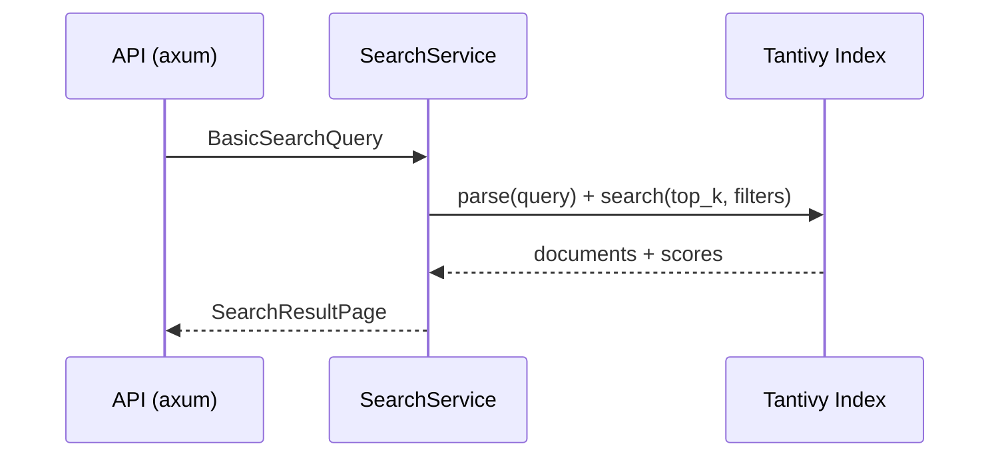
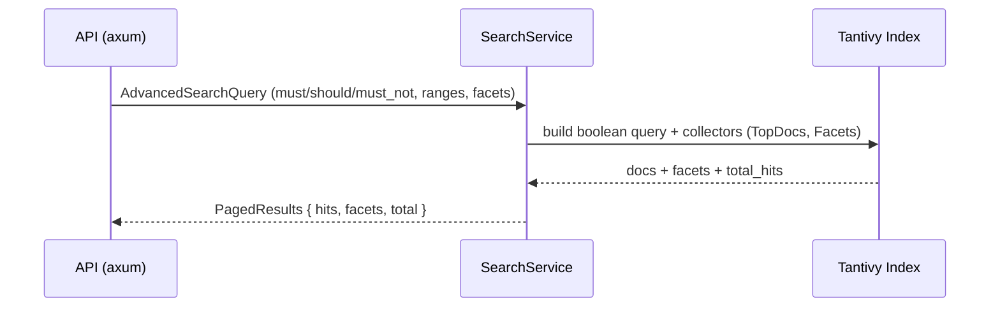
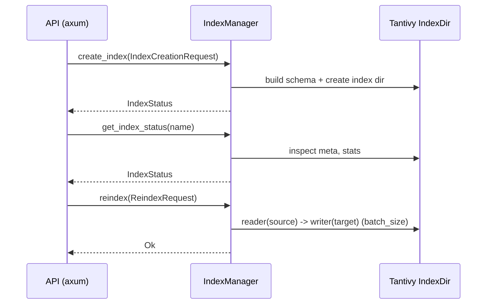
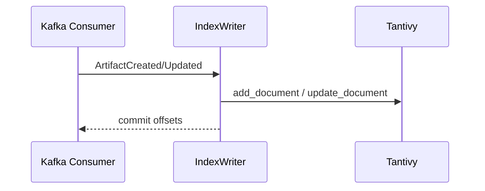

# Crate `search`

This crate implements the bounded context for search and indexing over artifacts and metadata.
It includes basic/advanced queries and index management.

- Directory: `crates/search/`
- Layers: `domain/`, `application/`, `features/`, `infrastructure/`, `error.rs`
- Main features:
  - `features/basic_search.rs`
  - `features/advanced_search.rs`
  - `features/index_management.rs`

## Purpose

- Index metadata (and derived fields) with `tantivy` (embedded search engine).
- Expose search APIs (basic, advanced, facets) and index administration.
- Consume events (e.g., `ArtifactCreated`) to keep the index up-to-date.

## Architecture and dependencies

- Index engine: `tantivy`.
- Operational persistence and auxiliary queries: `mongodb`, `repository` (internal crate).
- Messaging/events: `rdkafka`.
- Concurrency: `tokio`, `futures`.
- Web/API: `axum`.
- Utilities: `serde`, `thiserror`, `tracing`, `chrono`.

## Highlighted modules

- `features/basic_search.rs`: simple term queries and basic filters.
- `features/advanced_search.rs`: boolean queries, advanced scoring, pagination/facets.
- `features/index_management.rs`: DTOs for index creation/status/reindex and handlers (TDD).

## Diagrams (Mermaid)

### Basic search (`basic_search`)

### Advanced search (`advanced_search`)

### Index management (`index_management`)

### Event-driven ingest (indexing)

## Relationship with other crates

- Consumes events published by `artifact` to index.
- Reuses `repository` and `infra-mongo` where applicable.
- Shares base types with `shared/`.

## Testing

- Unit tests per slice (`features/*.rs`).
- Integration tests in `crates/search/tests/` using `testcontainers` (Kafka, MinIO) and `artifact` dev-dependency for end-to-end flows.
