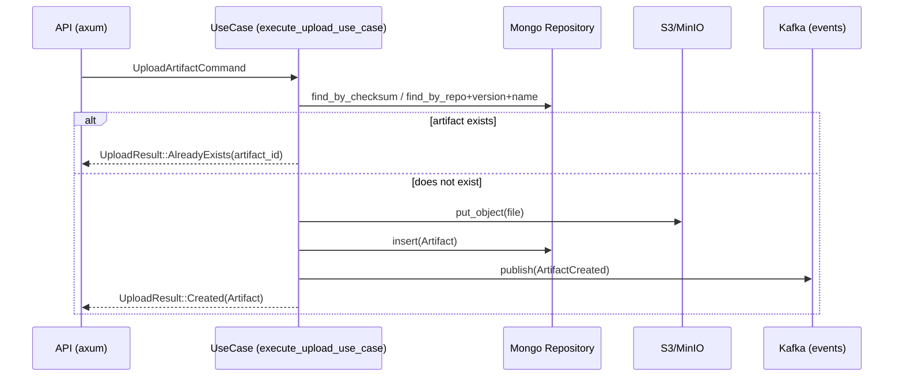
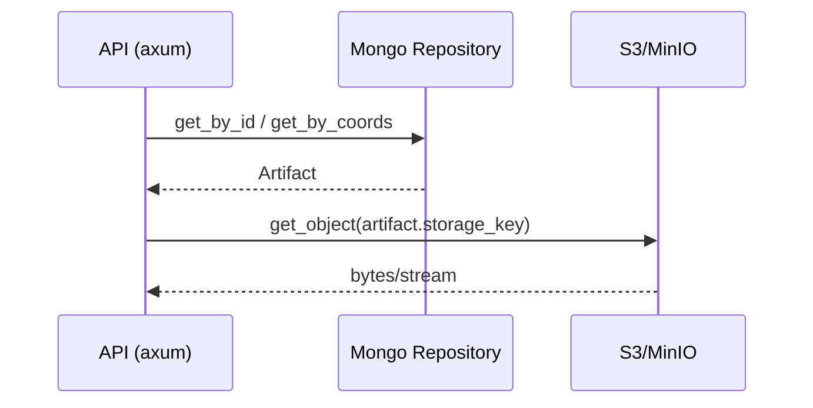

# Crate `artifact`

This crate implements the bounded context for managing binary artifacts.
It is responsible for: upload/ingest, download, metadata, idempotency, and event publishing.

- Directory: `crates/artifact/`
- Layers: `domain/`, `application/`, `features/`, `infrastructure/`, `error.rs`
- Main features:
  - `features/upload_artifact/`
  - `features/download_artifact/`

## Purpose

- Persist artifact metadata (`MongoDB`).
- Store the binary in `S3/MinIO`.
- Guarantee idempotent uploads (avoid duplicates).
- Publish domain events to `Kafka` (e.g., for other BCs like `search`).

## Architecture and dependencies

- Storage: `aws-config`, `aws-sdk-s3`.
- Persistence: `mongodb`, `infra-mongo`.
- Messaging/events: `rdkafka`.
- Web/API: `axum` (handlers in `application`/`infrastructure`).
- Utilities: `serde`, `thiserror`, `tracing`, `uuid`, `chrono`.

## Key entities and logic

- Entity `Artifact` in `domain::model`.
- Upload use case: `features/upload_artifact/logic/use_case.rs`
  - Decides between create vs already-exists (`UploadResult::{Created,AlreadyExists}`).
  - Command validation lives in `validate.rs`.

## Diagrams (Mermaid)

### Artifact upload (`upload_artifact`)

### Artifact download (`download_artifact`)

## Relationship with other crates

- Shares base models/IDs from `shared/` (e.g., `shared::ArtifactId`).
- Does not depend on `search`, but publishes events that `search` can consume to index.

## Testing

- Unit tests per slice in `features/.../tests`.
- Integration tests in `crates/artifact/tests/` using `testcontainers` (Mongo, LocalStack/MinIO, Kafka).
