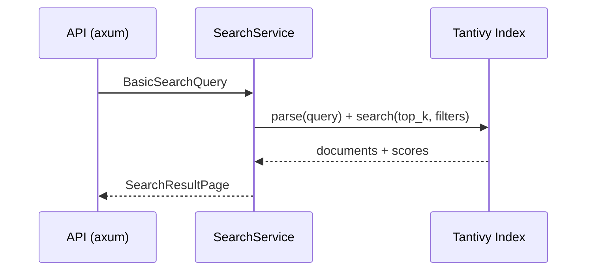
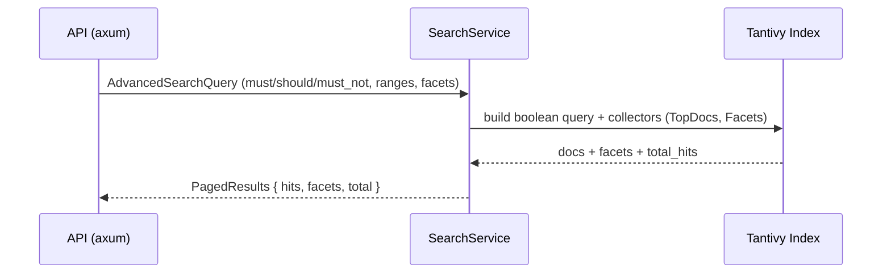
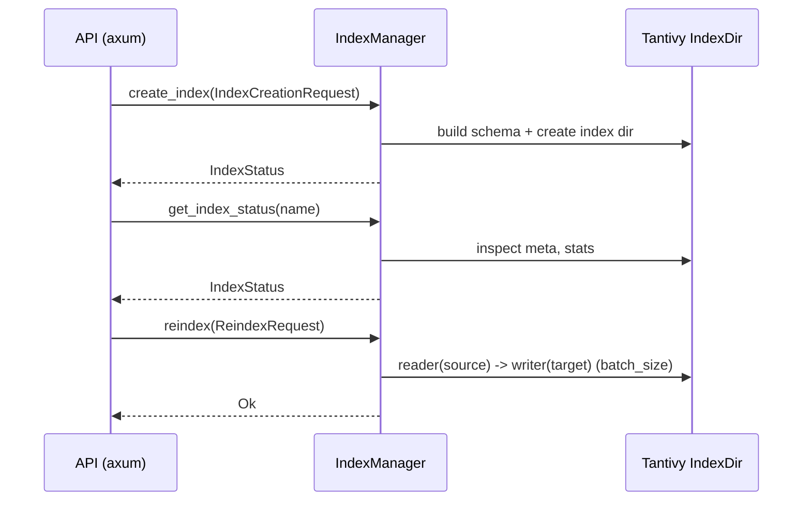
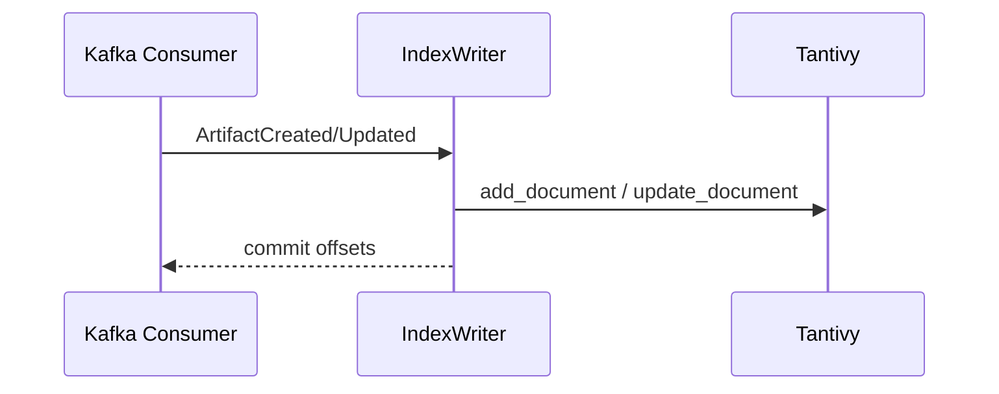

# Crate `search`

Este crate implementa el bounded context de búsqueda e indexación sobre artefactos y metadatos.
Incluye consultas básicas/avanzadas y gestión de índices.

- Directorio: `crates/search/`
- Capas: `domain/`, `application/`, `features/`, `infrastructure/`, `error.rs`
- Features principales:
  - `features/basic_search.rs`
  - `features/advanced_search.rs`
  - `features/index_management.rs`

## Objetivo

- Indexar metadatos (y campos derivados) con `tantivy` (motor de búsqueda embebido).
- Exponer APIs de búsqueda (básica, avanzada, facetas) y administración del índice.
- Consumir eventos (p.ej. `ArtifactCreated`) para mantener el índice actualizado.

## Arquitectura y dependencias

- Motor de índice: `tantivy`.
- Persistencia operativa y consultas auxiliares: `mongodb`, `repository` (crate interno).
- Mensajería/eventos: `rdkafka`.
- Concurrencia: `tokio`, `futures`.
- Web/API: `axum`.
- Utilidades: `serde`, `thiserror`, `tracing`, `chrono`.

## Módulos destacados

- `features/basic_search.rs`: consulta por términos simples y filtros básicos.
- `features/advanced_search.rs`: consulta booleana, scoring avanzado, paginación/facetas.
- `features/index_management.rs`: DTOs de creación/estado/reindexado de índices y handlers (TDD).

## Diagramas (Mermaid)

### Búsqueda básica (`basic_search`)

### Búsqueda avanzada (`advanced_search`)

### Gestión de índices (`index_management`)

### Ingesta por eventos (indexación)

## Relación con otros crates

- Consume eventos publicados por `artifact` para indexar.
- Reutiliza `repository` e `infra-mongo` cuando aplica.
- Comparte tipos base con `shared/`.

## Testing

- Tests unitarios por slice (`features/*.rs`).
- Tests de integración en `crates/search/tests/` con `testcontainers` (Kafka, MinIO) y dependencias de `artifact` para flujos end-to-end.
