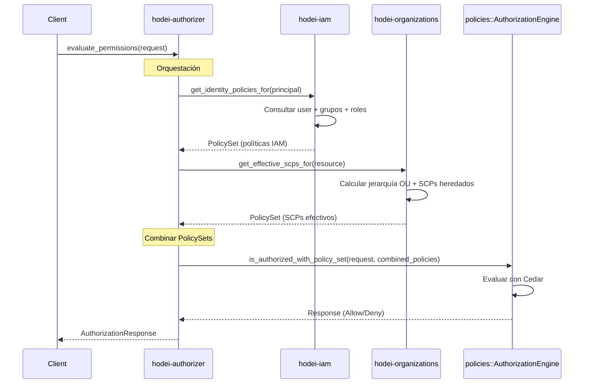

# Arquitectura Final Correcta - Hodei Authorization System ✅

**Fecha:** 2024  
**Estado:** ✅ IMPLEMENTADO Y VALIDADO

## 🎯 Principio Arquitectónico Central

> **"Separation of Concerns & Delegation Over Duplication"**

Cada crate tiene una responsabilidad única y bien definida. No se duplica lógica entre crates.

---

## 📦 Responsabilidades de Cada Crate

### 1. **policies** - Motor de Evaluación Cedar

**Responsabilidad:** Evaluación de políticas Cedar y gestión CRUD de políticas persistentes

**API Pública:**
```rust
// Evaluación con PolicyStore interno (para políticas persistentes)
impl AuthorizationEngine {
    pub async fn is_authorized(&self, request: &AuthorizationRequest<'_>) -> Response
}

// ✅ NUEVO: Evaluación con PolicySet externo (para políticas dinámicas)
impl AuthorizationEngine {
    pub fn is_authorized_with_policy_set(
        &self, 
        request: &AuthorizationRequest<'_>,
        policies: &PolicySet
    ) -> Response
}
```

**Exports:**
- `AuthorizationEngine` - Motor de evaluación
- `PolicyStore` - Almacenamiento interno (NO compartido)
- `PolicyStorage` trait - Para implementaciones custom
- `SurrealMemStorage` - Storage en memoria para tests
- Features CRUD: `create_policy`, `update_policy`, `delete_policy`, etc.

**NO Expone:**
- PolicyStore compartido entre crates
- Detalles internos de persistencia

---

### 2. **hodei-iam** - Gestión de Identidades

**Responsabilidad:** Gestión de usuarios, grupos, roles y sus políticas IAM

**Entidades:**
- `User` - Usuario del sistema
- `Group` - Grupo de usuarios
- `Role` - Rol con permisos
- `Policy` - Política IAM attachable a users/groups/roles

**Repositorios:**
- `UserRepository` - CRUD de usuarios
- `GroupRepository` - CRUD de grupos
- `PolicyRepository` - CRUD de políticas IAM

**Provider (para hodei-authorizer):**
```rust
pub trait IamPolicyProvider: Send + Sync {
    /// Retorna las políticas IAM efectivas para un principal
    /// Incluye: políticas directas + políticas de grupos + políticas de roles
    async fn get_identity_policies_for(
        &self, 
        principal_hrn: &Hrn
    ) -> Result<PolicySet, Error>;
}

pub struct HodeiIamPolicyProvider {
    user_repo: Arc<dyn UserRepository>,
    group_repo: Arc<dyn GroupRepository>,
    policy_repo: Arc<dyn PolicyRepository>,
}
```

**NO Gestiona:**
- Evaluación de políticas (eso es responsabilidad de `policies`)
- Estructura organizacional (eso es `hodei-organizations`)

---

### 3. **hodei-organizations** - Estructura Organizacional

**Responsabilidad:** Gestión de estructura organizacional y Service Control Policies (SCPs)

**Entidades:**
- `Organization` - Organización raíz
- `OrganizationalUnit` - Unidad organizacional (OU)
- `Account` - Cuenta dentro de una OU
- `ServiceControlPolicy` - SCP aplicable a OUs y cuentas

**Repositorios:**
- `OrganizationRepository` - CRUD de organizaciones
- `OuRepository` - CRUD de OUs
- `AccountRepository` - CRUD de cuentas
- `ScpRepository` - CRUD de SCPs

**Provider (para hodei-authorizer):**
```rust
pub trait OrganizationBoundaryProvider: Send + Sync {
    /// Retorna los SCPs efectivos para un recurso
    /// Calcula la jerarquía de OUs y combina SCPs heredados
    async fn get_effective_scps_for(
        &self, 
        resource_hrn: &Hrn
    ) -> Result<PolicySet, Error>;
}

pub struct HodeiOrganizationBoundaryProvider {
    account_repo: Arc<dyn AccountRepository>,
    ou_repo: Arc<dyn OuRepository>,
    scp_repo: Arc<dyn ScpRepository>,
}
```

**NO Gestiona:**
- Políticas IAM (eso es `hodei-iam`)
- Evaluación de políticas (eso es `policies`)

---

### 4. **hodei-authorizer** - Orquestador de Autorización

**Responsabilidad:** Orquestar la recolección de políticas y delegar evaluación

**NO Hace:**
- ❌ Evaluar políticas Cedar directamente
- ❌ Gestionar PolicyStore
- ❌ Implementar lógica de Cedar
- ❌ Persistir políticas

**SÍ Hace:**
- ✅ Recolectar políticas IAM del provider de `hodei-iam`
- ✅ Recolectar SCPs del provider de `hodei-organizations`
- ✅ Combinar PolicySets
- ✅ Delegar evaluación a `policies::AuthorizationEngine`
- ✅ Gestionar cache, logging, metrics (aspectos transversales)

**Arquitectura:**
```rust
pub struct EvaluatePermissionsUseCase<IAM, ORG, CACHE, LOGGER, METRICS> {
    iam_provider: IAM,               // Provee políticas IAM
    org_provider: ORG,               // Provee SCPs
    authorization_engine: Arc<AuthorizationEngine>, // Motor de policies
    cache: Option<CACHE>,            // Cache opcional
    logger: LOGGER,                  // Logging
    metrics: METRICS,                // Métricas
}

impl EvaluatePermissionsUseCase<...> {
    pub async fn execute(&self, request: AuthorizationRequest) 
        -> Result<AuthorizationResponse> 
    {
        // 1. Recolectar políticas IAM
        let iam_policies = self.iam_provider
            .get_identity_policies_for(&request.principal).await?;
        
        // 2. Recolectar SCPs
        let scps = self.org_provider
            .get_effective_scps_for(&request.resource).await?;
        
        // 3. Combinar PolicySets
        let mut combined = PolicySet::new();
        for policy in iam_policies.policies() {
            combined.add(policy.clone())?;
        }
        for policy in scps.policies() {
            combined.add(policy.clone())?;
        }
        
        // 4. ✅ DELEGAR evaluación a policies crate
        let response = self.authorization_engine
            .is_authorized_with_policy_set(&auth_request, &combined);
        
        Ok(response)
    }
}
```

---

## 🔄 Flujo de Autorización Completo



---

## 🎨 Principios de Diseño Aplicados

### 1. Single Responsibility Principle (SRP)
- Cada crate tiene UNA responsabilidad claramente definida
- `policies`: Evaluación Cedar
- `hodei-iam`: Gestión de identidades
- `hodei-organizations`: Estructura organizacional
- `hodei-authorizer`: Orquestación

### 2. Dependency Inversion Principle (DIP)
- hodei-authorizer depende de abstracciones (traits):
  - `IamPolicyProvider` trait
  - `OrganizationBoundaryProvider` trait
- Las implementaciones concretas se inyectan vía DI

### 3. Open/Closed Principle (OCP)
- La arquitectura es abierta a extensión:
  - Nuevos providers se pueden agregar fácilmente
  - Nuevos tipos de políticas sin cambiar el core
- Cerrada a modificación:
  - El motor de Cedar no cambia
  - La lógica de orquestación es estable

### 4. Interface Segregation Principle (ISP)
- Cada provider tiene una interfaz mínima y específica
- No hay "god interfaces" con múltiples responsabilidades

### 5. Don't Repeat Yourself (DRY)
- La lógica de evaluación Cedar existe UNA vez en `policies`
- No se duplica en otros crates

---

## ✅ Ventajas de Esta Arquitectura

### 1. **Testabilidad**
- Cada crate se testea independientemente
- Los providers se mockean fácilmente
- El engine de policies se testea aislado

### 2. **Mantenibilidad**
- Cambios en Cedar solo afectan al crate `policies`
- Cambios en IAM solo afectan a `hodei-iam`
- Cambios en organizaciones solo afectan a `hodei-organizations`

### 3. **Escalabilidad**
- Se pueden agregar nuevos tipos de providers sin cambiar el core
- Se pueden agregar nuevos crates de políticas (ej: Resource-Based Policies)
- Fácil escalar horizontalmente (providers distribuidos)

### 4. **Clarity (Claridad)**
- La responsabilidad de cada crate es obvia
- El flujo de datos es claro y unidireccional
- No hay dependencias circulares

### 5. **Flexibilidad**
- Se puede cambiar la implementación de storage sin afectar a otros crates
- Se pueden agregar nuevos tipos de cache, logging, metrics
- Se pueden implementar políticas custom por crate

---

## 🔧 Cambios Implementados (Fase 2)

### En `policies` crate:
✅ Agregado método `is_authorized_with_policy_set()` para evaluación con PolicySet externo
✅ Expuesto `SurrealMemStorage` para uso en tests
✅ Mantenido PolicyStore como interno (no compartido)

### En `hodei-authorizer` crate:
✅ Eliminado `InMemoryPolicyStorage` innecesario
✅ Eliminado `cedar_authorizer: Authorizer` (reimplementación)
✅ Eliminado `EntityResolver` (no necesario)
✅ Refactorizado `EvaluatePermissionsUseCase` para:
  - Inyectar `AuthorizationEngine` de policies
  - Combinar PolicySets de múltiples fuentes
  - Delegar evaluación al engine

### En DI Container:
✅ Actualizado para inyectar `AuthorizationEngine` en lugar de `Schema`
✅ Tests actualizados para usar `SurrealMemStorage` de policies

---

## 📋 Próximos Pasos (Fase 3)

### 1. Implementar Providers Reales

#### A. HodeiIamPolicyProvider
```rust
impl IamPolicyProvider for HodeiIamPolicyProvider {
    async fn get_identity_policies_for(&self, principal: &Hrn) 
        -> Result<PolicySet, Error> 
    {
        // 1. Resolver usuario desde user_repo
        // 2. Obtener grupos del usuario desde group_repo
        // 3. Obtener políticas directas del usuario
        // 4. Obtener políticas de cada grupo
        // 5. Combinar en PolicySet
    }
}
```

#### B. HodeiOrganizationBoundaryProvider
```rust
impl OrganizationBoundaryProvider for HodeiOrganizationBoundaryProvider {
    async fn get_effective_scps_for(&self, resource: &Hrn) 
        -> Result<PolicySet, Error> 
    {
        // 1. Determinar cuenta del recurso
        // 2. Obtener jerarquía de OUs desde ou_repo
        // 3. Recolectar SCPs de cada nivel desde scp_repo
        // 4. Combinar respetando herencia
    }
}
```

### 2. Actualizar Tests Unitarios
- Actualizar tests de hodei-authorizer para usar la nueva arquitectura
- Eliminar referencias a EntityResolver
- Validar orquestación correcta de políticas

### 3. Tests de Integración E2E
- Validar flujo completo de autorización
- Probar deny-override semantics (SCP > IAM)
- Verificar herencia de políticas en jerarquía de OUs

---

## 📊 Estado del Proyecto

| Fase | Estado | Descripción |
|------|--------|-------------|
| Fase 1 | ✅ Completada | Análisis de arquitectura |
| Fase 2 | ✅ Completada | Refactorización core |
| Fase 3 | 🔄 En progreso | Providers reales y tests |
| Fase 4 | ⏳ Pendiente | Documentación final |

---

## 🎉 Conclusión

La arquitectura ahora respeta correctamente el principio de separación de responsabilidades:

- **policies**: Motor de evaluación Cedar (evaluación pura)
- **hodei-iam**: Gestión de identidades y políticas IAM
- **hodei-organizations**: Estructura organizacional y SCPs
- **hodei-authorizer**: Orquestación (sin duplicar lógica)

Cada crate tiene su responsabilidad bien definida, no hay código duplicado, y el sistema es testeable, mantenible y escalable.

---

**Autor:** Sistema Hodei  
**Versión:** 1.0  
**Última actualización:** 2024