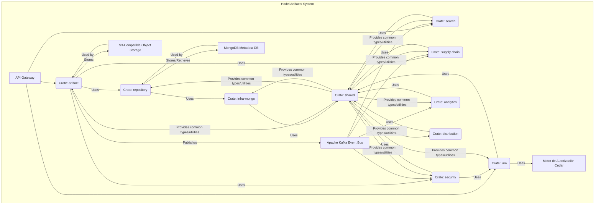
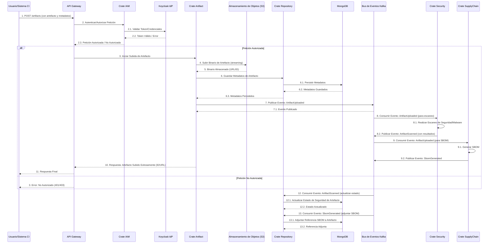
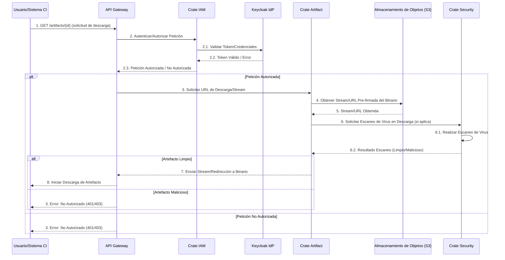
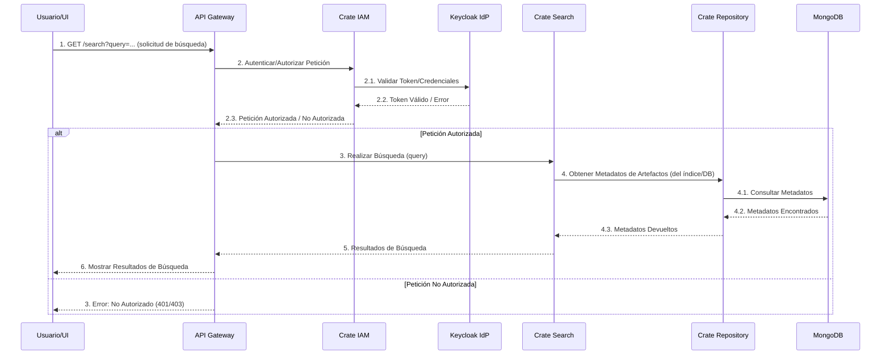
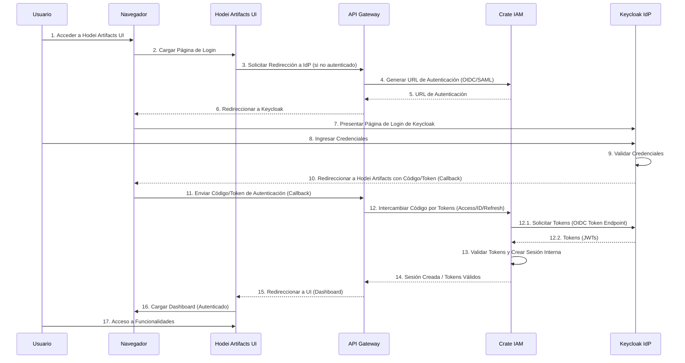
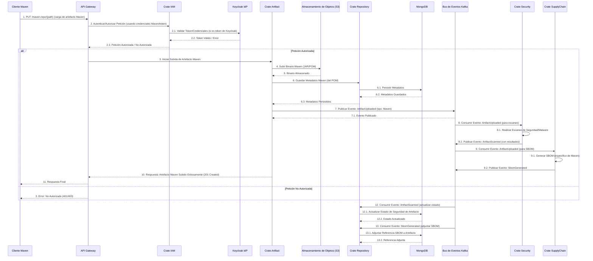
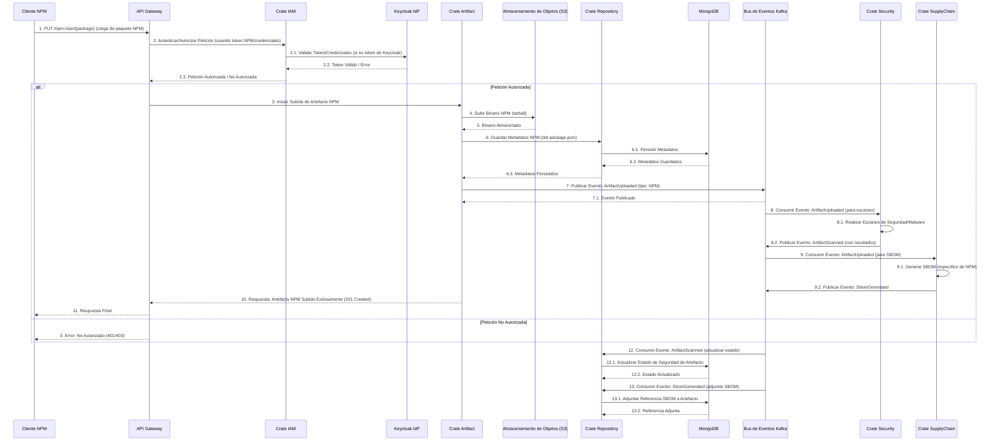

# Hodei Artifacts Architecture Document

## Introduction

This document outlines the overall project architecture for Hodei Artifacts, including backend systems, shared services, and non-UI specific concerns. Its primary goal is to serve as the guiding architectural blueprint for AI-driven development, ensuring consistency and adherence to chosen patterns and technologies.

**Relationship to Frontend Architecture:**
If the project includes a significant user interface, a separate Frontend Architecture Document will detail the frontend-specific design and MUST be used in conjunction with this document. Core technology stack choices documented herein (see "Tech Stack") are definitive for the entire project, including any frontend components.

### Starter Template or Existing Project

**Decision:** El proyecto es un desarrollo nuevo (greenfield) que utiliza Rust para el backend y React para el frontend.

**Justificación:** Comprender la base del proyecto es crucial. Si se basa en una plantilla o código base existente, necesitamos analizar su pila tecnológica preconfigurada, estructura, herramientas y patrones arquitectónicos existentes para asegurar que nuestro diseño se alinee o lo extienda adecuadamente. Si es un proyecto nuevo (greenfield), podemos sugerir plantillas de inicio adecuadas para acelerar el desarrollo y aprovechar las mejores prácticas.

### Change Log

| Date | Version | Description | Author |
|---|---|---|---|
| 2025-08-31 | 1.0 | Initial Draft based on PRD | Winston (Architect) |

## High Level Architecture

**Rationale:** This section establishes the foundational architectural decisions for the project. It provides a concise overview of the system's structure, key components, and the rationale behind major architectural choices, ensuring alignment with the PRD's goals.

### Technical Summary

The Hodei Artifacts system is designed with a modular monolith architecture, emphasizing high performance and scalability. Leveraging Rust, a language chosen specifically for its memory safety and concurrency features, the system aims for optimal performance in artifact ingestion and retrieval. Key components will interact through an event-driven architecture, ensuring low coupling and resilience. The architecture supports the PRD goals by providing a robust, scalable, and secure platform for software artifact management.

### High Level Overview

1.  **Main Architectural Style:** Modular Monolith with a strong emphasis on Event-Driven Architecture (EDA) for inter-component communication. This hybrid approach allows for modularity and scalability while maintaining a unified deployment.
2.  **Repository Structure:** Monorepo, as specified in the PRD, facilitating shared code and consistent development practices across different crates.
3.  **Service Architecture:** Modular Monolith, following Vertical Slice Architecture (VSA) for functional organization and Hexagonal Architecture (Ports and Adapters) for decoupling business logic from infrastructure concerns.
4.  **Primary User Interaction Flow/Data Flow:** Artifact ingestion and retrieval are central. Users (or CI/CD systems) upload artifacts, which are processed, stored in S3-compatible storage, and metadata is indexed in MongoDB. Downloads retrieve artifacts from storage. All critical operations are instrumented for observability.
5.  **Key Architectural Decisions and Rationale:**
    *   **Rust:** Chosen for its performance, memory safety, and concurrency capabilities, directly addressing the need for "super optimal performance" in critical operations like artifact ingestion and retrieval.
    *   **Modular Monolith (VSA + Hexagonal):** Provides a balance between development speed, maintainability, and scalability, allowing for a clear path to microservices if needed.
    *   **Event-Driven Architecture:** Decouples components, improves resilience, and enables asynchronous processing, crucial for high-throughput operations and security workflows.
    *   **S3-compatible Object Storage:** For binary storage, ensuring scalability and cost-effectiveness.
    *   **MongoDB:** For metadata storage, offering flexibility and scalability for diverse artifact metadata.

### High Level Project Diagram

```mermaid
graph TD
    User --> API_Gateway
    CI_CD_System --> API_Gateway

    API_Gateway --> Hodei_Artifacts_App

    subgraph Hodei_Artifacts_App
        direction LR
        Artifact_Ingestion[Servicio de Ingesta de Artefactos]
        Artifact_Retrieval[Servicio de Recuperación de Artefactos]
        Metadata_Management[Servicio de Gestión de Metadatos]
        Security_Service[Servicio de Seguridad]
        Repository_Management[Servicio de Gestión de Repositorios]
        IAM_ABAC[Servicio IAM & ABAC]
        Observability[Observabilidad y Monitorización]

        API_Gateway --> Artifact_Ingestion
        API_Gateway --> Artifact_Retrieval
        API_Gateway --> Metadata_Management
        API_Gateway --> Repository_Management
        API_Gateway --> IAM_ABAC

        Artifact_Ingestion --> Object_Storage[Almacenamiento de Objetos Compatible con S3]
        Artifact_Ingestion --> Kafka_Bus[Bus de Eventos Apache Kafka]
        Artifact_Ingestion --> Metadata_Management
        Artifact_Retrieval --> Object_Storage
        Metadata_Management --> MongoDB[Base de Datos de Metadatos MongoDB]
        Security_Service --> Kafka_Bus
        IAM_ABAC --> Cedar[Motor de Autorización Cedar]
        Observability --> Prometheus[Métricas Prometheus]
        Observability --> OpenTelemetry[Trazado OpenTelemetry]
        Observability --> Centralized_Logs[Registro Centralizado]

        Kafka_Bus --> Security_Service
        Kafka_Bus --> Observability
    end

    Hodei_Artifacts_App --> External_Integrations[Integraciones Externas (ej. SIEM, IdP)]
    Hodei_Artifacts_App --> UI[Interfaz de Usuario Web]
    Hodei_Artifacts_App --> CLI[Herramientas CLI]
```

### Architectural and Design Patterns

*   **Monolito Modular:**
    *   **Recomendación:** Utilizar un Monolito Modular con Arquitectura de Slice Vertical (VSA) y Arquitectura Hexagonal (Puertos y Adaptadores).
    *   **Justificación:** Este enfoque proporciona una clara separación de responsabilidades basada en las capacidades de negocio (slices verticales) mientras mantiene los beneficios de una única unidad de despliegue. La arquitectura hexagonal asegura que la lógica de negocio central sea independiente de los detalles de la infraestructura, promoviendo la capacidad de prueba y la flexibilidad. Esto se alinea con la mención del PRD de un "monolito modular" y el deseo de modularidad y escalabilidad.
*   **Arquitectura Orientada a Eventos (EDA):**
    *   **Recomendación:** Implementar una Arquitectura Orientada a Eventos robusta utilizando Apache Kafka como el bus de eventos central.
    *   **Justificación:** EDA es crucial para lograr un bajo acoplamiento entre diferentes slices funcionales, permitiendo el procesamiento asíncrono y mejorando la resiliencia del sistema. Apoya el requisito del PRD de comunicación asíncrona y flujos de trabajo de seguridad proactivos.
*   **Patrón Repositorio:**
    *   **Recomendación:** Aplicar el Patrón Repositorio para el acceso a datos.
    *   **Justificación:** Este patrón abstrae los detalles de almacenamiento de datos de la lógica de negocio, haciendo que el sistema sea más fácil de probar y permitiendo cambios más sencillos en la tecnología de base de datos subyacente (ej. cambiar de MongoDB a otra base de datos NoSQL) sin afectar la aplicación central.
*   **Control de Acceso Basado en Atributos (ABAC):**
    *   **Recomendación:** Utilizar Cedar como motor de autorización para ABAC.
    *   **Justificación:** ABAC proporciona un control granular sobre los recursos basado en los atributos del usuario, el recurso y el entorno. Cedar es un lenguaje de política como código de alto rendimiento que se alinea con los requisitos de seguridad del PRD.

## Tech Stack

**Rationale:** This section is critical as it defines the definitive technology selections for the project. These choices will guide all subsequent development, impact performance, scalability, and maintainability, and ensure alignment with the PRD's technical assumptions and the overall architectural vision. It's crucial to get explicit user approval for each selection.

**Key decisions to finalize:**

*   Starter templates (if any) - *We've discussed this, and the decision was Rust for backend and React for frontend, with no specific starter template chosen for React yet.*
*   Languages and runtimes with exact versions
*   Frameworks and libraries / packages
*   Cloud provider and key services choices
*   Database and storage solutions
*   Development tools

**Technology Stack Table**

| Categoría | Tecnología | Versión | Propósito | Justificación |
|---|---|---|---|---|
| **Lenguaje** | Rust | Última versión estable | Lenguaje de desarrollo principal para el backend | Elegido por su rendimiento, seguridad de memoria y concurrencia, fundamental para la optimización del rendimiento. |
| **Tiempo de Ejecución** | Tokio | - | Tiempo de ejecución asíncrono para Rust | Proporciona un entorno de ejecución eficiente para aplicaciones asíncronas en Rust. |
| **Framework Web (Backend)** | Axum | - | Framework web para el backend | Un framework web moderno y de alto rendimiento para Rust, que se integra bien con Tokio. |
| **Almacenamiento de Metadatos** | MongoDB | - | Base de datos para metadatos de artefactos | Ofrece flexibilidad y escalabilidad para almacenar y gestionar metadatos diversos. |
| **Almacenamiento de Objetos** | Compatible con S3 (MinIO para desarrollo/pruebas) | - | Almacenamiento de binarios de artefactos | Proporciona escalabilidad, durabilidad y rentabilidad para grandes volúmenes de datos binarios. |
| **Bus de Eventos** | Apache Kafka | - | Bus de mensajes para comunicación asíncrona | Permite el desacoplamiento de componentes, procesamiento asíncrono y escalabilidad para flujos de eventos. |
| **Motor de Autorización** | Cedar | - | Motor de políticas ABAC | Lenguaje de políticas de alto rendimiento para control de acceso granular basado en atributos. |
| **Caché** | Redis | - | Caché en memoria | Mejora el rendimiento al almacenar datos de acceso frecuente. |
| **Métricas** | Prometheus | - | Recopilación y monitorización de métricas | Estándar de facto para la monitorización de sistemas cloud-native. |
| **Trazas y Registros** | OpenTelemetry | - | Trazado distribuido y registro | Proporciona observabilidad integral para depuración y análisis de rendimiento. |
| **Contenerización y Orquestación** | Docker y Kubernetes | - | Contenerización y orquestación de la aplicación | Permite el despliegue, escalado y gestión eficiente de la aplicación en entornos cloud-native. |

## Data Models

**Rationale:** Defining the core data models is fundamental to the system's design. It establishes the structure and relationships of the key business entities, which will directly influence the database schema and the overall data flow within the application. A clear conceptual model is essential before moving to concrete database implementations.

### Model: Artefacto

**Propósito:** Representa un paquete de software o componente binario almacenado en Hodei Artifacts. Es la unidad fundamental de gestión dentro del sistema.

**Atributos Clave:**

*   `id`: String (HRN) - Identificador único del artefacto.
*   `contentHash`: Objeto `ContentHash` - Hash del contenido del artefacto para verificar la integridad.
*   `coordinates`: Objeto `ArtifactCoordinates` - Coordenadas del artefacto (grupo, nombre, versión, clasificador, extensión).
*   `tags`: Lista<String> - Etiquetas asociadas al artefacto.
*   `packagingType`: String - Tipo de empaquetado del artefacto (ej. "jar", "war", "npm", "docker").
*   `sizeInBytes`: Long - Tamaño del artefacto en bytes.
*   `status`: Enumeración `ArtifactStatus` - Estado actual del artefacto (ej. ACTIVO, DEPRECADO, CUARENTENA).
*   `metadata`: Objeto `ArtifactMetadata` - Metadatos detallados del artefacto, incluyendo creador, fecha de creación, checksums, etc.
*   `dependencies`: Lista<Objeto `ArtifactDependency`> - Dependencias del artefacto.
*   `securityScan`: Objeto `SecurityScan` - Resultado del escaneo de seguridad del artefacto.
*   `repository_id`: String (HRN) - ID del repositorio al que pertenece el artefacto.

**Relaciones:**

*   Un Artefacto tiene `ContentHash`, `ArtifactCoordinates`, `ArtifactMetadata`, `SecurityScan`.
*   Un Artefacto puede tener múltiples `ArtifactDependency`.
*   Un Artefacto pertenece a un Repositorio (relación N:1 con Repositorio).

**Design Decisions for Discussion (Updated):**

*   **HRN para IDs:** Uso consistente de HRN para identificación única.
*   **Metadatos Ricos y Sub-Objetos:** Aprovechamiento de los objetos detallados `ArtifactCoordinates`, `ContentHash`, `ArtifactMetadata`, `SecurityScan`, y `ArtifactDependency` de `domain.md` para una representación más estructurada y completa.
*   **Enumeración de Estado:** Uso de la enumeración `ArtifactStatus` para estados de artefactos claros y estandarizados.
*   **Dependencias Explícitas y Escaneo de Seguridad:** Inclusión directa de objetos `dependencies` y `securityScan` para una mejor trazabilidad y postura de seguridad.

### Model: Repositorio

**Propósito:** Representa un contenedor lógico para organizar y almacenar artefactos. Los repositorios definen políticas de retención, cuotas de almacenamiento y control de acceso.

**Atributos Clave:**

*   `id`: String (HRN) - Identificador único del repositorio.
*   `name`: String - Nombre del repositorio.
*   `description`: String - Descripción del repositorio.
*   `type`: String - Tipo de repositorio (ej. "maven", "npm", "docker", "virtual", "proxy").
*   `owner_id`: String (HRN) - ID de la organización o usuario propietario del repositorio.
*   `creation_date`: DateTime - Fecha y hora de creación.
*   `last_modified_date`: DateTime - Última fecha y hora de modificación.
*   `retention_policy`: Object - Objeto que define la política de retención (ej. `max_versions: 10`, `delete_after_days: 30`).
*   `storage_quota`: Long - Cuota de almacenamiento en bytes.
*   `current_size`: Long - Tamaño actual ocupado por los artefactos en el repositorio.
*   `is_public`: Boolean - Indica si el repositorio es público o privado.
*   `metadata`: Map<String, String> - Metadatos personalizados y extensibles.

**Relaciones:**

*   Un Repositorio contiene Artefactos (relación 1:N con Artefacto).
*   Un Repositorio pertenece a una Organización o Usuario (relación N:1 con Organización/Usuario).
*   Un Repositorio puede ser un proxy o virtual de otros repositorios (relación N:M con Repositorio para proxy/virtual).

**Design Decisions for Discussion:**

*   **HRN para IDs:** Uso consistente de HRN para identificación única.
*   **Política de Retención Flexible:** El uso de un objeto para `retention_policy` permite varias reglas de retención (ej. por recuento de versiones, por antigüedad).
*   **Cuotas de Almacenamiento:** `storage_quota` y `current_size` para el control de recursos.
*   **Tipos de Repositorio:** Atributo `type` para admitir diferentes tipos de repositorios (ej. alojados, proxy, virtuales).

### Model: SBOM

**Propósito:** Representa una lista formal y jerárquica de los componentes e ingredientes que conforman un artefacto de software. Es crucial para la seguridad de la cadena de suministro y el cumplimiento normativo.

**Atributos Clave:**

*   `id`: String (HRN) - Identificador único del SBOM.
*   `artifactId`: String (HRN) - ID del artefacto al que pertenece este SBOM.
*   `format`: Enumeración `SbomFormat` - Formato del SBOM (ej. CYCLONE_DX, SPDX).
*   `specVersion`: String - Versión de la especificación del SBOM.
*   `components`: Lista<Objeto `SbomComponent`> - Lista de componentes del software.
*   `relationships`: Lista<Objeto `SbomRelationship`> - Relaciones entre los componentes del SBOM.
*   `creationTime`: Instant - Fecha y hora de creación del SBOM.
*   `tools`: Lista<Objeto `ToolInformation`> - Información sobre las herramientas utilizadas para generar el SBOM.
*   `authors`: Lista<Objeto `ContactInformation`> - Información de contacto de los autores del SBOM.
*   `serialNumber`: String - Número de serie del documento SBOM.
*   `documentName`: String - Nombre del documento SBOM.
*   `documentNamespace`: String - Espacio de nombres del documento SBOM.
*   `describesComponentRef`: String - Referencia al componente que describe el SBOM.
*   `externalReferences`: Lista<Objeto `ExternalReference`> - Referencias externas del SBOM.
*   `dataLicense`: String - Licencia de los datos del SBOM.
*   `metadata`: Map<String, String> - Metadatos personalizados y extensibles para el SBOM.

**Relaciones:**

*   Un SBOM pertenece a un Artefacto (relación 1:1 con Artefacto).
*   Un SBOM contiene múltiples `SbomComponent` y `SbomRelationship`.

**Design Decisions for Discussion (Updated):**

*   **HRN para IDs:** Uso consistente de HRN para identificación única.
*   **Estructura Integral de SBOM:** La adopción de la estructura detallada de `SbomDocument` de `domain.md` proporciona una representación más rica y compatible de los SBOM, incluyendo relaciones, herramientas, autores y referencias externas.
*   **Formato Enumerado:** Uso de la enumeración `SbomFormat` para formatos de SBOM estandarizados.
*   **PURLs para Componentes:** El objeto `SbomComponent` utiliza PURLs para una identificación única, lo cual es una buena práctica.

## Components

**Rationale:** The system's modular monolith architecture, guided by Vertical Slice Architecture and Hexagonal principles, naturally leads to components aligned with business capabilities. Each component, often corresponding to a Rust crate, encapsulates specific functionality and interacts with others primarily through well-defined interfaces and asynchronous events.

### 1. Component: `artifact` (Crate: `crates/artifact`)

*   **Responsibility:** Manages the full lifecycle of artifacts, including upload, download, metadata management, and artifact-related events. It is the core component for artifact storage and retrieval.
*   **Key Interfaces/APIs Exposed:**
    *   REST API endpoints for artifact upload (`POST /artifacts`), download (`GET /artifacts/{id}`), and metadata retrieval (`GET /artifacts/{id}/metadata`).
    *   Internal ports for interacting with object storage, metadata database, and event bus.
*   **Dependencias:**
    *   `shared` (for common types, errors)
    *   `repository` (for data access traits/ports)
    *   `infra-mongo` (for MongoDB client implementation)
    *   `iam` (for authorization checks via ABAC)
    *   `supply-chain` (for SBOM generation/attachment, signature management)
    *   `security` (for security scanning integration)
*   **Technology Specifics:** Rust, Axum handlers, Tokio for async operations.

### 2. Component: `repository` (Crate: `crates/repository`)

*   **Responsibility:** Provides data access abstractions (ports/traits) and their concrete implementations (adapters) for various data stores, primarily MongoDB. It acts as the data persistence layer for other components.
*   **Key Interfaces/APIs Exposed:**
    *   Rust traits (e.g., `ArtifactRepository`, `UserRepository`) defining data operations.
    *   Concrete implementations of these traits for MongoDB.
*   **Dependencias:**
    *   `shared` (for common types, errors)
    *   `infra-mongo` (for MongoDB client)
*   **Technology Specifics:** Rust, MongoDB driver.

### 3. Component: `supply-chain` (Crate: `crates/supply-chain`)

*   **Responsibility:** Handles Software Bill of Materials (SBOM) generation, management of attestations, and verification of the software supply chain (e.g., SLSA, in-toto). Ensures the integrity and provenance of artifacts.
*   **Key Interfaces/APIs Exposed:**
    *   Internal ports for SBOM generation and verification.
    *   Event consumers for `ArtifactUploaded` to trigger SBOM generation.
*   **Dependencias:**
    *   `shared`
    *   `artifact` (to retrieve artifact content for SBOM generation)
*   **Technology Specifics:** Rust.

### 4. Component: `search` (Crate: `crates/search`)

*   **Responsibility:** Manages artifact indexing and provides search capabilities. It allows users to efficiently find artifacts based on various criteria.
*   **Key Interfaces/APIs Exposed:**
    *   REST API endpoints for artifact search (`GET /search`).
    *   Event consumers for `ArtifactMetadataUpdated` to update search index.
*   **Dependencias:**
    *   `shared`
    *   `repository` (to read metadata for indexing)
*   **Technology Specifics:** Rust, Tantivy (as mentioned in `arquitectura-sistema.md`).

### 5. Component: `security` (Crate: `crates/security`)

*   **Responsibility:** Implements Attribute-Based Access Control (ABAC) policies using Cedar, handles digital signatures, and performs security verifications and compliance checks.
*   **Key Interfaces/APIs Exposed:**
    *   Internal API for policy evaluation (e.g., `is_authorized(user, action, resource)`).
    *   Event consumers for security-related events.
*   **Dependencias:**
    *   `shared`
    *   `iam` (for user/policy data)
    *   Cedar authorization engine.
*   **Technology Specifics:** Rust, Cedar.

### 6. Component: `iam` (Crate: `crates/iam`)

*   **Responsibility:** Manages user identities, groups, and ABAC policies. It is the central authority for authentication and authorization data.
*   **Key Interfaces/APIs Exposed:**
    *   REST API endpoints for user/group/policy management.
    *   Internal ports for user/policy data storage.
*   **Dependencias:**
    *   `shared`
    *   `repository` (for data persistence)
*   **Technology Specifics:** Rust.

### 7. Component: `analytics` (Crate: `crates/analytics`)

*   **Responsibility:** Collects and processes usage data and security metrics for business intelligence and operational insights.
*   **Key Interfaces/APIs Exposed:**
    *   Event consumers for various system events (e.g., `ArtifactDownloaded`, `LoginSuccess`).
    *   Internal APIs for data aggregation and reporting.
*   **Dependencias:**
    *   `shared`
*   **Technology Specifics:** Rust.

### 8. Component: `distribution` (Crate: `crates/distribution`)

*   **Responsibility:** Handles artifact distribution, potentially integrating with CDN services.
*   **Key Interfaces/APIs Exposed:**
    *   Internal ports for CDN integration.
*   **Dependencias:**
    *   `shared`
    *   `artifact` (to retrieve artifact content)
*   **Technology Specifics:** Rust.

### 9. Component: `shared` (Crate: `crates/shared`)

*   **Responsibility:** Provides common types, errors, and utilities that are reused across multiple bounded contexts (crates). It acts as the shared kernel.
*   **Key Interfaces/APIs Exposed:**
    *   Public Rust modules for DTOs, common enums, error types, utility functions.
*   **Dependencias:** None on other domain crates.
*   **Technology Specifics:** Rust.

### 10. Component: `infra-mongo` (Crate: `crates/infra-mongo`)

*   **Responsibility:** Provides the MongoDB client and helpers, along with test utilities for MongoDB interactions.
*   **Key Interfaces/APIs Exposed:**
    *   Rust modules for MongoDB client setup, connection pooling, and common database operations.
*   **Dependencias:** MongoDB driver.
*   **Technology Specifics:** Rust, MongoDB.

### Component Diagrams



## External APIs

**Rationale:** Integrating with external APIs is a common requirement for modern systems. It identifies and documents these integrations, including their purpose, authentication methods, and any constraints. This is crucial for planning development, security, and operational aspects.

### API: Proveedor de Identidad (Keycloak)

-   **Purpose:** Autenticación de usuarios y gestión de identidades federadas, permitiendo a Hodei Artifacts delegar la autenticación a Keycloak y aprovechar sus capacidades de SSO y gestión de usuarios.
-   **Documentation:** Keycloak documentation (specific version to be determined).
    *   **URL:** `https://www.keycloak.org/documentation` (general documentation)
-   **Authentication:**
    *   **Method:** OpenID Connect (OIDC) o SAML 2.0. Hodei Artifacts actuará como cliente OIDC o Service Provider SAML.
    *   **Security Considerations:**
        *   Uso de HTTPS obligatorio para todas las comunicaciones.
        *   Gestión segura de secretos de cliente (client secrets) para OIDC.
        *   Validación de tokens JWT emitidos por Keycloak (firma, expiración, audiencia).
        *   Implementación de flujos de concesión de OIDC adecuados (ej. Authorization Code Flow).
-   **Key Endpoints Used (Examples for OIDC):**
    *   `GET /realms/{realm}/protocol/openid-connect/auth` - Endpoint de autorización (para iniciar sesión).
    *   `POST /realms/{realm}/protocol/openid-connect/token` - Endpoint de token (para intercambiar código de autorización por tokens).
    *   `GET /realms/{realm}/protocol/openid-connect/userinfo` - Endpoint de información de usuario (para obtener atributos del usuario).
    *   `GET /realms/{realm}/protocol/openid-connect/certs` - Endpoint de certificados (para obtener claves públicas para la verificación de la firma del token).
    *   `GET /realms/{realm}/protocol/openid-connect/logout` - Endpoint de cierre de sesión.
-   **Rate Limits/Usage Constraints:**
    *   Generalmente, Keycloak no impone límites de tasa estrictos en sus APIs de autenticación para clientes internos, pero el rendimiento dependerá de la infraestructura de Keycloak y la carga.
    *   Considerar la escalabilidad de la instancia de Keycloak para soportar el volumen de usuarios y solicitudes de autenticación.

## Core Workflows

**Rationale:** Visualizing core workflows through sequence diagrams is essential for understanding the dynamic behavior of the system. It clarifies how different components interact to achieve a specific business goal, including external integrations and asynchronous operations. This helps in identifying potential bottlenecks, error handling strategies, and ensuring a smooth user experience.

### Workflow: Subida de Artefacto (Artifact Upload)



### Workflow: Descarga de Artefacto (Artifact Download)



### Workflow: Búsqueda de Artefacto (Artifact Search)



### Workflow: Autenticación de Usuario (User Authentication)



### Workflow: Subida Maven, con Autenticación



### Workflow: Subida NPM con Autenticación



## Infrastructure and Deployment

**Rationale:** Defining the infrastructure and deployment strategy is crucial for ensuring the system's availability, scalability, and maintainability in production. It covers how the application will be deployed, managed, and operated in a cloud-native environment, aligning with the PRD's requirements for Kubernetes deployment and CI/CD pipelines.

### Infrastructure as Code

*   **Tool:** Terraform
*   **Version:** (To be specified, e.g., `1.5.7`)
*   **Location:** `infrastructure/terraform/` (or similar, within the monorepo)
*   **Approach:** Declarative infrastructure provisioning, managing cloud resources (Kubernetes clusters, S3 buckets, MongoDB Atlas, Kafka clusters, Redis instances).

### Deployment Strategy

*   **Strategy:** Kubernetes Native Deployments (Helm Charts, Rolling Updates, Canary Deployments)
*   **CI/CD Platform:** (To be specified, e.g., GitHub Actions, GitLab CI, Jenkins)
*   **Pipeline Configuration:** `.github/workflows/` (for GitHub Actions) or similar.

### Environments

*   **Development:** Local development environment (Docker Compose for dependencies, local Rust/React setup).
*   **Staging:** Environment for integration testing, UAT, and pre-production validation. Mirrors production as closely as possible.
*   **Production:** Live environment serving end-users.

### Environment Promotion Flow

```text
Development --> Staging --> Production
```
*   **Automated Promotion:** From Development to Staging via CI/CD pipeline upon successful tests.
*   **Manual Approval:** From Staging to Production, requiring manual approval after UAT and performance testing.

### Rollback Strategy

*   **Primary Method:** Kubernetes Rolling Back Deployments (for application code), IaC state rollback (for infrastructure changes).
*   **Trigger Conditions:** Failed health checks, critical errors in logs, performance degradation, security incidents.
*   **Recovery Time Objective (RTO):** (To be specified, e.g., < 5 minutes for critical services).

## Error Handling Strategy

**Rationale:** A robust error handling strategy is fundamental for building resilient and maintainable software. It ensures that the system behaves predictably in the face of errors, provides clear feedback, and facilitates debugging and operational monitoring. This section will define the approach to error modeling, logging, and specific patterns for handling different types of errors.

### General Approach

*   **Error Model:** Use Rust's `Result<T, E>` type for fallible operations. Define custom error types (`thiserror` crate) for each bounded context/crate, encapsulating specific error conditions.
*   **Exception Hierarchy:** A flat hierarchy of custom error types per crate, with a top-level application error type that aggregates all possible errors. This allows for granular error handling at the source and consistent mapping to HTTP status codes at the API boundary.
*   **Error Propagation:** Errors should be propagated up the call stack using `?` operator until they can be handled appropriately (e.g., converted to an HTTP response, logged, or retried).

### Logging Standards

*   **Library:** `tracing` crate for structured logging and tracing.
*   **Format:** Structured JSON logs for easy parsing and analysis by centralized logging systems.
*   **Levels:** Standard logging levels (TRACE, DEBUG, INFO, WARN, ERROR, CRITICAL) should be used consistently.
*   **Required Context:**
    *   **Correlation ID:** A unique ID generated at the entry point of each request/event, propagated across all services and logs for end-to-end traceability.
    *   **Service Context:** Information about the service, module, and function where the log originated.
    *   **User Context:** Anonymized user ID or session ID (if applicable) for debugging user-specific issues, ensuring no PII is logged.

### Error Handling Patterns

#### External API Errors

*   **Retry Policy:** Implement exponential backoff with jitter for transient network errors or external service unavailability. Define maximum retry attempts.
*   **Circuit Breaker:** Use a circuit breaker pattern for calls to external APIs to prevent cascading failures when an external service is unhealthy.
*   **Timeout Configuration:** Define strict timeouts for all external API calls to prevent hanging requests.
*   **Error Translation:** Translate generic external API errors into meaningful internal error types or HTTP status codes.

#### Business Logic Errors

*   **Custom Exceptions:** Define specific custom error types for business rule violations (e.g., `ArtifactNotFound`, `RepositoryQuotaExceeded`, `PermissionDenied`).
*   **User-Facing Errors:** For errors that need to be presented to the user, provide clear, concise, and user-friendly messages. Avoid exposing internal technical details.
*   **Error Codes:** Implement a system of standardized error codes for programmatic error identification and handling by clients.

#### Data Consistency

*   **Transaction Strategy:** Utilize MongoDB's multi-document transactions for operations requiring atomicity across multiple documents or collections.
*   **Compensation Logic:** For distributed transactions (e.g., across Kafka events), implement compensation logic (Sagas) to revert or compensate for previously completed actions in case of failures.
*   **Idempotency:** Design operations to be idempotent where possible, especially for event consumers, to prevent unintended side effects from retries.

## Coding Standards

**Rationale:** Establishing clear coding standards is essential for maintaining code quality, consistency, and readability across the project. These standards directly influence how AI agents generate code and how human developers contribute, ensuring adherence to best practices and project-specific conventions. It's crucial to define only the most critical rules to avoid unnecessary overhead.

### Core Standards

*   **Languages & Runtimes:** Rust (última versión estable) con Tokio. React con TypeScript para el frontend.
*   **Style & Linting:** `cargo fmt` para formateo de código Rust. `cargo clippy` para linting estático. Para TypeScript/React, se utilizarán Prettier y ESLint con configuraciones estándar del proyecto (`.prettierrc`, `eslint.config.js`).
*   **Test Organization:** Tests unitarios junto a la lógica (`src/lib.rs`, `src/main.rs`). Tests de integración en `tests/` a nivel de crate y en `e2e/` para tests de sistema.

### Naming Conventions

*   **Rust:**
    *   `snake_case` para funciones, variables, módulos y nombres de archivos.
    *   `PascalCase` para tipos (structs, enums, traits).
    *   `SCREAMING_SNAKE_CASE` para constantes.
*   **Features (Vertical Slices):** Nombres de módulos en `snake_case` que describan la acción (ej. `upload_artifact`, `get_user_by_id`).
*   **Eventos de Dominio:** Nombres en pasado (ej. `UserRegistered`, `ArtifactUploaded`).
*   **Frontend (React/TypeScript):**
    *   `PascalCase` para componentes React y nombres de archivos de componentes.
    *   `camelCase` para variables y funciones.
    *   `kebab-case` para nombres de archivos CSS/SCSS.

### Critical Rules

*   **Inversión de Dependencias (DIP) es OBLIGATORIA:** Los `handlers` en los `features` deben depender de abstracciones (traits/puertos), nunca de implementaciones concretas de la capa de infraestructura.
*   **El Dominio es PURO y SÍNCRONO:** No usar `async/await` dentro de la capa `domain`. La lógica de negocio no debe conocer la asincronía.
*   **Manejo de Errores Robusto:** Uso de tipos de error personalizados por Bounded Context con `thiserror`. Prohibido el uso de `.unwrap()` o `.expect()` en código de producción.
*   **Eventos de Dominio:** La comunicación **entre Bounded Contexts (crates)** es **SIEMPRE** asíncrona mediante eventos de dominio. Se **PROHÍBEN** las llamadas síncronas directas entre crates.
*   **Dependencias Cruzadas entre Features:** Un módulo de un feature **NUNCA** debe importar código de otro feature. Si se necesita código compartido, debe ser abstraído y movido al núcleo compartido (`domain` o `application/ports` dentro del crate).
*   **Lógica de Negocio en la Infraestructura:** Los adaptadores (controladores HTTP, repositorios) deben ser "tontos". Solo adaptan datos y llaman a los `handlers` de las features, no contienen reglas de negocio.
*   **Dependencias hacia el Exterior:** Ningún módulo en `domain`, `application` o `features` puede tener una dependencia (`use ...`) de un módulo en `infrastructure`.
*   **No Valores Mágicos:** No usar strings o números "mágicos". Utilizar enums o constantes con nombres significativos.
*   **No `console.log` en Producción:** Para el frontend, usar un logger configurado para evitar `console.log` en entornos de producción.

### Language-Specific Guidelines

*   **Rust Specifics:**
    *   **Ownership y Borrowing:** Adherirse estrictamente a las reglas de ownership y borrowing de Rust para garantizar la seguridad de la memoria y la concurrencia.
    *   **Traits:** Favorecer el uso de traits para definir interfaces y abstracciones.
    *   **Macros:** Usar macros con moderación y solo cuando sea necesario para reducir la verbosidad o generar código repetitivo.
*   **TypeScript/React Specifics:**
    *   **Tipado Estricto:** Utilizar TypeScript con tipado estricto (`strict: true` en `tsconfig.json`).
    *   **Componentes Funcionales y Hooks:** Preferir componentes funcionales y hooks para la lógica de los componentes.
    *   **Inmutabilidad:** Mantener la inmutabilidad del estado siempre que sea posible.

## Test Strategy and Standards

**Rationale:** A comprehensive testing strategy is paramount for ensuring the quality, reliability, and maintainability of the Hodei Artifacts system. It defines how different types of tests will be implemented, organized, and executed to validate functionality, performance, and security across the entire development lifecycle. The provided `docs/testing-organization.md` serves as the authoritative guide for these standards.

### Testing Philosophy

*   **Approach:** A hybrid approach combining Test-Driven Development (TDD) for critical business logic and a test-after approach for broader integration and E2E scenarios. Emphasis on the "Test Pyramid" principle.
*   **Coverage Goals:**
    *   Unit Tests: >90% code coverage for core business logic (`domain` and `application` layers within crates).
    *   Integration Tests: High coverage for feature handlers and interactions with infrastructure adapters.
    *   E2E Tests: Cover critical user journeys and API flows.
*   **Test Pyramid:** Prioritize a large base of fast, isolated unit tests, a smaller layer of integration tests, and a minimal set of E2E tests.

### Test Types and Organization

#### Unit Tests

*   **Framework:** Rust: `cargo test` (built-in test harness). React/TypeScript: Vitest.
*   **File Convention:** Rust: Unit tests are placed in **separate files** with a `_test.rs` suffix, co-located with the source code in the same directory (e.g., `calculator.rs` and `calculator_test.rs` in `src/modules/`). React/TypeScript: `.test.ts` or `.spec.ts` files co-located with components/modules.
*   **Location:** Rust: Within `src/` modules. React/TypeScript: Co-located with source files.
*   **Mocking Library:** Rust: `mockall` or similar for mocking traits/dependencies. React/TypeScript: Vitest's built-in mocking capabilities.
*   **Coverage Requirement:** Enforced via CI/CD pipelines.

    **AI Agent Requirements:**
    *   Generate tests for all public methods in `domain` and `application` layers.
    *   Cover edge cases and error conditions.
    *   Follow AAA pattern (Arrange, Act, Assert).
    *   Mock all external dependencies (ports/traits).

#### Integration Tests

*   **Scope:** Validate the interaction between components and with infrastructure adapters (e.g., database, message queue, external APIs). Test feature handlers end-to-end within a crate.
*   **Location:** Rust: `crates/<context>/tests/` directory for crate-specific integration tests.
*   **Test Infrastructure:** Utilizes a custom framework based on Docker Compose for reproducible environments and parallel execution.
    *   **Docker Compose Template:** `tests/compose/docker-compose.template.yml` with dynamic ports and subnets.
    *   **Orchestration:** `shared-test` crate manages the lifecycle of the environment.
    *   **Database (MongoDB):** `testcontainers` for ephemeral MongoDB instances.
    *   **Message Queue (Kafka):** `testcontainers` for ephemeral Kafka instances.
    *   **Object Storage (S3/MinIO):** `testcontainers` for MinIO.
    *   **External APIs:** `wiremock` for stubbing HTTP external APIs.
*   **Parallel Execution:** Supported by the custom Docker Compose framework, automatically detecting resources and optimizing parallel limits.

#### End-to-End Tests

*   **Framework:** Playwright (for API-level E2E tests).
*   **Scope:** Validate critical user journeys and API flows across the entire deployed system.
*   **Environment:** Dedicated staging environment or ephemeral test environments provisioned via IaC.
*   **Test Data:** Use test data factories and cleanup strategies to ensure test isolation and repeatability.
*   **Directory Structure:** `e2e/` directory with `tests/`, `setup/`, `package.json`, `playwright.config.ts`.
*   **Features:** Multi-browser support, mobile devices, parallelization, automatic retry, screenshots on failure, video recording on failure, Rust server integration.

### Test Data Management

*   **Strategy:** Use factories and builders for generating realistic and consistent test data.
*   **Fixtures:** Define test fixtures for common setup scenarios.
*   **Factories:** Implement data factories to create complex test objects.
*   **Cleanup:** Ensure proper cleanup of test data after each test run (e.g., database truncation, object storage cleanup).

### Continuous Testing

*   **CI Integration:** Integrate all test types into the CI/CD pipeline.
    *   Unit tests run on every commit/PR (`cargo test --lib`).
    *   Integration tests run on every PR and merge to main (`cargo test --test 'it_*'`).
    *   E2E tests run on deployment to staging and before production promotion (`cd e2e && npm test`).
*   **Performance Tests:** Conduct regular load and stress tests using tools like K6 or JMeter to ensure performance requirements are met.
*   **Security Tests:** Integrate SAST (Static Application Security Testing) and DAST (Dynamic Application Security Testing) tools into the CI/CD pipeline. Conduct regular penetration testing and vulnerability scanning.

## Security

**Rationale:** Security is a paramount concern for Hodei Artifacts, especially given its role in managing software supply chains. This section defines mandatory security requirements and patterns that must be implemented at the code level, guiding both AI and human developers to build a secure system by design. It incorporates principles like Zero Trust and Defense in Depth.

### Input Validation

*   **Validation Library:** Rust: `validator` crate or manual validation. React/TypeScript: Zod or Yup for schema validation.
*   **Validation Location:** All external inputs MUST be validated at the API boundary (Axum handlers for backend, form/input components for frontend) before processing. Re-validate critical inputs at the business logic layer.
*   **Required Rules:**
    *   Whitelist approach preferred over blacklist for input sanitization.
    *   Strict type checking and format validation (e.g., UUIDs, HRNs, dates, emails).
    *   Length constraints for strings.
    *   Range constraints for numbers.
    *   Avoidance of SQL/NoSQL injection, XSS, and other common vulnerabilities through proper escaping and parameterized queries/safe ORM usage.

### Authentication & Authorization

*   **Auth Method:** JWT-based authentication for API access, integrated with Keycloak (OIDC/SAML) for user authentication. Basic Auth and API Keys for CLI/programmatic access.
*   **Session Management:** Stateless JWTs for API calls. Secure, short-lived refresh tokens for obtaining new access tokens. Server-side session management for UI (if applicable).
*   **Required Patterns:**
    *   All API endpoints must be protected by authentication and authorization checks.
    *   Authorization decisions must be made using the Cedar policy engine (`security` crate) based on ABAC principles.
    *   Least privilege principle: Users/services should only have access to resources and actions strictly necessary for their function.
    *   Secure storage and transmission of authentication credentials (e.g., hashed passwords, encrypted tokens).

### Secrets Management

*   **Development:** Environment variables, `.env` files (excluded from VCS), or local secret management tools (e.g., `direnv`).
*   **Production:** Centralized secret management service (e.g., HashiCorp Vault, Kubernetes Secrets with external secret store, AWS Secrets Manager, Azure Key Vault).
*   **Code Requirements:**
    *   NEVER hardcode secrets (API keys, database credentials, etc.) in the codebase.
    *   Access secrets via a dedicated configuration service or environment variables only.
    *   No secrets in logs or error messages.
    *   Regular rotation of secrets.

### API Security

*   **Rate Limiting:** Implement API rate limiting at the API Gateway level (e.g., Axum middleware, Nginx, Kubernetes Ingress) to prevent abuse and DoS attacks.
*   **CORS Policy:** Strictly define CORS (Cross-Origin Resource Sharing) policies to allow only trusted origins to access the API.
*   **Security Headers:** Implement standard security headers (e.g., HSTS, X-Content-Type-Options, X-Frame-Options, Content-Security-Policy) for web interfaces.
*   **HTTPS Enforcement:** All communication must use HTTPS/TLS. Enforce strict TLS versions and strong cipher suites.

### Data Protection

*   **Encryption at Rest:** All sensitive data (e.g., artifact binaries, database backups) must be encrypted at rest using industry-standard encryption algorithms (e.g., AES-256). Leverage cloud provider encryption features.
*   **Encryption in Transit:** All data in transit (API calls, inter-service communication, database connections) must be encrypted using TLS.
*   **PII Handling:** Minimize collection of Personally Identifiable Information (PII). Anonymize or pseudonymize PII where possible. Implement strict access controls for PII.
*   **Logging Restrictions:** Do not log sensitive information (passwords, tokens, PII, full credit card numbers) in plain text. Mask or redact sensitive data in logs.

### Dependency Security

*   **Scanning Tool:** Integrate automated dependency scanning tools (e.g., `cargo-audit` for Rust, Snyk, Dependabot) into the CI/CD pipeline to identify known vulnerabilities in third-party libraries.
*   **Update Policy:** Regularly update dependencies to their latest secure versions. Prioritize updates for dependencies with known vulnerabilities.
*   **Approval Process:** Establish a process for reviewing and approving new third-party dependencies before their introduction into the project.

### Security Testing

*   **SAST Tool:** Integrate Static Application Security Testing (SAST) tools into the CI/CD pipeline for automated code analysis (e.g., SonarQube, Bandit for Python, specific Rust linters).
*   **DAST Tool:** Integrate Dynamic Application Security Testing (DAST) tools for runtime vulnerability scanning (e.g., OWASP ZAP, Burp Suite).
*   **Penetration Testing:** Conduct regular third-party penetration tests and security audits.
*   **Fuzzing:** Implement fuzzing for critical components to discover unexpected vulnerabilities.
