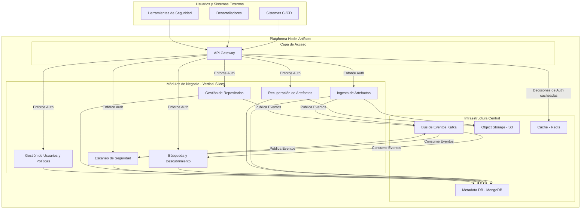
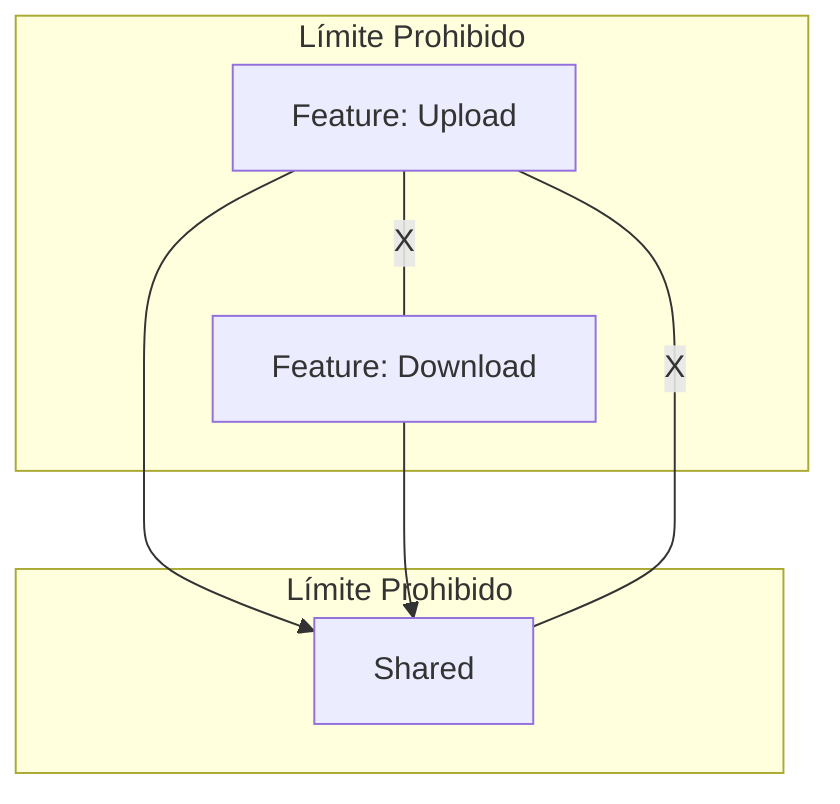

# Arquitectura del Sistema: Hodei Artifacts

**Versión**: 1.2 (Revisada con Guía Práctica)
**Fecha**: 24 de Agosto, 2025
**Autor**: Solution Architect & Tech Lead
**Estado**: Documento Vivo

## 🎯 Resumen Ejecutivo

Hodei Artifacts es un repositorio de artefactos de nueva generación diseñado para ofrecer máximo rendimiento, seguridad y escalabilidad. Construido en **Rust**, el sistema adopta una arquitectura híbrida que fusiona **Vertical Slice Architecture (VSA)**, **Arquitectura Hexagonal** y un modelo **Dirigido por Eventos (EDA)**.

Nuestra estrategia es un **monolito modular evolutivo**: un enfoque pragmático que nos otorga la velocidad de desarrollo de un sistema unificado al inicio, mientras que la estricta modularidad de los *Slices* verticales nos garantiza la flexibilidad para extraer funcionalidades a microservicios en el futuro sin reescrituras masivas.

### Decisiones Arquitectónicas Clave

* **Lenguaje**: Rust, por su rendimiento, seguridad de memoria y concurrencia de primer nivel.
* **Patrón Arquitectónico**: Híbrido VSA + Hexagonal + EDA para combinar cohesión funcional, desacoplamiento y escalabilidad asíncrona.
* **Estrategia Evolutiva**: Iniciar como monolito modular para una rápida puesta en marcha, con un camino claro hacia la extracción de microservicios.
* **Almacenamiento**: Binarios en un backend compatible con **S3** (ej. MinIO) para escalabilidad infinita; metadatos en **MongoDB** por su flexibilidad y capacidad de indexación.
* **Comunicación**: **API REST** para interacciones síncronas cliente-servidor y **Apache Kafka** para la comunicación asíncrona y desacoplada entre los diferentes módulos del sistema.
* **Autorización**: Modelo de Control de Acceso Basado en Atributos (**ABAC**) con el motor de políticas **Cedar** para una gestión de permisos granular y flexible.

## 📐 Principios Arquitectónicos Fundamentales

1. **Alta Cohesión Funcional (Vertical Slices)**: Organizamos el código en torno a capacidades de negocio completas ("slices"), no por capas técnicas. Esto minimiza el acoplamiento entre funcionalidades y facilita el trabajo de equipos autónomos.
2. **Inversión de Dependencias (Arquitectura Hexagonal)**: El núcleo de la lógica de negocio (dominio) es agnóstico a la infraestructura. Define "puertos" (interfaces) que son implementados por "adaptadores" (bases de datos, APIs externas), asegurando que el dominio permanezca puro y fácilmente testeable.
3. **Comunicación Asíncrona por Defecto**: La comunicación entre los *Slices* se realiza preferentemente a través de eventos. Esto aumenta la resiliencia, el desacoplamiento y la escalabilidad del sistema.
4. **Contratos de API Primero (Contract-First)**: La especificación **OpenAPI** es la fuente de verdad para nuestras APIs. Esto permite el desarrollo en paralelo del frontend y backend y garantiza la coherencia de la interfaz.

## 🏗️ Vista de Alto Nivel

### Arquitectura Lógica

El sistema está compuesto por Slices Verticales cohesivos que exponen su funcionalidad a través de una API Gateway. Estos Slices se comunican entre sí de forma asíncrona mediante un Bus de Eventos y persisten sus datos en una capa de almacenamiento compartida pero lógicamente separada.



* *Nota sobre el diagrama: La API Gateway actúa como **Policy Enforcement Point (PEP)**, validando cada petición antes de dirigirla al Slice correspondiente.*

## 🔧 Stack Tecnológico


| Categoría         | Componente                | Tecnología                   | Justificación                                                                                               |
| :----------------- | :------------------------ | :---------------------------- | :----------------------------------------------------------------------------------------------------------- |
| **Core Backend**   | Lenguaje                  | **Rust**                      | Rendimiento, seguridad de memoria y concurrencia.                                                            |
|                    | Runtime Asíncrono        | **Tokio**                     | Ecosistema maduro y estándar de facto para I/O asíncrono en Rust.                                          |
|                    | Web Framework             | **Axum**                      | Ergonómico, alto rendimiento y perfecta integración con el ecosistema Tokio.                               |
|                    | Serialización            | **Serde**                     | Framework de serialización/deserialización universal y de alto rendimiento.                                |
| **Persistencia**   | Base de Datos (Metadata)  | **MongoDB**                   | Flexibilidad de esquema para metadatos ricos y potentes capacidades de indexación.                          |
|                    | Almacenamiento de Objetos | **Compatible con S3**         | Interfaz estándar para almacenamiento de binarios escalable y desacoplado del proveedor.                    |
|                    | Caché                    | **Redis**                     | Almacenamiento en memoria de baja latencia para sesiones, decisiones de autorización y metadatos calientes. |
| **Mensajería**    | Bus de Eventos            | **Apache Kafka**              | Plataforma de streaming de eventos distribuida, duradera y de alto rendimiento.                              |
|                    | Registro de Esquemas      | **Confluent Schema Registry** | Gobierna la evolución de los esquemas de eventos, evitando breaking changes.                                |
| **Seguridad**      | Motor de Políticas       | **Cedar**                     | Lenguaje de políticas declarativo para control de acceso granular (ABAC).                                   |
|                    | Tokens                    | **JWT (jsonwebtoken)**        | Estándar para la validación de tokens de autenticación.                                                   |
| **Observabilidad** | Métricas                 | **Prometheus**                | Estándar de la industria para la recolección de métricas.                                                 |
|                    | Trazas y Logs             | **Tracing + OpenTelemetry**   | Para logging estructurado y trazado distribuido de peticiones.                                               |
| **Tooling**        | Contenerización          | **Docker**                    | Empaquetado de la aplicación y sus dependencias.                                                            |
|                    | Orquestación             | **Kubernetes**                | Despliegue, escalado y gestión de la aplicación containerizada.                                            |

## 🎨 Arquitectura Funcional: Vertical Slices (VSA) en la Práctica

La arquitectura VSA es nuestro pilar organizativo. Cada *slice* es un módulo autocontenido que agrupa toda la lógica para una capacidad de negocio específica.

### Organización del Código: Carpetas por Feature

Para un programador, esto se traduce en una estructura de directorios simple y predecible. Organizamos el código por **feature**, no por capa técnica.

```
src/
├── features/
│   │
│   ├── upload_artifact/        // <-- SLICE VERTICAL 1
│   │   ├── mod.rs              // Define la API pública del módulo.
│   │   ├── handler.rs          // Endpoint de la API (función que recibe la petición HTTP).
│   │   ├── command.rs          // Definición del caso de uso (ej. struct UploadArtifactCommand).
│   │   └── logic.rs            // Lógica de negocio pura para este feature.
│   │
│   └── download_artifact/      // <-- SLICE VERTICAL 2
│       ├── mod.rs
│       ├── handler.rs
│       ├── query.rs            // Para lecturas, se suele usar "Query".
│       └── logic.rs
│
├── shared/                     // <-- CÓDIGO REUTILIZABLE
│   ├── domain/
│   │   └── models.rs           // Entidades centrales (ej. struct Artifact).
│   ├── infrastructure/
│   │   ├── database.rs         // Pool de conexiones a BD.
│   │   └── storage.rs          // Cliente S3.
│   └── web/
│       ├── middleware.rs       // Middleware de autenticación, logging.
│       └── errors.rs           // Manejo de errores comunes.
│
└── main.rs                     // Punto de entrada: solo enruta peticiones a los handlers.
```

### La Regla de Oro de las Dependencias

Este modelo se sostiene sobre una regla fundamental que garantiza el bajo acoplamiento:

> **Un feature NUNCA debe depender directamente de otro feature.**
> **Todos los features PUEDEN depender de `shared`.**
> **El código en `shared` NO debe depender de ningún feature.**



Esto evita el "código espagueti" y asegura que cada feature pueda ser modificado (o incluso eliminado) con un impacto mínimo en el resto del sistema.

## 🔀 Patrones de Comunicación

*(Esta sección detalla los flujos de comunicación Síncrona (REST) y Asíncrona (Eventos) con diagramas de secuencia y ejemplos de payload)*

## 🔐 Arquitectura de Seguridad (Security by Design)

*(Esta sección detalla los principios de Zero Trust, Defensa en Profundidad y el modelo de autorización ABAC con ejemplos de políticas Cedar)*

## 📊 Estrategia de Datos

*(Esta sección detalla la visión general del uso de MongoDB, S3, Kafka y Redis, incluyendo un ejemplo del esquema de datos clave en MongoDB)*

## 🚀 Estrategia de Despliegue y Operación

*(Esta sección detalla la Arquitectura de Contenedores con un Dockerfile de ejemplo y la estrategia de despliegue en Kubernetes)*

## 📈 Observabilidad

*(Esta sección detalla los tres pilares (Métricas, Logs Estructurados, Trazado Distribuido) con ejemplos)*

## 📚 Decisiones Arquitectónicas Registradas (ADRs)

*(Esta sección lista las decisiones clave y su justificación)*

---

## 🎓 Guía Práctica y Escenarios Problemáticos

Una arquitectura es tan buena como la disciplina del equipo para mantenerla. A continuación, se detallan los problemas más comunes que podemos encontrar y cómo mitigarlos proactivamente.

### 1\. El "Shared Monolith"

* **Problema**: La carpeta `shared` crece sin control, acumulando lógica que no es verdaderamente compartida. Con el tiempo, se convierte en un "mini-monolito" y el punto de mayor acoplamiento del sistema, traicionando el propósito de VSA.
* **Síntomas**:
  * Casi cualquier cambio en un feature requiere modificar código en `shared`.
  * La carpeta `shared` contiene lógica de negocio compleja en lugar de solo componentes de infraestructura y modelos de dominio estables.
  * Los desarrolladores añaden código a `shared` "por si acaso" se necesita en otro lugar.
* **Solución / Mitigación**:
  * **Adherirse a la "Regla de Tres"**: Un fragmento de código solo se mueve a `shared` cuando es necesitado por una **tercera** feature. Con dos, la duplicación suele ser preferible a una abstracción prematura y errónea.
  * **Auditorías de Código Frecuentes**: Las revisiones de código deben cuestionar explícitamente cualquier adición a `shared`. Preguntar: "¿Es esto infraestructura agnóstica al dominio, un modelo de dominio central o una utilidad pura?".
  * **`shared` no debe contener lógica de casos de uso**: Si un código orquesta un proceso de negocio, pertenece a un *feature*, no a `shared`.

### 2\. Transacciones entre Features

* **Problema**: Un requerimiento de negocio exige que una operación atómica afecte a datos que son propiedad de dos *slices* diferentes. Por ejemplo, "al subir un artefacto (`UploadSlice`), se debe actualizar la cuota de uso del repositorio (`RepoManagementSlice`)".
* **Síntomas**:
  * Un `handler` de un feature intenta llamar directamente a la lógica de otro feature para "completar la transacción". Esto viola la regla de dependencia.
  * Se intentan implementar transacciones distribuidas (Two-Phase Commit) dentro del monolito, añadiendo una complejidad enorme.
* **Solución / Mitigación**:
  * **Consistencia Eventual (Patrón Saga)**: Es el enfoque preferido.
    1. El `UploadSlice` hace su trabajo y guarda el artefacto. Al final, emite un evento `ArtifactUploaded`.
    2. El `RepoManagementSlice` se suscribe a ese evento. Al recibirlo, actualiza la cuota de uso en su propia transacción.
  * **Manejo de Fallos**: El sistema debe ser resiliente. Si el consumidor del evento falla, Kafka garantiza que el evento puede ser reintentado. Se deben implementar políticas de reintento y colas de "mensajes fallidos" (dead-letter queues) para análisis manual.
  * **Aceptar la Consistencia Eventual**: El negocio debe entender que la cuota no se actualizará en el mismo nanosegundo que la subida, sino milisegundos después. Para la gran mayoría de los casos, esto es perfectamente aceptable.

### 3\. Consultas y Reporting Transversales

* **Problema**: Se necesita generar un informe que combine datos de múltiples *slices*. Por ejemplo, "mostrar todos los artefactos subidos por usuarios de un departamento específico", donde los artefactos son de `UploadSlice` y los datos de los usuarios de `UserManagementSlice`.
* **Síntomas**:
  * Un *feature* intenta consultar directamente las tablas de la base de datos de otro *feature*.
  * Se crean "endpoints de sincronización" complejos solo para obtener datos para un informe.
* **Solución / Mitigación**:
  * **Composición en la API Gateway o BFF (Backend-For-Frontend)**: Para consultas en tiempo real, el cliente puede realizar dos llamadas separadas (una a cada *slice*) y combinar los datos. O, preferiblemente, un servicio ligero como un BFF puede hacer estas dos llamadas en el backend y presentar un resultado unificado.
  * **Data Warehouse / Read Model Denormalizado**: Para reporting complejo y analítica, la mejor solución es que cada *slice* publique eventos con sus cambios (`UserUpdated`, `ArtifactUploaded`). Un proceso ETL separado consume estos eventos y los proyecta en una base de datos optimizada para lectura (un "read model" o un data warehouse), donde los datos ya están denormalizados y listos para ser consultados.

### 4\. Disciplina del Equipo y Consistencia

* **Problema**: La arquitectura VSA no es reforzada por el compilador de forma tan estricta como otras reglas. Requiere que el equipo entienda y respete los límites de los *slices*.
* **Síntomas**:
  * Aparición de dependencias directas `use crate::features::otro_feature;` dentro de un *slice*.
  * Código de infraestructura (ej. llamadas a la base de datos) mezclado dentro de `logic.rs` en lugar de estar tras una abstracción.
* **Solución / Mitigación**:
  * **Documentación Viva**: Este documento debe ser el punto de referencia.
  * **Plantillas de Código (Scaffolding)**: Crear herramientas o scripts (`cargo-generate`) que generen la estructura de carpetas y archivos para una nueva feature. Esto asegura que todos los nuevos *slices* partan de una base consistente y correcta.
  * **Ownership y Revisiones de Código**: Designar "dueños" o expertos en ciertas áreas del código que presten especial atención a mantener la integridad arquitectónica durante las revisiones de código. La pregunta clave siempre es: "¿Pertenece este código a este *slice*?".
