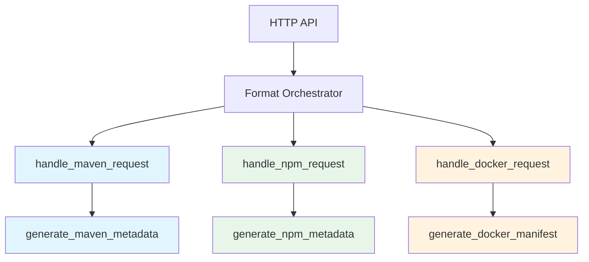

# Resumen de Reestructuración VSA - Distribution Crate

## 📊 Estado Actual

### ✅ Logros Completados
1. **Análisis y Planificación**: Identificados los problemas de arquitectura actual
2. **Documentación Completa**: Plan detallado y guía de implementación creados
3. **Diseño VSA**: Arquitectura pura con Clean Architecture por feature definida

### ❌ Problemas Identificados en Implementación Actual

1. **Servicios Monolíticos**: `MavenFormatHandler`, `NpmFormatHandler`, `DockerFormatHandler` contienen toda la lógica
2. **Interfaces Compartidas**: Todos usan el mismo `FormatHandler` trait genérico
3. **Sin Segregación de Interfaces**: Violación del Principio de Segregación de Interfaces (ISP)
4. **Acoplamiento Fuerte**: Features dependen de implementaciones concretas
5. **Dominio Contaminado**: Lógica de negocio mezclada con detalles de infraestructura

## 🎯 Objetivo de la Reestructuración

Migrar a una arquitectura **pura VSA** donde:
- Cada feature tiene sus **PROPIOS puertos** (interfaces segregadas)
- **Sin dependencias entre features** 
- **Dominio puro** sin async/await ni dependencias de infraestructura
- **Use cases específicos** por cada operación
- **Tests aislados** por feature con mocks específicos

## 🏗️ Nueva Arquitectura VSA

### Principios Fundamentales

1. **🔒 Independencia Total**: Cada feature es un módulo aislado
2. **🎯 Puertos Segregados**: Interfaces específicas por feature, no genéricas
3. **🏛️ Dominio Puro**: Lógica de negocio sin dependencias externas
4. **🧪 Testabilidad**: Mocks específicos por feature
5. **📈 Escalabilidad**: Nuevos features sin afectar existentes

### Features a Implementar



### Estructura por Feature

```
features/handle_maven_request/
├── mod.rs              # Exportaciones públicas
├── dto.rs              # DTOs específicos
├── ports.rs            # Interfaces SEGREGADAS
├── use_case.rs         # Lógica del caso de uso
├── adapter.rs          # Implementaciones concretas
├── api.rs              # Punto de entrada HTTP
└── di.rs               # Configuración DI
```

## 📋 Features Específicos

### 1. `handle_maven_request`
**Puertos segregados:**
```rust
trait MavenArtifactReader {
    async fn read_artifact(&self, coordinates: &MavenCoordinates) -> Result<Vec<u8>, MavenReadError>;
}

trait MavenArtifactWriter {
    async fn write_artifact(&self, coordinates: &MavenCoordinates, content: &[u8]) -> Result<(), MavenWriteError>;
}
```

### 2. `handle_npm_request` 
**Puertos COMPLETAMENTE DIFERENTES:**
```rust
trait NpmPackageReader {
    async fn read_package(&self, name: &str) -> Result<NpmPackage, NpmReadError>;
    async fn read_tarball(&self, name: &str, version: &str) -> Result<Vec<u8>, NpmReadError>;
}
```

### 3. `handle_docker_request`
**Puertos específicos Docker:**
```rust
trait DockerManifestReader {
    async fn read_manifest(&self, name: &str, reference: &str) -> Result<DockerManifest, DockerReadError>;
}

trait DockerBlobReader {
    async fn read_blob(&self, name: &str, digest: &str) -> Result<Vec<u8>, DockerReadError>;
}
```

## 🚀 Plan de Implementación

### Fase 1: Preparación (1-2 días)
- [ ] Crear estructura de directorios VSA
- [ ] Configurar Cargo.toml con dependencias necesarias
- [ ] Preparar sistema de build para compilación incremental

### Fase 2: Dominio Puro (2-3 días)
- [ ] Migrar `MavenCoordinates` a dominio puro
- [ ] Migrar `NpmPackage` a dominio puro  
- [ ] Migrar `DockerManifest` a dominio puro
- [ ] Crear tests unitarios para dominio

### Fase 3: Features Core (5-7 días)
- [ ] Implementar `handle_maven_request` completo
- [ ] Implementar `handle_npm_request` completo
- [ ] Implementar `handle_docker_request` completo
- [ ] Tests unitarios por feature con mocks específicos

### Fase 4: Features Metadata (3-4 días)
- [ ] Implementar `generate_maven_metadata`
- [ ] Implementar `generate_npm_metadata`
- [ ] Implementar `generate_docker_manifest`
- [ ] Tests unitarios para generadores

### Fase 5: Application Layer (2-3 días)
- [ ] Crear `FormatOrchestrator`
- [ ] Implementar routing entre features
- [ ] Tests de integración entre features

### Fase 6: Infrastructure & API (3-4 días)
- [ ] Implementar adaptadores S3/MinIO
- [ ] Crear endpoints HTTP específicos
- [ ] Tests E2E con clientes reales (Maven CLI, npm CLI, Docker CLI)

### Fase 7: Validación & Optimización (2-3 días)
- [ ] Verificar independencia de features
- [ ] Optimizar compilación incremental
- [ ] Documentación final y ejemplos

## 📊 Métricas de Éxito

### ✅ Criterios de Aceptación

1. **Independencia de Features**
   ```bash
   # Cada feature debe compilar solo
   cargo check -p distribution --features handle_maven_request
   cargo check -p distribution --features handle_npm_request  
   cargo check -p distribution --features handle_docker_request
   ```

2. **Sin Dependencias Cruzadas**
   ```bash
   # Buscar imports entre features (debe estar vacío)
   grep -r "use crate::features::" src/features/ | grep -v "self"
   ```

3. **Tests Aislados**
   ```bash
   # Tests unitarios por feature
   cargo test -p distribution handle_maven_request
   cargo test -p distribution handle_npm_request
   cargo test -p distribution handle_docker_request
   ```

4. **Dominio Puro**
   ```bash
   # No debe haber async en domain
   grep -r "async" src/domain/ || echo "✅ Dominio puro"
   ```

### 📈 KPIs de Calidad

- **Cobertura de Tests**: >90% por feature
- **Tiempo de Compilación**: <30s para cambios en un feature
- **Acoplamiento**: 0 dependencias entre features
- **Complejidad Ciclomática**: <10 por función
- **Duplicación de Código**: <5% entre features

## 🎯 Beneficios Esperados

### 1. **Desarrollo Paralelo**
- Equipos pueden trabajar en features diferentes simultáneamente
- Sin conflictos de merge entre features
- Code reviews enfocados por feature

### 2. **Deployment Independiente**
- Features pueden deployarse separadamente
- Rollback granular por feature
- Menos riesgo en releases

### 3. **Mantenimiento Simplificado**
- Bugs aislados a features específicos
- Refactoring localizado sin efectos colaterales
- Nueva funcionalidad sin tocar features existentes

### 4. **Testing Mejorado**
- Tests rápidos y enfocados
- Mocks específicos por feature
- Debugging simplificado

### 5. **Escalabilidad**
- Nuevos formatos sin modificar existentes
- Features opcionales fácilmente deshabilitables
- Microservicios potenciales en el futuro

## 🔍 Validación de Implementación

### Checklist de VSA Pura

- [ ] Cada feature tiene su propio `Cargo.toml` o feature flag
- [ ] Sin imports cruzados entre features
- [ ] Interfaces segregadas por feature (no compartidas)
- [ ] Dominio sin dependencias de infraestructura
- [ ] Use cases con lógica específica del caso de uso
- [ ] Tests unitarios por feature con mocks propios
- [ ] Adaptadores de infraestructura separados
- [ ] Application layer sin lógica de negocio

### Ejemplo de Validación Final

```rust
// ✅ Código VSA puro - cada feature es independiente
pub mod handle_maven_request {
    pub use self::api::MavenRequestApi;
    pub use self::dto::{MavenGetArtifactRequest, MavenGetArtifactResponse};
    // Solo exportar lo necesario del feature
}

pub mod handle_npm_request {
    pub use self::api::NpmRequestApi;
    pub use self::dto::{NpmGetPackageRequest, NpmGetPackageResponse};
    // Puertos completamente diferentes a Maven
}
```

## 📚 Documentación Relacionada

1. **[distribution-vsa-restructuring-plan.md](distribution-vsa-restructuring-plan.md)** - Plan detallado de arquitectura
2. **[distribution-vsa-implementation-guide.md](distribution-vsa-implementation-guide.md)** - Guía paso a paso de implementación
3. **[architecture.md](../architecture.md)** - Arquitectura general del proyecto
4. **[testing-organization.md](../testing-organization.md)** - Estrategia de testing

## 🎉 Conclusión

Esta reestructuración transformará el código actual en una arquitectura VSA pura que:
- **Respeta los principios SOLID** completamente
- **Facilita el desarrollo paralelo** por equipos
- **Mejora la testabilidad** con mocks específicos
- **Permite escalabilidad** sin límites
- **Reduce el acoplamiento** a cero entre features

La implementación seguirá los principios de Clean Architecture con segregación estricta de interfaces, garantizando que cada feature sea un módulo independiente y cohesivo.