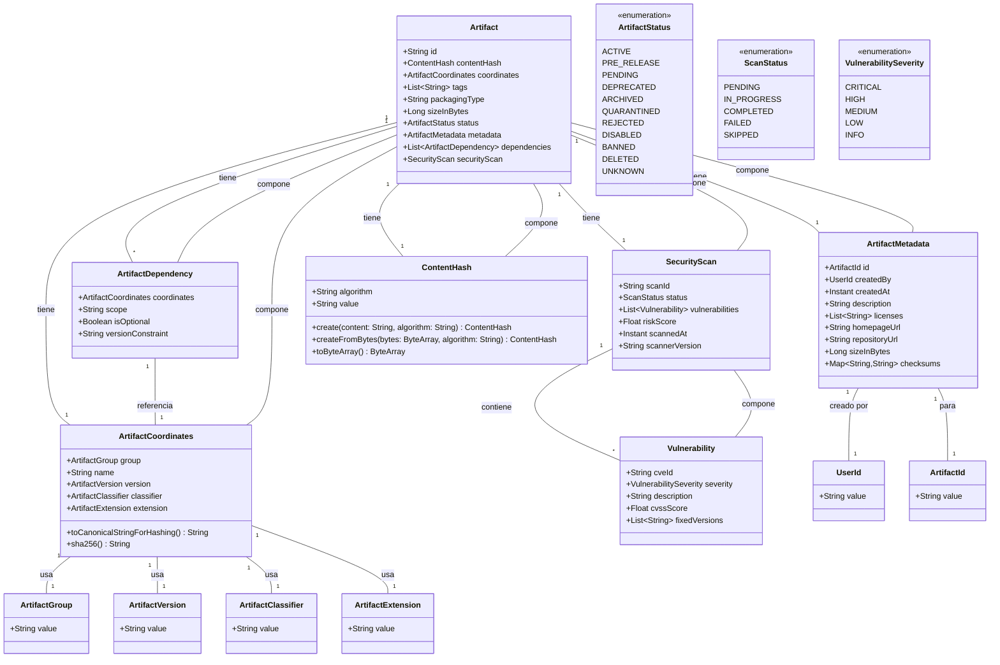
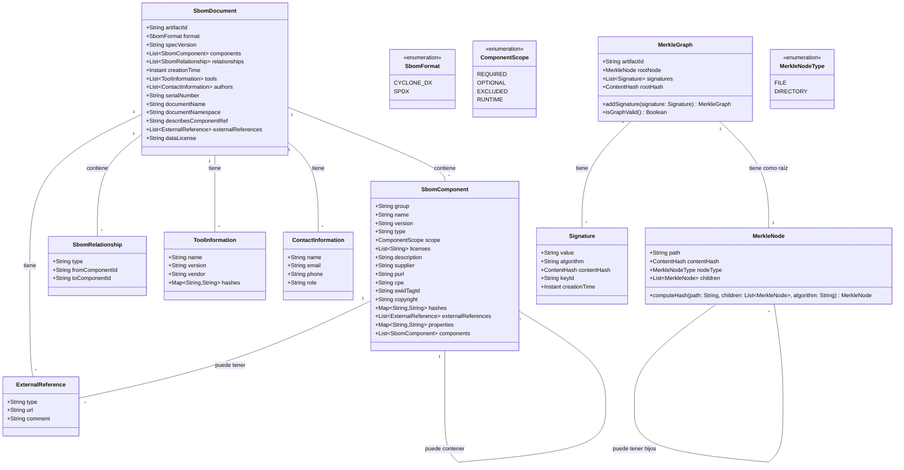

## **6. Modelo de Datos de Dominio**

### **6.1. Diagramas de Clases (Mermaid)**

#### **Diagrama Principal de Artefactos**

```mermaid
classDiagram
    %% Entidades principales
    class Artifact {
        +String id
        +ContentHash contentHash
        +ArtifactCoordinates coordinates
        +List~String~ tags
        +String packagingType
        +Long sizeInBytes
        +ArtifactStatus status
        +ArtifactMetadata metadata
        +List~ArtifactDependency~ dependencies
        +SecurityScan securityScan
    }

    class ArtifactCoordinates {
        +ArtifactGroup group
        +String name
        +ArtifactVersion version
        +ArtifactClassifier classifier
        +ArtifactExtension extension
        +toCanonicalStringForHashing() String
        +sha256() String
    }

    class ArtifactMetadata {
        +ArtifactId id
        +UserId createdBy
        +Instant createdAt
        +String description
        +List~String~ licenses
        +String homepageUrl
        +String repositoryUrl
        +Long sizeInBytes
        +Map~String,String~ checksums
    }

    class ArtifactDependency {
        +ArtifactCoordinates coordinates
        +String scope
        +Boolean isOptional
        +String versionConstraint
    }

    class SecurityScan {
        +String scanId
        +ScanStatus status
        +List~Vulnerability~ vulnerabilities
        +Float riskScore
        +Instant scannedAt
        +String scannerVersion
    }

    class Vulnerability {
        +String cveId
        +VulnerabilitySeverity severity
        +String description
        +Float cvssScore
        +List~String~ fixedVersions
    }

    %% Value Objects
    class ArtifactGroup {
        +String value
    }

    class ArtifactVersion {
        +String value
    }

    class ArtifactClassifier {
        +String value
    }

    class ArtifactExtension {
        +String value
    }

    class ContentHash {
        +String algorithm
        +String value
        +create(content: String, algorithm: String) ContentHash
        +createFromBytes(bytes: ByteArray, algorithm: String) ContentHash
        +toByteArray() ByteArray
    }

    class UserId {
        +String value
    }

    class ArtifactId {
        +String value
    }

    %% Enumeraciones
    class ArtifactStatus {
        <<enumeration>>
        ACTIVE
        PRE_RELEASE
        PENDING
        DEPRECATED
        ARCHIVED
        QUARANTINED
        REJECTED
        DISABLED
        BANNED
        DELETED
        UNKNOWN
    }

    class ScanStatus {
        <<enumeration>>
        PENDING
        IN_PROGRESS
        COMPLETED
        FAILED
        SKIPPED
    }

    class VulnerabilitySeverity {
        <<enumeration>>
        CRITICAL
        HIGH
        MEDIUM
        LOW
        INFO
    }

    %% Relaciones entre clases
    Artifact "1" -- "1" ArtifactCoordinates : tiene
    Artifact "1" -- "1" ArtifactMetadata : tiene
    Artifact "1" -- "1" ContentHash : tiene
    Artifact "1" -- "*" ArtifactDependency : tiene
    Artifact "1" -- "1" SecurityScan : tiene
    SecurityScan "1" -- "*" Vulnerability : contiene
  
    ArtifactCoordinates "1" -- "1" ArtifactGroup : usa
    ArtifactCoordinates "1" -- "1" ArtifactVersion : usa
    ArtifactCoordinates "1" -- "1" ArtifactClassifier : usa
    ArtifactCoordinates "1" -- "1" ArtifactExtension : usa
  
    ArtifactMetadata "1" -- "1" UserId : creado por
    ArtifactMetadata "1" -- "1" ArtifactId : para
  
    ArtifactDependency "1" -- "1" ArtifactCoordinates : referencia
  
    %% Relaciones de composición/agregación
    ArtifactCoordinates -- Artifact : compone
    ArtifactMetadata -- Artifact : compone
    ContentHash -- Artifact : compone
    ArtifactDependency -- Artifact : compone
    SecurityScan -- Artifact : compone
    Vulnerability -- SecurityScan : compone
```

## Diagrama Adicional para SBOM y Merkle Tree

```mermaid
classDiagram
    %% Entidades de SBOM
    class SbomDocument {
        +String artifactId
        +SbomFormat format
        +String specVersion
        +List~SbomComponent~ components
        +List~SbomRelationship~ relationships
        +Instant creationTime
        +List~ToolInformation~ tools
        +List~ContactInformation~ authors
        +String serialNumber
        +String documentName
        +String documentNamespace
        +String describesComponentRef
        +List~ExternalReference~ externalReferences
        +String dataLicense
    }

    class SbomComponent {
        +String group
        +String name
        +String version
        +String type
        +ComponentScope scope
        +List~String~ licenses
        +String description
        +String supplier
        +String purl
        +String cpe
        +String swidTagId
        +String copyright
        +Map~String,String~ hashes
        +List~ExternalReference~ externalReferences
        +Map~String,String~ properties
        +List~SbomComponent~ components
    }

    class SbomRelationship {
        +String type
        +String fromComponentId
        +String toComponentId
    }

    class ExternalReference {
        +String type
        +String url
        +String comment
    }

    class ToolInformation {
        +String name
        +String version
        +String vendor
        +Map~String,String~ hashes
    }

    class ContactInformation {
        +String name
        +String email
        +String phone
        +String role
    }

    %% Enumeraciones SBOM
    class SbomFormat {
        <<enumeration>>
        CYCLONE_DX
        SPDX
    }

    class ComponentScope {
        <<enumeration>>
        REQUIRED
        OPTIONAL
        EXCLUDED
        RUNTIME
    }

    %% Entidades de Merkle Tree
    class MerkleGraph {
        +String artifactId
        +MerkleNode rootNode
        +List~Signature~ signatures
        +ContentHash rootHash
        +addSignature(signature: Signature) MerkleGraph
        +isGraphValid() Boolean
    }

    class MerkleNode {
        +String path
        +ContentHash contentHash
        +MerkleNodeType nodeType
        +List~MerkleNode~ children
        +computeHash(path: String, children: List~MerkleNode~, algorithm: String) MerkleNode
    }

    class Signature {
        +String value
        +String algorithm
        +ContentHash contentHash
        +String keyId
        +Instant creationTime
    }

    class MerkleNodeType {
        <<enumeration>>
        FILE
        DIRECTORY
    }

    %% Relaciones entre clases
    SbomDocument "1" -- "*" SbomComponent : contiene
    SbomDocument "1" -- "*" SbomRelationship : contiene
    SbomDocument "1" -- "*" ExternalReference : tiene
    SbomDocument "1" -- "*" ToolInformation : tiene
    SbomDocument "1" -- "*" ContactInformation : tiene
  
    SbomComponent "1" -- "*" SbomComponent : puede contener
    SbomComponent "1" -- "*" ExternalReference : puede tener
  
    MerkleGraph "1" -- "1" MerkleNode : tiene como raíz
    MerkleGraph "1" -- "*" Signature : tiene
    MerkleNode "1" -- "*" MerkleNode : puede tener hijos
```
