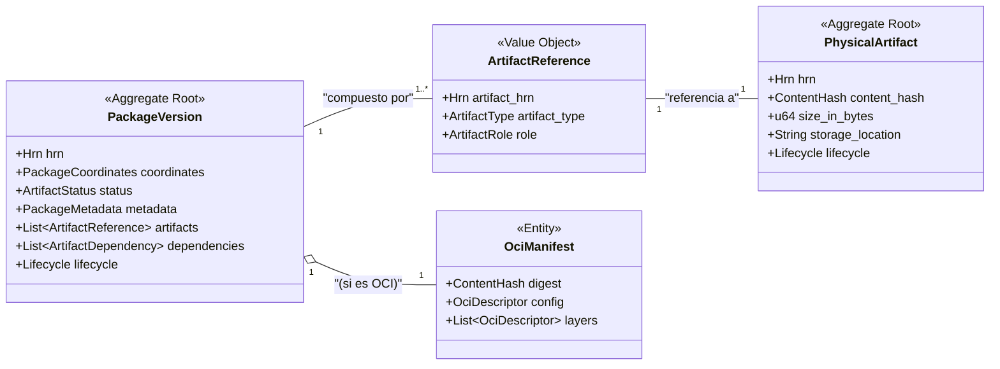

# Especificación Completa del Modelo de Datos: Crate `artifact`

**Versión:** 6.0
**Crate:** `crates/artifact`
**Contexto de Dominio:** Ciclo de Vida del Artefacto

### 1\. Propósito y Responsabilidades

El crate `artifact` es el Bounded Context central del sistema. Su responsabilidad principal es gestionar el ciclo de vida completo de los paquetes de software y sus ficheros físicos correspondientes.

Sus responsabilidades clave son:

* Gestionar el Agregado Raíz `PackageVersion`, que representa una versión única y publicada de un paquete de software.
* Modelar la relación entre un `PackageVersion` (la entidad lógica) y uno o más `PhysicalArtifact` (los ficheros binarios inmutables), permitiendo la deduplicación de almacenamiento.
* Definir y gestionar los metadatos, dependencias, etiquetas y el estado (`Active`, `Quarantined`, etc.) de cada `PackageVersion`.
* Proporcionar un modelo de dominio detallado y fiel al estándar para artefactos OCI (contenedores Docker).
* Publicar los eventos de dominio cruciales (ej. `PackageVersionPublished`) que inician los flujos de trabajo en otros contextos como `security` y `supply-chain`.

### 2\. Diagrama UML del Contexto



### 3\. Estructura de Ficheros del Dominio

```
crates/artifact/src/domain/
├── mod.rs
├── package_version.rs
├── physical_artifact.rs
├── oci.rs
└── events.rs
```

### 4\. Definiciones Completas en `rust`

#### 4.1. Módulo de Versión de Paquete (`domain/package_version.rs`)

```rust
// crates/artifact/src/domain/package_version.rs

use crate::shared::hrn::{Hrn, OrganizationId, RepositoryId, UserId};
use crate::shared::lifecycle::Lifecycle;
use crate::shared::models::{PackageCoordinates, ArtifactReference};
use crate::shared::enums::{ArtifactStatus, ArtifactRole};
use crate::shared::security::CedarResource;
use serde::{Serialize, Deserialize};
use time::OffsetDateTime;
use cedar_policy::{EntityUid, Expr};
use std::collections::HashMap;

/// La representación de una única versión de un paquete publicado en un repositorio.
/// Es el Agregado Raíz principal de este Bounded Context.
#[derive(Debug, Clone, Serialize, Deserialize)]
pub struct PackageVersion {
    /// El HRN único y global de esta versión del paquete.
    /// Formato: `hrn:hodei:artifact:<region>:<org_id>:package-version/<repo_name>/<path>`
    pub hrn: Hrn,

    /// HRN de la organización propietaria (denormalizado para búsquedas y políticas rápidas).
    pub organization_hrn: OrganizationId,

    /// HRN del repositorio que contiene esta versión del paquete.
    pub repository_hrn: RepositoryId,

    /// Las coordenadas que identifican unívocamente al paquete en su ecosistema.
    pub coordinates: PackageCoordinates,

    /// El estado actual del ciclo de vida del artefacto.
    pub status: ArtifactStatus,

    /// Metadatos descriptivos y de uso.
    pub metadata: PackageMetadata,

    /// Lista de referencias a los ficheros físicos que componen este paquete.
    pub artifacts: Vec<ArtifactReference>,

    /// Lista de las dependencias directas de este paquete.
    pub dependencies: Vec<ArtifactDependency>,

    /// Etiquetas de texto libre para clasificación y búsqueda.
    pub tags: Vec<String>,

    /// Información de auditoría y ciclo de vida.
    pub lifecycle: Lifecycle,

    /// Si este artefacto es de tipo OCI, HRN al `PhysicalArtifact` que contiene el manifiesto.
    pub oci_manifest_hrn: Option<Hrn>,
}

impl PackageVersion {
    /// Pone en cuarentena un artefacto si está en un estado válido.
    /// Este método encapsula la lógica de negocio para la transición de estado.
    pub fn quarantine(&mut self, reason: String, by: Hrn, at: OffsetDateTime) -> Result<(), DomainError> {
        // ... Lógica para una transición de estado segura
    }
    // ... otros métodos de negocio (deprecate, ban, etc.)
}

/// Metadatos detallados de una `PackageVersion`.
#[derive(Debug, Clone, Serialize, Deserialize)]
pub struct PackageMetadata {
    pub description: Option<String>,
    pub licenses: Vec<String>, // SPDX license identifiers
    pub authors: Vec<String>,
    pub project_url: Option<String>,
    pub repository_url: Option<String>,
    pub last_downloaded_at: Option<OffsetDateTime>,
    pub download_count: u64,
    /// Metadatos personalizados para extensibilidad.
    pub custom_properties: HashMap<String, String>,
}

/// Una dependencia de software de este `PackageVersion`.
#[derive(Debug, Clone, Serialize, Deserialize)]
pub struct ArtifactDependency {
    pub coordinates: PackageCoordinates,
    pub scope: String, // "compile", "runtime", "test", etc.
    pub version_constraint: String, // ej. "^1.2.3", "~4.5.0"
    pub is_optional: bool,
}

/// El estado del artefacto, con datos contextuales.
#[derive(Debug, Clone, Serialize, Deserialize, PartialEq)]
pub enum ArtifactStatus {
    Active,
    Quarantined { reason: String, since: OffsetDateTime },
    Banned { reason: String, since: OffsetDateTime },
    Deprecated { successor_hrn: Option<Hrn> },
}

/// Implementación para que `PackageVersion` pueda ser un recurso en políticas Cedar.
impl CedarResource for PackageVersion {
    fn cedar_entity_uid(&self) -> EntityUid { /* ... */ }

    fn cedar_attributes(&self) -> HashMap<String, Expr> {
        let mut attrs = HashMap::new();
        attrs.insert("status".to_string(), Expr::val(self.status.as_ref()));
        let tags_expr = self.tags.iter().map(|t| Expr::val(t.clone())).collect::<Vec<_>>();
        attrs.insert("tags".to_string(), Expr::set(tags_expr));
        // ... otros atributos como licencias, etc.
        attrs
    }

    fn cedar_parents(&self) -> Vec<EntityUid> {
        vec![
            EntityUid::from_str(self.repository_hrn.as_str()).unwrap(),
            EntityUid::from_str(self.organization_hrn.as_str()).unwrap(),
        ]
    }
}
```

#### 4.2. Módulo de Artefacto Físico (`domain/physical_artifact.rs`)

```rust
// crates/artifact/src/domain/physical_artifact.rs

use crate::shared::hrn::{Hrn, OrganizationId};
use crate::shared::lifecycle::Lifecycle;
use crate::shared::models::ContentHash;
use crate::shared::enums::HashAlgorithm;
use serde::{Serialize, Deserialize};
use std::collections::HashMap;

/// Representa un fichero físico, inmutable, almacenado en el backend de almacenamiento.
/// Su identidad es su `content_hash`. La misma instancia puede ser referenciada
/// por múltiples `PackageVersion`, permitiendo la deduplicación.
/// Es un Agregado Raíz.
#[derive(Debug, Clone, Serialize, Deserialize)]
pub struct PhysicalArtifact {
    /// HRN único para este blob físico.
    /// Formato: `hrn:hodei:artifact:<region>:<org_id>:physical-artifact/<hash_alg>-<hash_value>`
    pub hrn: Hrn,

    /// Organización que subió originalmente este artefacto.
    pub organization_hrn: OrganizationId,

    /// El hash del contenido, que actúa como su identificador único.
    pub content_hash: ContentHash,

    /// Tamaño del fichero en bytes.
    pub size_in_bytes: u64,

    /// Mapa de otros checksums calculados para el fichero (ej. MD5, SHA-1).
    pub checksums: HashMap<HashAlgorithm, String>,

    /// Ubicación en el backend de almacenamiento (ej. `s3://my-bucket/cas/sha256/abc...`).
    pub storage_location: String,
    
    /// Información de auditoría y ciclo de vida (útil para la recolección de basura).
    pub lifecycle: Lifecycle,
}
```

#### 4.3. Módulo OCI (`domain/oci.rs`)

```rust
// crates/artifact/src/domain/oci.rs

use crate::shared::models::ContentHash;
use serde::{Serialize, Deserialize};
use std::collections::HashMap;

/// Representa un manifiesto de imagen OCI, que es la raíz de una imagen de contenedor.
/// El manifiesto en sí es un `PhysicalArtifact`.
#[derive(Debug, Clone, Serialize, Deserialize)]
pub struct OciManifest {
    /// El digest del manifiesto.
    pub digest: ContentHash,
    /// El tipo de media, ej. "application/vnd.oci.image.manifest.v1+json".
    pub media_type: String,
    /// Descriptor que apunta al fichero de configuración de la imagen.
    pub config: OciDescriptor,
    /// Lista ordenada de descriptores que apuntan a las capas de la imagen.
    pub layers: Vec<OciDescriptor>,
    /// Anotaciones opcionales.
    pub annotations: Option<HashMap<String, String>>,
}

/// Un descriptor OCI, usado para `config` y `layers`. Apunta a otro `PhysicalArtifact`
/// a través de su `digest`.
#[derive(Debug, Clone, Serialize, Deserialize)]
pub struct OciDescriptor {
    pub media_type: String,
    pub digest: ContentHash,
    pub size: u64,
    pub annotations: Option<HashMap<String, String>>,
}

/// Representa el fichero de configuración de una imagen OCI.
#[derive(Debug, Clone, Serialize, Deserialize)]
pub struct OciImageConfig {
    pub architecture: String,
    pub os: String,
    /// Configuración del contenedor en sí.
    pub config: OciContainerConfig,
    /// Historial de cómo se construyó cada capa.
    pub history: Vec<OciHistory>,
    /// Sistema de ficheros raíz.
    pub rootfs: OciRootFs,
}

#[derive(Debug, Clone, Serialize, Deserialize)]
pub struct OciContainerConfig {
    pub user: Option<String>,
    pub exposed_ports: Option<HashMap<String, serde_json::Value>>,
    pub env: Option<Vec<String>>,
    pub entrypoint: Option<Vec<String>>,
    pub cmd: Option<Vec<String>>,
    pub working_dir: Option<String>,
    pub labels: Option<HashMap<String, String>>,
}
// ... otras structs OCI: OciHistory, OciRootFs, etc.
```

#### 4.4. Módulo de Eventos (`domain/events.rs`)

```rust
// crates/artifact/src/domain/events.rs

use crate::shared::hrn::{Hrn, RepositoryId, UserId};
use crate::shared::models::{PackageCoordinates, ArtifactReference};
use crate::domain::package_version::ArtifactStatus;
use serde::{Serialize, Deserialize};
use time::OffsetDateTime;

/// Eventos de dominio publicados por el contexto `artifact`.
#[derive(Debug, Clone, Serialize, Deserialize)]
pub enum ArtifactEvent {
  /// Se ha publicado una nueva versión de un paquete. Este es el evento principal.
  PackageVersionPublished(PackageVersionPublished),
  /// Se ha eliminado una versión de un paquete.
  PackageVersionDeleted(PackageVersionDeleted),
  /// El estado de una versión de paquete ha cambiado (ej. a Quarantined).
  PackageVersionStatusChanged(PackageVersionStatusChanged),
}

#[derive(Debug, Clone, Serialize, Deserialize)]
pub struct PackageVersionPublished {
  pub hrn: Hrn,
  pub repository_hrn: RepositoryId,
  pub coordinates: PackageCoordinates,
  /// Lista de todos los ficheros físicos que componen este paquete.
  pub artifacts: Vec<ArtifactReference>,
  pub publisher_hrn: UserId,
  pub at: OffsetDateTime,
}

#[derive(Debug, Clone, Serialize, Deserialize)]
pub struct PackageVersionDeleted {
  pub hrn: Hrn,
  pub deleted_by: Hrn,
  pub at: OffsetDateTime,
}

#[derive(Debug, Clone, Serialize, Deserialize)]
pub struct PackageVersionStatusChanged {
  pub hrn: Hrn,
  pub old_status: ArtifactStatus,
  pub new_status: ArtifactStatus,
  pub changed_by: Hrn,
  pub at: OffsetDateTime,
}
```