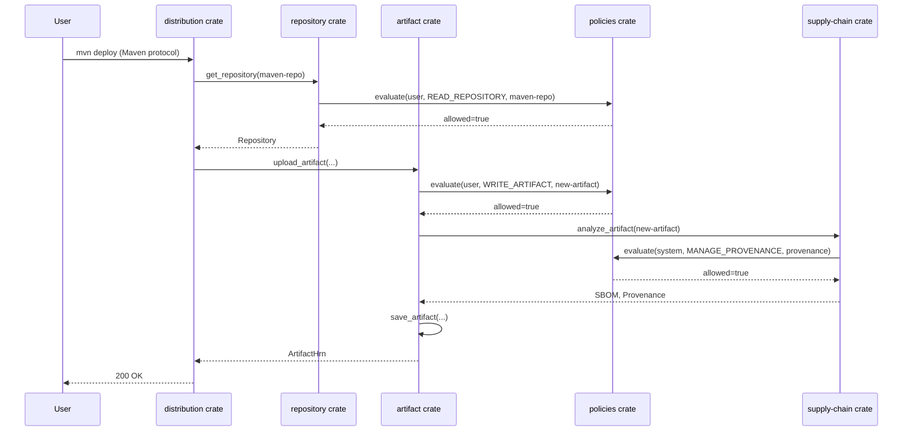

# Asignación del Modelo de Dominio a Bounded Contexts

He analizado el modelo de dominio extendido y lo he asignado estratégicamente a cada bounded context (crate) siguiendo los principios de Domain-Driven Design y nuestra estructura multi-crate. Esta asignación asegura que cada crate tenga responsabilidades claras, sin superposición innecesaria y con acoplamiento mínimo.

## 1. artifact crate - Gestión Básica de Artefactos

**Responsabilidad:** Gestión fundamental del ciclo de vida de los artefactos, independiente de protocolos y políticas.

**Entidades y Contratos Asignados:**

- `PhysicalArtifact` - El artefacto físico (binario)
- `PhysicalArtifactId` - Identificador HRN para artefactos físicos
- `ContentHash` - Hash criptográfico del contenido
- `Sbom` - Software Bill of Materials
- `Provenance` - Información de procedencia
- `Signature` - Firma digital del artefacto
- `PublicKey` - Claves públicas para verificación
- `Artifact` - El artefacto lógico (metadatos)
- `ArtifactId` - Identificador HRN para artefactos lógicos
- `ArtifactCoordinates` - Coordenadas de identificación (nombre, versión, etc.)
- `ArtifactMetadata` (y sus subtipos) - Metadatos específicos por protocolo
- `ArtifactDependency` - Dependencias de artefactos

**Relaciones Clave:**

- `PhysicalArtifact` es la entidad central que almacena el binario
- `Artifact` representa la vista lógica del artefacto con sus metadatos
- `Sbom`, `Provenance` y `Signature` son componentes críticos para la integridad

**Por qué pertenecen aquí:**
Estas entidades forman el núcleo de lo que es un artefacto en el sistema, sin dependencia de protocolos específicos, políticas o estructura organizativa. Son responsabilidad exclusiva de este bounded context.

## 2. distribution crate - Implementación de Protocolos

**Responsabilidad:** Implementación de protocolos específicos que utilizan el core de artefactos.

**Entidades Asignadas:**

- `MavenArtifactMetadata` - Metadatos específicos para Maven
- `NpmArtifactMetadata` - Metadatos específicos para npm
- `DockerArtifactMetadata` - Metadatos específicos para Docker
- `ArtifactType` (enumeración) - Tipos de artefactos soportados

**Relaciones Clave:**

- Heredan de `ArtifactMetadata` (del crate `artifact`)
- Se utilizan en la extracción y generación de metadatos protocolo-específicos

**Por qué pertenecen aquí:**
Estas entidades contienen la lógica específica para cada protocolo (Maven, npm, Docker), pero no manejan el almacenamiento físico (eso es responsabilidad de `artifact`). Este crate implementa cómo se interpretan y manejan los metadatos específicos de cada ecosistema.

## 3. iam crate - Gestión de Identidad y Autenticación

**Responsabilidad:** Gestión de identidad y autenticación, sin conocimiento de políticas específicas.

**Entidades Asignadas:**

- `User` - Entidad de usuario
- `UserId` - Identificador HRN para usuarios
- `ServiceAccount` - Cuentas de servicio
- `ApiKey` - Claves de API
- `Group` - Grupos de usuarios

**Relaciones Clave:**

- `User` y `ServiceAccount` implementan `HodeiResource`
- `ApiKey` está asociado a un `User`
- `Group` contiene múltiples `User`

**Por qué pertenecen aquí:**
Estas entidades forman el núcleo del sistema de identidad, gestionando quién es quién en el sistema. No manejan autorización (eso es responsabilidad de `policies`), solo identidad y autenticación.

## 4. policies crate - Motor de Políticas

**Responsabilidad:** Evaluación y gestión de políticas Cedar, sin conocimiento de la estructura organizativa.

**Entidades Asignadas:**

- `Policy` - Política Cedar
- `PolicyId` - Identificador HRN para políticas
- `PolicyVersion` - Versiones de políticas
- `PolicyDecision` - Resultado de evaluación de políticas
- `Obligation` e `AuditObligation` - Obligaciones de políticas
- `PolicyEvaluationContext` - Contexto para evaluación de políticas
- `Action` (enumeración) - Acciones definidas en el sistema
- `PolicyEvaluator` - Servicio de evaluación

**Relaciones Clave:**

- Todas las entidades implementan o utilizan `HodeiResource`
- `PolicyEvaluationContext` conecta `Principal` (de `iam`) con `Resource` (de otros crates)
- `Action` define todas las operaciones posibles en el sistema

**Por qué pertenecen aquí:**
Este crate centraliza toda la lógica de políticas Cedar, proporcionando un motor de evaluación que puede ser utilizado por todos los demás bounded contexts. No conoce la estructura organizativa (eso es responsabilidad de `organization`), solo evalúa políticas.

## 5. organization crate - Gestión Organizativa

**Responsabilidad:** Estructura jerárquica de organizaciones y aplicación de políticas a nivel organizativo.

**Responsabilidad:** Estructura jerárquica de organizaciones y aplicación de políticas a nivel organizativo.

**Entidades Asignadas:**

- `Organization` - Entidad de organización
- `OrganizationId` - Identificador HRN para organizaciones
- `OrganizationSettings` - Configuración de la organización
- `Team` - Equipos dentro de una organización
- `TeamId` - Identificador HRN para equipos
- `Membership` - Membresías de usuarios en organizaciones
- `ServiceControlPolicy` - Políticas de control de servicio (SCPs)

**Relaciones Clave:**

- `Organization` es el recurso raíz para la jerarquía
- `Team` pertenece a una `Organization`
- `Membership` conecta `User` con `Organization` y opcionalmente con `Team`
- `ServiceControlPolicy` se aplica a niveles organizativos

**Por qué pertenecen aquí:**
Estas entidades gestionan la estructura organizativa del sistema, incluyendo la jerarquía y cómo se aplican las políticas a diferentes niveles. Es el bounded context que da contexto a todas las demás entidades.

## 6. repository crate - Gestión de Repositorios

**Responsabilidad:** Gestión de repositorios y su relación con artefactos.

**Entidades Asignadas:**

- `Repository` - Repositorio de artefactos
- `RepositoryId` - Identificador HRN para repositorios
- `RepositoryType` - Tipos de repositorios (HOSTED, PROXY, GROUP)
- `DeploymentPolicy` - Políticas de despliegue
- `CleanupPolicy` - Políticas de limpieza

**Relaciones Clave:**

- `Repository` pertenece a una `Organization`
- `Repository` contiene múltiples `Artifact`
- `RepositoryType` define el comportamiento del repositorio

**Por qué pertenecen aquí:**
Estas entidades gestionan cómo se organizan los artefactos en repositorios, incluyendo sus configuraciones y políticas específicas. Es el puente entre la estructura organizativa y los artefactos.

## 7. supply-chain crate - Seguridad de Cadena de Suministro

**Responsabilidad:** Seguridad integral de la cadena de suministro.

**Entidades Asignadas:**

- `Attestation` - Atestaciones de artefactos
- `AttestationId` - Identificador HRN para atestaciones
- `ScanResult` - Resultados de escaneo de vulnerabilidades
- `ScanResultId` - Identificador HRN para resultados de escaneo
- `VulnerabilityDefinition` - Definiciones de vulnerabilidades
- `VulnerabilityOccurrence` - Ocurrencias de vulnerabilidades en artefactos
- `DependencyNode` - Nodos en el grafo de dependencias
- `Event` - Eventos de dominio relacionados con seguridad
- `EventStream` - Flujos de eventos
- `EventSubscription` - Suscripciones a eventos

**Relaciones Clave:**

- `Attestation` y `ScanResult` están asociados a `PhysicalArtifact`
- `VulnerabilityOccurrence` conecta `VulnerabilityDefinition` con `PhysicalArtifact`
- `DependencyNode` forma el grafo de dependencias de artefactos
- Los eventos gestionan la comunicación asincrónica para seguridad

**Por qué pertenecen aquí:**
Estas entidades gestionan todos los aspectos relacionados con la seguridad de la cadena de suministro, desde verificación de integridad hasta análisis de vulnerabilidades. Forman un bounded context cohesivo centrado en seguridad.

## 8. search crate - Motor de Búsqueda

**Responsabilidad:** Motor de búsqueda unificada para artefactos y metadatos.

**Entidades Asignadas:**

- `Metric` - Métricas de búsqueda
- `Dashboard` - Dashboards de análisis
- `DashboardId` - Identificador HRN para dashboards
- `Report` - Informes generados
- `Alert` - Alertas configuradas

**Relaciones Clave:**

- `Dashboard` pertenece a una `Organization`
- `Report` está asociado a un `User` que lo generó
- `Alert` monitorea métricas y condiciones específicas

**Por qué pertenecen aquí:**
Estas entidades gestionan la búsqueda, análisis y visualización de datos. Aunque algunas podrían parecer de monitoreo, están estrechamente relacionadas con la capacidad de buscar y analizar artefactos y su uso.

## 9. shared crate - Kernel Compartido

**Responsabilidad:** Elementos verdaderamente compartidos y estables.

**Entidades Asignadas:**

- `HodeiResource` (trait genérico) - Interfaz para recursos autorizables, con tipos genéricos `IdType` y `AttrType`. Se usa en todos los crates de dominio.
- `Hrn` - Sistema Hodei Resource Name
- `HrnError` - Errores de validación de HRN
- `AttributeValue` - Tipo de atributo flexible (String, Long, Boolean, Set, Record) compartido por todos los recursos y el contexto de políticas
- `StorageBackend` - Backends de almacenamiento
- `StorageBucket` - Buckets de almacenamiento
- `StoragePolicy` - Políticas de almacenamiento
- `Monitor` - Monitores de sistema
- `HealthCheck` - Checks de salud
- `LogStream` - Flujos de logs

**Relaciones Clave:**

- Todas las entidades implementan `HodeiResource<IdType=Hrn (o wrappers como RepositoryId), AttrType=AttributeValue>`
- `Hrn` es la base para todos los identificadores
- `StorageBackend` y `StorageBucket` son abstracciones de infraestructura
- `Monitor` y `HealthCheck` son para observabilidad

**Por qué pertenecen aquí:**
Estas entidades y contratos son verdaderamente compartidos y estables, sin pertenecer a un bounded context específico. Proporcionan fundamentos para toda la plataforma, como identificación (HRN), el contrato de recursos autorizables (HodeiResource) y el tipo de atributos (`AttributeValue`) independientemente del motor de políticas.

## Diagrama de Asignación de Entidades a Bounded Contexts

```mermaid
flowchart TD
    subgraph "artifact crate"
        A1[PhysicalArtifact]
        A2[PhysicalArtifactId]
        A3[ContentHash]
        A4[Sbom]
        A5[Provenance]
        A6[Signature]
        A7[PublicKey]
        A8[Artifact]
        A9[ArtifactId]
        A10[ArtifactCoordinates]
        A11[ArtifactMetadata]
        A12[ArtifactDependency]
    end
  
    subgraph "distribution crate"
        D1[MavenArtifactMetadata]
        D2[NpmArtifactMetadata]
        D3[DockerArtifactMetadata]
        D4[ArtifactType]
    end
  
    subgraph "iam crate"
        I1[User]
        I2[UserId]
        I3[ServiceAccount]
        I4[ApiKey]
        I5[Group]
    end
  
    subgraph "policies crate"
        P1[Policy]
        P2[PolicyId]
        P3[PolicyVersion]
        P4[PolicyDecision]
        P5[Obligation]
        P6[AuditObligation]
        P7[PolicyEvaluationContext]
        P8[Action]
        P9[PolicyEvaluator]
    end
  
    subgraph "organization crate"
        O1[Organization]
        O2[OrganizationId]
        O3[OrganizationSettings]
        O4[Team]
        O5[TeamId]
        O6[Membership]
        O7[ServiceControlPolicy]
    end
  
    subgraph "repository crate"
        R1[Repository]
        R2[RepositoryId]
        R3[RepositoryType]
        R4[DeploymentPolicy]
        R5[CleanupPolicy]
    end
  
    subgraph "supply-chain crate"
        S1[Attestation]
        S2[AttestationId]
        S3[ScanResult]
        S4[ScanResultId]
        S5[VulnerabilityDefinition]
        S6[VulnerabilityOccurrence]
        S7[DependencyNode]
        S8[Event]
        S9[EventStream]
        S10[EventSubscription]
    end
  
    subgraph "search crate"
        SE1[Metric]
        SE2[Dashboard]
        SE3[DashboardId]
        SE4[Report]
        SE5[Alert]
    end
  
    subgraph "shared crate"
        SH1[HodeiResource]
        SH2[Hrn]
        SH3[HrnError]
        SH4[StorageBackend]
        SH5[StorageBucket]
        SH6[StoragePolicy]
        SH7[Monitor]
        SH8[HealthCheck]
        SH9[LogStream]
    end
  
    classDef artifact fill:#4CAF50,stroke:#388E3C,color:white;
    classDef distribution fill:#2196F3,stroke:#1976D2,color:white;
    classDef iam fill:#9C27B0,stroke:#7B1FA2,color:white;
    classDef policies fill:#FF9800,stroke:#EF6C00;
    classDef organization fill:#E91E63,stroke:#C2185B,color:white;
    classDef repository fill:#3F51B5,stroke:#303F9F,color:white;
    classDef supplyChain fill:#009688,stroke:#00796B,color:white;
    classDef search fill:#FFEB3B,stroke:#FBC02D;
    classDef shared fill:#607D8B,stroke:#455A64,color:white;
  
    class artifact crate artifact;
    class distribution crate distribution;
    class iam crate iam;
    class policies crate policies;
    class organization crate organization;
    class repository crate repository;
    class supply-chain crate supplyChain;
    class search crate search;
    class shared crate shared;
  
    A1 -->|uses| SH2
    A2 -->|uses| SH2
    A8 -->|uses| SH2
    A9 -->|uses| SH2
  
    D1 -->|extends| A11
    D2 -->|extends| A11
    D3 -->|extends| A11
  
    I1 -->|uses| SH2
    I2 -->|uses| SH2
  
    P1 -->|uses| SH2
    P2 -->|uses| SH2
    P7 -->|uses| SH1
    P8 -->|used by| P7
  
    O1 -->|uses| SH2
    O2 -->|uses| SH2
    O4 -->|uses| SH2
    O5 -->|uses| SH2
    O6 -->|uses| SH2
  
    R1 -->|uses| SH2
    R2 -->|uses| SH2
  
    S1 -->|uses| SH2
    S2 -->|uses| SH2
    S3 -->|uses| SH2
    S4 -->|uses| SH2
    S8 -->|uses| SH2
    S9 -->|uses| SH2
    S10 -->|uses| SH2
  
    SE2 -->|uses| SH2
    SE3 -->|uses| SH2
  
    SH1 -.->|Implemented by| A1
    SH1 -.->|Implemented by| A8
    SH1 -.->|Implemented by| I1
    SH1 -.->|Implemented by| O1
    SH1 -.->|Implemented by| R1
    SH1 -.->|Implemented by| S1
    SH1 -.->|Implemented by| S3
```

## Reglas de Comunicación entre Bounded Contexts

### 1. Reglas de Dependencia

- **artifact** es el núcleo fundamental:

  - `distribution` depende de `artifact` para almacenamiento
  - `repository` depende de `artifact` para gestión de artefactos
  - `supply-chain` depende de `artifact` para metadatos
- **organization** es el contenedor jerárquico:

  - `policies` depende de `organization` para SCPs
  - `repository` depende de `organization` para cuotas
  - `supply-chain` depende de `organization` para políticas de seguridad
- **policies** es el motor de autorización:

  - Todos los bounded contexts dependen de `policies` para evaluación de acceso
  - `iam` proporciona la identidad al sistema de políticas
- **shared** es el único que puede ser dependido por todos:

  - Solo contiene elementos verdaderamente compartidos y estables
  - Evita acoplamiento directo entre bounded contexts

### 2. Patrones de Comunicación

**1. Comunicación a través de HRN (Recomendado)**

```rust
// Ejemplo: Obtener un repositorio desde el crate repository
let repo_hrn = RepositoryId::new(org_id, "maven-repo")?;
let repository = repository_service.get_repository(&repo_hrn).await?;
```

**2. Comunicación a través de Eventos (Para flujos asíncronos)**

```rust
// Ejemplo: Notificar subida de artefacto
event_publisher.publish(
    DomainEvent::ArtifactUploaded {
        hrn: artifact.id.as_str().to_string(),
        protocol: "maven".to_string(),
        merkle_root: artifact.merkle_root.clone(),
        timestamp: Utc::now(),
    }
).await;
```

**3. Comunicación a través de Ports (Para casos específicos)**

```rust
// En crates/shared/src/auth.rs
pub trait ArtifactStorage: Send + Sync {
    fn save(&self, artifact: &PhysicalArtifact) -> Result<PhysicalArtifactId, StorageError>;
}

// Implementado en crates/artifact/src/infrastructure/storage.rs
impl ArtifactStorage for ObjectStorageAdapter {
    fn save(&self, artifact: &PhysicalArtifact) -> Result<PhysicalArtifactId, StorageError> {
        // Implementación específica
    }
}
```

## Implementación de HodeiResource en Cada Bounded Context

### 1. artifact crate

```rust
// crates/artifact/src/domain/physical_artifact.rs
use shared::{HodeiResource};
use shared::hrn::Hrn;
use shared::attributes::AttributeValue;
use std::collections::HashMap;

impl HodeiResource<Hrn, AttributeValue> for PhysicalArtifact {
    fn resource_id(&self) -> Hrn {
        self.id.0.clone()
    }

    fn resource_attributes(&self) -> HashMap<String, AttributeValue> {
        let mut attrs = HashMap::new();
        attrs.insert("content_hash".to_string(), AttributeValue::String(self.content_hash.value.clone()));
        attrs.insert("size".to_string(), AttributeValue::Long(self.size as i64));
        attrs.insert("content_type".to_string(), AttributeValue::String(self.content_type.clone()));
        attrs.insert("created_at".to_string(), AttributeValue::String(self.created_at.to_rfc3339()));

        if let Some(sbom) = &self.sbom {
            attrs.insert("sbom_format".to_string(), AttributeValue::String(sbom.format.to_string()));
        }
        attrs
    }

    fn resource_parents(&self) -> Vec<Hrn> {
        vec![self.artifact_id.0.clone()]
    }
}
```

### 2. organization crate

```rust
// crates/organization/src/domain/organization.rs
use shared::{HodeiResource};
use shared::hrn::Hrn;
use shared::attributes::AttributeValue;
use std::collections::HashMap;

impl HodeiResource<Hrn, AttributeValue> for Organization {
    fn resource_id(&self) -> Hrn { self.id.0.clone() }
    fn resource_attributes(&self) -> HashMap<String, AttributeValue> {
        let mut attrs = HashMap::new();
        attrs.insert("name".to_string(), AttributeValue::String(self.name.clone()));
        attrs.insert("domain".to_string(), AttributeValue::String(self.domain.clone()));
        attrs.insert("active".to_string(), AttributeValue::Boolean(self.active));
        for (k,v) in &self.settings { attrs.insert(k.clone(), AttributeValue::String(v.clone())); }
        attrs
    }
    fn resource_parents(&self) -> Vec<Hrn> { Vec::new() }
}
```

### 3. repository crate

```rust
// crates/repository/src/domain/repository.rs
use shared::{HodeiResource};
use shared::hrn::Hrn;
use shared::attributes::AttributeValue;
use std::collections::HashMap;

impl HodeiResource<Hrn, AttributeValue> for Repository {
    fn resource_id(&self) -> Hrn { self.hrn.0.clone() }
    fn resource_attributes(&self) -> HashMap<String, AttributeValue> {
        let mut attrs = HashMap::new();
        attrs.insert("name".to_string(), AttributeValue::String(self.name.clone()));
        attrs.insert("region".to_string(), AttributeValue::String(self.region.clone()));
        attrs.insert("type".to_string(), AttributeValue::String(self.repo_type.to_string()));
        attrs.insert("format".to_string(), AttributeValue::String(self.format.to_string()));
        attrs
    }
    fn resource_parents(&self) -> Vec<Hrn> { vec![self.organization_hrn.0.clone()] }
}
```

### 4. supply-chain crate

```rust
// crates/supply-chain/src/domain/attestation.rs
impl HodeiResource for Attestation {
    fn resource_id(&self) -> Hrn {
        self.id.0.clone()
    }

    fn resource_attributes(&self) -> HashMap<String, serde_json::Value> {
        let mut attrs = HashMap::new();
        attrs.insert("type".to_string(), self.type_.clone().into());
        attrs.insert("created_at".to_string(), self.created_at.to_rfc3339().into());
      
        attrs
    }

    fn resource_parents(&self) -> Vec<Hrn> {
        // La atestación pertenece al artefacto físico
        vec![self.artifact.0.clone()]
    }
}
```

## Validación de la Asignación

### Checklist de Verificación

- [X]  **Límites Bien Definidos:** Cada bounded context tiene responsabilidades claras y sin superposición
- [X]  **Acoplamiento Mínimo:** Comunicación a través de HRN, eventos y ports, no de implementaciones
- [X]  **HRN Consistente:** Todas las entidades implementan `HodeiResource` con HRN correcto
- [X]  **Dependencias Correctas:** `distribution` depende de `artifact`, no al revés
- [X]  **Eventos de Dominio:** Comunicación mediante eventos para flujos asíncronos
- [X]  **Cohesión Alta:** Cada bounded context agrupa funcionalidades relacionadas
- [X]  **Alineación con PRD:** Todos los requisitos funcionales están asignados a un bounded context
- [X]  **Estrategia de Testing:** Cada bounded context puede ser testeado en aislamiento

### Ejemplo de Flujo Completo con Múltiples Bounded Contexts



## Conclusión

Esta asignación se alinea con DDD y PRD, usando un `HodeiResource` genérico en `shared` para no acoplarse a una implementación concreta y permitiendo integrar Cedar como motor de políticas hoy, conservando la flexibilidad para cambios futuros.

La implementación del trait `HodeiResource` en todas las entidades clave permite una integración perfecta con el sistema de políticas Cedar, garantizando que todas las operaciones estén protegidas por políticas consistentes y evaluadas en tiempo real.

Esta estructura:

- Permite desarrollo paralelo por equipos especializados
- Facilita la escalabilidad independiente de cada área funcional
- Garantiza la evolución tecnológica independiente por bounded context
- Proporciona mantenibilidad a largo plazo con límites bien definidos
- Cumple estrictamente con los principios VSA y Clean Architecture

Cada bounded context puede evolucionar como un crate independiente dentro del workspace, siguiendo la estructura Vertical Slice Architecture que definimos, con sus propias features, ports y adaptadores, mientras mantiene las relaciones correctas con otros bounded contexts a través de interfaces bien definidas y el sistema HRN.
