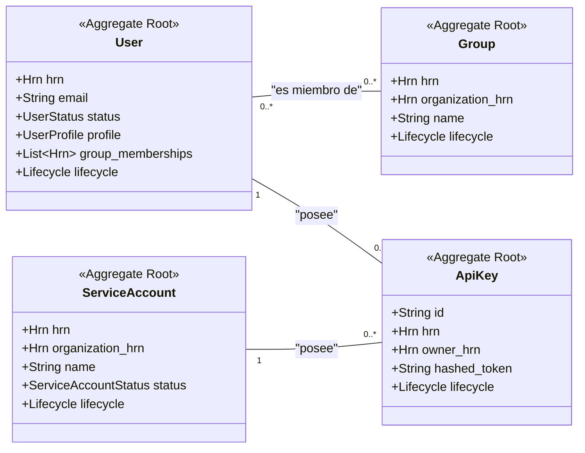

# Especificación Completa del Modelo de Datos: Crate `iam`

**Versión:** 6.0
**Crate:** `crates/iam`
**Contexto de Dominio:** Identidad y Gestión de Acceso

### 1\. Propósito y Responsabilidades

El crate `iam` es el Bounded Context responsable de gestionar la **identidad y el ciclo de vida de los principals**. Un "principal" es cualquier entidad que puede realizar una acción en el sistema y, por lo tanto, ser sujeto de una política de autorización.

Sus responsabilidades clave son:

* Gestionar usuarios humanos (`User`).
* Gestionar identidades para automatización (`ServiceAccount`).
* Gestionar credenciales de acceso programático (`ApiKey`).
* Agrupar principals para una gestión de permisos simplificada (`Group`).
* Proporcionar la información de identidad necesaria para que otros contextos, principalmente el de `security`, realicen las evaluaciones de autorización.

Este contexto define el **"quién"** en el paradigma de la autorización.

### 2\. Diagrama UML del Contexto



### 3\. Estructura de Ficheros del Dominio

```
crates/iam/src/domain/
├── mod.rs
├── user.rs
├── group.rs
├── service_account.rs
├── api_key.rs
└── events.rs
```

### 4\. Definiciones Completas en `rust`

#### 4.1. Módulo de Usuario (`domain/user.rs`)

```rust
// crates/iam/src/domain/user.rs

use crate::shared::hrn::{Hrn, OrganizationId};
use crate::shared::lifecycle::Lifecycle;
use crate::shared::security::CedarResource;
use serde::{Serialize, Deserialize};
use time::OffsetDateTime;
use cedar_policy::{EntityUid, Expr};
use std::collections::HashMap;

/// Representa a un usuario humano, un principal fundamental en el sistema.
/// Es un Agregado Raíz.
#[derive(Debug, Clone, Serialize, Deserialize)]
pub struct User {
    /// El HRN único y global del usuario.
    /// Formato: `hrn:hodei:iam:global:<org_id>:user/<user_id>`
    pub hrn: Hrn,

    /// El email del usuario, usado para login y notificaciones. Debe ser único.
    pub email: String,

    /// El estado actual de la cuenta de usuario.
    pub status: UserStatus,

    /// Información de perfil adicional y no crítica para la seguridad.
    pub profile: UserProfile,
    
    /// Lista de HRNs de las organizaciones a las que este usuario pertenece.
    /// Esta información es crucial para las políticas de Cedar.
    pub organization_memberships: Vec<OrganizationId>,

    /// Lista de HRNs de los grupos a los que este usuario pertenece.
    pub group_memberships: Vec<Hrn>,

    /// El ID del usuario en un proveedor de identidad externo (ej. Keycloak, Okta).
    pub external_id: Option<String>,
    
    /// Información de auditoría y ciclo de vida.
    pub lifecycle: Lifecycle,
}

/// Información de perfil de un usuario.
#[derive(Debug, Clone, Serialize, Deserialize, Default)]
pub struct UserProfile {
    /// El nombre completo del usuario.
    pub full_name: Option<String>,
    /// La URL a la imagen de avatar del usuario.
    pub avatar_url: Option<String>,
}

/// El estado del ciclo de vida de una cuenta de usuario.
#[derive(Debug, Clone, Copy, PartialEq, Eq, Serialize, Deserialize)]
pub enum UserStatus {
    /// El usuario puede autenticarse y operar.
    Active,
    /// El usuario no puede autenticarse.
    Suspended,
    /// La cuenta está pendiente de eliminación.
    PendingDeletion,
}

/// Implementación para que los usuarios puedan ser 'principals' en políticas Cedar.
impl CedarResource for User {
    fn cedar_entity_uid(&self) -> EntityUid {
        // Implementación para construir el EntityUid a partir del HRN.
        // ej. `Hodei::User::"hrn:hodei:iam:global:org_...:user/usr_..."`
    }

    fn cedar_attributes(&self) -> HashMap<String, Expr> {
        let mut attrs = HashMap::new();
        attrs.insert("status".to_string(), Expr::val(self.status.as_ref()));

        // Exponer las membresías de grupo es vital para políticas basadas en roles/grupos.
        let groups = self.group_memberships.iter().map(|hrn| Expr::val(hrn.as_str())).collect();
        attrs.insert("memberOfGroups".to_string(), Expr::set(groups));
        
        // Exponer las membresías de organización.
        let orgs = self.organization_memberships.iter().map(|hrn| Expr::val(hrn.as_str())).collect();
        attrs.insert("memberOfOrgs".to_string(), Expr::set(orgs));

        attrs
    }

    fn cedar_parents(&self) -> Vec<EntityUid> {
        // La relación de un usuario con una organización se modela mejor como un atributo
        // (`memberOfOrgs`), ya que un usuario puede pertenecer a varias.
        // Por lo tanto, un usuario no tiene un padre jerárquico directo.
        vec![]
    }
}
```

#### 4.2. Módulo de Grupo (`domain/group.rs`)

```rust
// crates/iam/src/domain/group.rs

use crate::shared::hrn::{Hrn, OrganizationId};
use crate::shared::lifecycle::Lifecycle;
use crate::shared::security::CedarResource;
use serde::{Serialize, Deserialize};

/// Representa un grupo de principals (usuarios o cuentas de servicio) dentro de una organización.
/// Facilita la asignación de permisos a múltiples principals a la vez.
/// Es un Agregado Raíz.
#[derive(Debug, Clone, Serialize, Deserialize)]
pub struct Group {
    /// El HRN único y global del grupo.
    /// Formato: `hrn:hodei:iam:global:<org_id>:group/<group_name>`
    pub hrn: Hrn,

    /// La organización a la que pertenece este grupo.
    pub organization_hrn: OrganizationId,
    
    /// El nombre del grupo, único dentro de la organización.
    pub name: String,
    
    /// Descripción del propósito del grupo.
    pub description: Option<String>,

    /// Información de auditoría y ciclo de vida.
    pub lifecycle: Lifecycle,
}

/// Implementación para que los grupos puedan ser parte de jerarquías en Cedar.
impl CedarResource for Group {
    fn cedar_entity_uid(&self) -> EntityUid { /* ... */ }
    fn cedar_attributes(&self) -> HashMap<String, Expr> { /* ... */ }

    fn cedar_parents(&self) -> Vec<EntityUid> {
        // El padre de un grupo es su organización.
        vec![EntityUid::from_str(self.organization_hrn.as_str()).unwrap()]
    }
}
```

#### 4.3. Módulo de Cuenta de Servicio (`domain/service_account.rs`)

```rust
// crates/iam/src/domain/service_account.rs

use crate::shared::hrn::{Hrn, OrganizationId};
use crate::shared::lifecycle::Lifecycle;
use crate::shared::security::CedarResource;
use serde::{Serialize, Deserialize};

/// Representa un principal no humano, como una aplicación o un sistema de CI/CD.
/// Es un Agregado Raíz.
#[derive(Debug, Clone, Serialize, Deserialize)]
pub struct ServiceAccount {
    /// El HRN único y global de la cuenta de servicio.
    /// Formato: `hrn:hodei:iam:global:<org_id>:service-account/<sa_name>`
    pub hrn: Hrn,

    /// La organización a la que pertenece.
    pub organization_hrn: OrganizationId,

    /// El nombre de la cuenta de servicio.
    pub name: String,

    /// Descripción de su propósito.
    pub description: Option<String>,
    
    /// El estado actual de la cuenta.
    pub status: ServiceAccountStatus,

    /// Información de auditoría y ciclo de vida.
    pub lifecycle: Lifecycle,
}

/// El estado del ciclo de vida de una cuenta de servicio.
#[derive(Debug, Clone, Copy, PartialEq, Eq, Serialize, Deserialize)]
pub enum ServiceAccountStatus { Active, Disabled }

/// Implementación para que las cuentas de servicio puedan ser principals en Cedar.
impl CedarResource for ServiceAccount { /* ... similar a User y Group ... */ }
```

#### 4.4. Módulo de Clave API (`domain/api_key.rs`)

```rust
// crates/iam/src/domain/api_key.rs

use crate::shared::hrn::Hrn;
use crate::shared::lifecycle::Lifecycle;
use serde::{Serialize, Deserialize};
use time::OffsetDateTime;

/// Representa una credencial de larga duración para acceso programático.
/// Es un Agregado Raíz.
/// Nota: Una ApiKey es una CREDENCIAL, no un principal. El sistema la usa para
/// identificar a su `owner` (User o ServiceAccount), que SÍ es el principal en la política.
#[derive(Debug, Clone, Serialize, Deserialize)]
pub struct ApiKey {
    /// Un identificador corto, público y no secreto, usado para identificar la clave.
    pub id: String,

    /// El HRN único y global de la propia clave API.
    /// Formato: `hrn:hodei:iam:global:<org_id>:apikey/<key_id>`
    pub hrn: Hrn,
    
    /// El HRN de su propietario (un `User` o `ServiceAccount`). Este es el principal.
    pub owner_hrn: Hrn,
    
    /// El hash del token secreto. El token en texto plano solo se muestra una vez.
    pub hashed_token: String,
    
    /// Descripción de para qué se usa esta clave.
    pub description: Option<String>,

    /// Fecha y hora opcional de expiración.
    pub expires_at: Option<OffsetDateTime>,
    
    /// Información de auditoría y ciclo de vida.
    pub lifecycle: Lifecycle,
}
```

#### 4.5. Módulo de Eventos (`domain/events.rs`)

```rust
// crates/iam/src/domain/events.rs

use crate::shared::hrn::{Hrn, OrganizationId};
use serde::{Serialize, Deserialize};
use time::OffsetDateTime;

/// Eventos de dominio publicados por el contexto `iam`.
#[derive(Debug, Clone, Serialize, Deserialize)]
pub enum IamEvent {
    UserRegistered(UserRegistered),
    UserSuspended(UserSuspended),
    ApiKeyCreated(ApiKeyCreated),
    GroupCreated(GroupCreated),
    UserAddedToGroup(UserAddedToGroup),
    // ... otros eventos
}

#[derive(Debug, Clone, Serialize, Deserialize)]
pub struct UserRegistered {
    pub hrn: Hrn,
    pub email: String,
    pub organization_hrns: Vec<OrganizationId>,
    pub at: OffsetDateTime,
}

#[derive(Debug, Clone, Serialize, Deserialize)]
pub struct UserSuspended {
    pub hrn: Hrn,
    pub suspended_by: Hrn,
    pub at: OffsetDateTime,
}

#[derive(Debug, Clone, Serialize, Deserialize)]
pub struct ApiKeyCreated {
    pub hrn: Hrn,
    pub owner_hrn: Hrn,
    pub at: OffsetDateTime,
}

#[derive(Debug, Clone, Serialize, Deserialize)]
pub struct GroupCreated {
    pub hrn: Hrn,
    pub name: String,
    pub organization_hrn: OrganizationId,
    pub at: OffsetDateTime,
}

#[derive(Debug, Clone, Serialize, Deserialize)]
pub struct UserAddedToGroup {
    pub user_hrn: Hrn,
    pub group_hrn: Hrn,
    pub added_by: Hrn,
    pub at: OffsetDateTime,
}
```