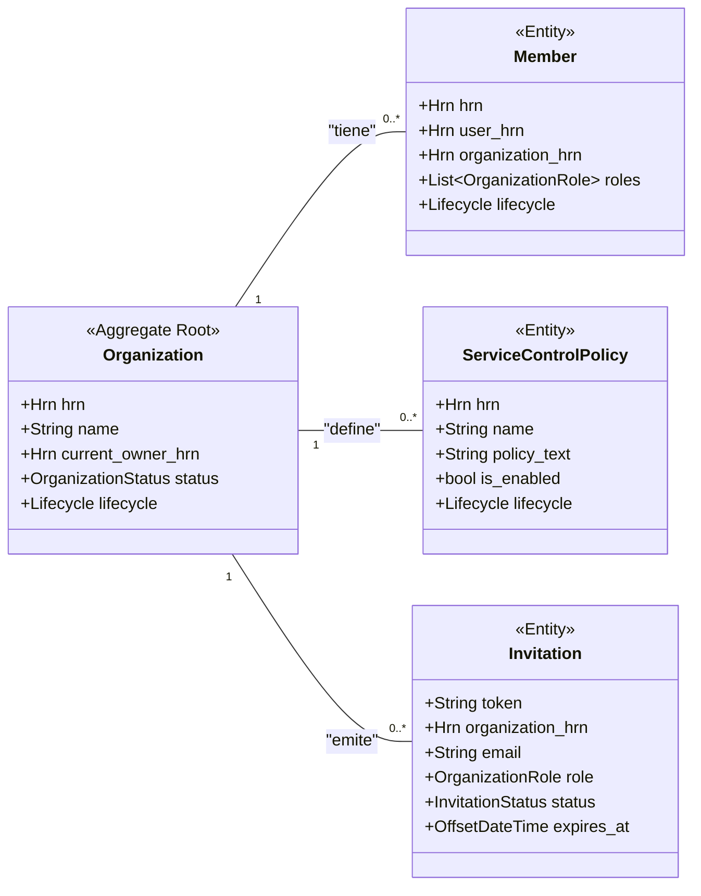

# Especificación Completa del Modelo de Datos: Crate `organization`

**Versión:** 6.0
**Crate:** `crates/organization`
**Contexto de Dominio:** Gobernanza y Multi-Tenancy

### 1\. Propósito y Responsabilidades

El crate `organization` es el contexto de más alto nivel en el ecosistema Hodei. Su responsabilidad principal es gestionar el ciclo de vida y la gobernanza de las **Organizaciones**, que actúan como los tenants del sistema.

Esto incluye:

* Creación, actualización y eliminación de organizaciones.
* Gestión de la membresía: invitar usuarios, asignar roles y gestionar su acceso a la organización.
* Definición y aplicación de Políticas de Control de Servicio (SCPs), que actúan como barreras de seguridad para todos los recursos dentro de una organización.

### 2\. Diagrama UML del Contexto



### 3\. Estructura de Ficheros del Dominio

```
crates/organization/src/domain/
├── mod.rs
├── organization.rs
├── member.rs
├── policy.rs
├── invitation.rs
└── events.rs
```

### 4\. Definiciones Completas en `rust`

#### 4.1. Módulo Principal (`domain/organization.rs`)

```rust
// crates/organization/src/domain/organization.rs

use crate::shared::hrn::{Hrn, UserId};
use crate::shared::lifecycle::{Lifecycle};
use crate::shared::security::HodeiResource;
use serde::{Serialize, Deserialize};
use time::OffsetDateTime;
use cedar_policy::{EntityUid, Expr};
use std::collections::HashMap;

/// Representa un tenant del sistema, un contenedor lógico que aísla todos sus recursos.
/// Es el Agregado Raíz principal de este Bounded Context.
#[derive(Debug, Clone, Serialize, Deserialize)]
pub struct Organization {
    /// El identificador único y global de la organización.
    /// Formato: `hrn:hodei:iam:global:<org_id>:organization`
    pub hrn: Hrn,

    /// El nombre legible de la organización.
    pub name: String,

    /// El HRN del usuario que es el propietario actual de la organización.
    /// El creador original se encuentra en `lifecycle.created_by`.
    pub current_owner_hrn: UserId,
    
    /// La región geográfica principal de la organización.
    pub primary_region: String,

    /// El estado actual de la organización.
    pub status: OrganizationStatus,

    /// Configuraciones específicas del tenant.
    pub settings: OrganizationSettings,

    /// Información de auditoría y ciclo de vida (creación, actualización, estado).
    pub lifecycle: Lifecycle,
}

/// Configuraciones a nivel de organización.
#[derive(Debug, Clone, Serialize, Deserialize)]
pub struct OrganizationSettings {
    /// Email de contacto para asuntos de facturación y administrativos.
    pub billing_contact_email: String,
    
    /// El nivel de permiso por defecto para nuevos repositorios creados en la organización.
    pub default_repository_permission: String, // ej. "read", "none"
}

/// El estado del ciclo de vida de una organización.
#[derive(Debug, Clone, Copy, PartialEq, Eq, Serialize, Deserialize)]
pub enum OrganizationStatus {
    /// La organización está activa y plenamente funcional.
    Active,
    /// La organización ha sido suspendida, bloqueando el acceso a sus recursos.
    Suspended,
    /// La organización está en proceso de ser eliminada permanentemente.
    PendingDeletion,
}

/// Implementación del trait `HodeiResource<EntityUid>` para que las organizaciones
/// puedan ser utilizadas en políticas de autorización con Cedar.
impl HodeiResource<EntityUid, Expr> for Organization {
    fn resource_id(&self) -> EntityUid {
        EntityUid::from_str(&self.hrn.as_str()).unwrap()
    }

    fn resource_attributes(&self) -> HashMap<String, Expr> {
        let mut attrs = HashMap::new();
        attrs.insert("type".to_string(), Expr::val("organization"));
        attrs.insert("status".to_string(), Expr::val(self.status.as_ref()));
        attrs.insert("primary_region".to_string(), Expr::val(self.primary_region.clone()));
        attrs
    }

    fn resource_parents(&self) -> Vec<EntityUid> {
        // Las organizaciones son la raíz de la jerarquía, no tienen padres.
        vec![]
    }
}
```

#### 4.2. Módulo de Miembros (`domain/member.rs`)

```rust
// crates/organization/src/domain/member.rs

use crate::shared::hrn::{Hrn, UserId, OrganizationId};
use crate::shared::lifecycle::Lifecycle;
use serde::{Serialize, Deserialize};

/// Representa la relación entre un `User` y una `Organization`, incluyendo sus roles.
/// Es una entidad dentro del agregado `Organization`.
#[derive(Debug, Clone, Serialize, Deserialize)]
pub struct Member {
    /// HRN único para la membresía en sí.
    /// Formato: `hrn:hodei:iam:global:<org_id>:member/<user_id>`
    pub hrn: Hrn,

    /// El HRN del usuario.
    pub user_hrn: UserId,

    /// El HRN de la organización.
    pub organization_hrn: OrganizationId,

    /// Roles asignados al usuario dentro de esta organización.
    pub roles: Vec<OrganizationRole>,

    /// Información de auditoría y ciclo de vida de la membresía.
    pub lifecycle: Lifecycle,
}

/// Roles que un miembro puede tener dentro de una organización.
#[derive(Debug, Clone, Copy, PartialEq, Eq, Serialize, Deserialize)]
pub enum OrganizationRole {
    /// Permisos completos sobre la organización.
    Admin,
    /// Permisos estándar para miembros del equipo.
    Member,
    /// Permisos para gestionar la facturación y suscripción.
    BillingManager,
}
```

#### 4.3. Módulo de Políticas (`domain/policy.rs`)

```rust
// crates/organization/src/domain/policy.rs

use crate::shared::hrn::{Hrn, OrganizationId};
use crate::shared::lifecycle::Lifecycle;
use serde::{Serialize, Deserialize};

/// Una Política de Control de Servicio (SCP) que establece los límites
/// de permisos para todos los principales dentro de una organización.
#[derive(Debug, Clone, Serialize, Deserialize)]
pub struct ServiceControlPolicy {
    /// HRN único para la política.
    /// Formato: `hrn:hodei:iam:global:<org_id>:scp/<policy_name>`
    pub hrn: Hrn,
    
    /// HRN de la organización a la que está adjunta.
    pub organization_hrn: OrganizationId,

    /// Nombre de la política.
    pub name: String,

    /// Descripción de la política.
    pub description: Option<String>,

    /// El texto completo de la política en lenguaje Cedar.
    pub policy_text: String,

    /// Si la política está activa y se está aplicando.
    pub is_enabled: bool,
    
    /// Información de auditoría y ciclo de vida.
    pub lifecycle: Lifecycle,
}
```

#### 4.4. Módulo de Invitaciones (`domain/invitation.rs`)

```rust
// crates/organization/src/domain/invitation.rs

use crate::shared::hrn::{Hrn, OrganizationId};
use crate::domain::member::OrganizationRole;
use serde::{Serialize, Deserialize};
use time::OffsetDateTime;

/// Representa una invitación para que un usuario se una a una organización.
#[derive(Debug, Clone, Serialize, Deserialize)]
pub struct Invitation {
    /// Un token único, corto y seguro que se enviará por email. No es un HRN.
    pub token: String,
    
    /// HRN de la organización a la que se invita.
    pub organization_hrn: OrganizationId,
    
    /// Email del usuario invitado.
    pub email: String,
    
    /// Rol que se asignará al usuario si acepta.
    pub role: OrganizationRole,
    
    /// HRN del miembro que envió la invitación.
    pub inviter_hrn: Hrn,
    
    /// Estado actual de la invitación.
    pub status: InvitationStatus,
    
    /// Fecha y hora en que la invitación expira.
    pub expires_at: OffsetDateTime,
    
    /// Fecha y hora de creación.
    pub created_at: OffsetDateTime,
}

/// El estado del ciclo de vida de una invitación.
#[derive(Debug, Clone, Copy, PartialEq, Eq, Serialize, Deserialize)]
pub enum InvitationStatus {
    Pending,
    Accepted,
    Expired,
    Revoked,
}
```

#### 4.5. Módulo de Eventos (`domain/events.rs`)

```rust
// crates/organization/src/domain/events.rs

use crate::shared::hrn::{Hrn, OrganizationId, UserId};
use serde::{Serialize, Deserialize};
use time::OffsetDateTime;

/// Eventos de dominio publicados por el contexto `organization`.
#[derive(Debug, Clone, Serialize, Deserialize)]
pub enum OrganizationEvent {
    /// Se ha creado una nueva organización.
    OrganizationCreated(OrganizationCreated),
    
    /// Un miembro ha sido invitado a unirse a una organización.
    MemberInvited(MemberInvited),
    
    /// Un usuario ha aceptado una invitación y se ha unido a una organización.
    MemberJoined(MemberJoined),
    
    /// Se ha actualizado una Política de Control de Servicio.
    ScpUpdated(ScpUpdated),
}

#[derive(Debug, Clone, Serialize, Deserialize)]
pub struct OrganizationCreated {
    pub hrn: OrganizationId,
    pub name: String,
    pub owner_hrn: UserId,
    pub at: OffsetDateTime,
}

#[derive(Debug, Clone, Serialize, Deserialize)]
pub struct MemberInvited {
    pub invitation_token: String,
    pub organization_hrn: OrganizationId,
    pub email: String,
    pub inviter_hrn: UserId,
    pub at: OffsetDateTime,
}

#[derive(Debug, Clone, Serialize, Deserialize)]
pub struct MemberJoined {
    pub member_hrn: Hrn,
    pub organization_hrn: OrganizationId,
    pub user_hrn: UserId,
    pub at: OffsetDateTime,
}

#[derive(Debug, Clone, Serialize, Deserialize)]
pub struct ScpUpdated {
    pub policy_hrn: Hrn,
    pub updated_by: Hrn,
    pub at: OffsetDateTime,
}
```