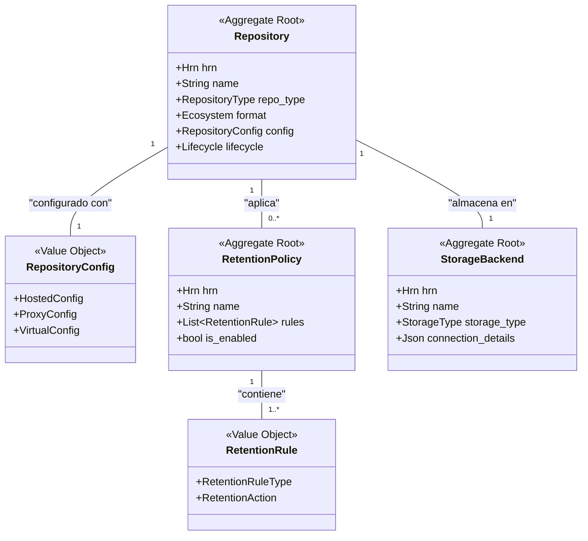

# Especificación Completa del Modelo de Datos: Crate `repository`

**Versión:** 6.0
**Crate:** `crates/repository`
**Contexto de Dominio:** Gestión de Repositorios

### 1\. Propósito y Responsabilidades

El crate `repository` es el Bounded Context responsable de gestionar los **contenedores de artefactos**. Actúa como el "bibliotecario" del sistema, definiendo la existencia, configuración, reglas y ubicación de almacenamiento de cada repositorio.

Sus responsabilidades clave son:

* Gestionar el ciclo de vida completo de los repositorios (`Repository`).
* Modelar los diferentes comportamientos de los repositorios:
    * **Hosted**: Aloja artefactos subidos directamente.
    * **Proxy**: Actúa como caché de un repositorio remoto.
    * **Virtual**: Agrega el contenido de múltiples repositorios en una única URL.
* Definir y aplicar políticas de gobernanza específicas del repositorio, como las políticas de retención (`RetentionPolicy`).
* Gestionar la configuración de los backends de almacenamiento físico (`StorageBackend`).

### 2\. Diagrama UML del Contexto



### 3\. Estructura de Ficheros del Dominio

```
crates/repository/src/domain/
├── mod.rs
├── repository.rs
├── policy.rs
├── storage.rs
└── events.rs
```

### 4\. Definiciones Completas en `rust`

#### 4.1. Módulo de Repositorio (`domain/repository.rs`)

```rust
// crates/repository/src/domain/repository.rs

use crate::shared::hrn::{Hrn, OrganizationId, RepositoryId};
use crate::shared::lifecycle::Lifecycle;
use crate::shared::enums::Ecosystem;
use crate::shared::security::HodeiResource;
use crate::domain::storage::StorageBackendId;
use serde::{Serialize, Deserialize};
use url::Url;
use cedar_policy::{EntityUid, Expr};
use std::collections::HashMap;

/// Representa un contenedor para artefactos que define políticas de acceso y almacenamiento.
/// Es el Agregado Raíz principal de este Bounded Context.
#[derive(Debug, Clone, Serialize, Deserialize)]
pub struct Repository {
    /// El HRN único y global del repositorio.
    /// Formato: `hrn:hodei:repository:<region>:<org_id>:repository/<repo_name>`
    pub hrn: RepositoryId,

    /// La organización a la que pertenece este repositorio.
    pub organization_hrn: OrganizationId,
    
    /// El nombre del repositorio, único dentro de la organización.
    pub name: String,

    /// La región geográfica donde reside primariamente este repositorio.
    pub region: String,
    
    /// El tipo de comportamiento del repositorio (Hosted, Proxy, Virtual).
    pub repo_type: RepositoryType,
    
    /// El ecosistema de paquetes que gestiona este repositorio (Maven, Npm, etc.).
    pub format: Ecosystem,

    /// Configuración detallada y específica según el `repo_type`.
    pub config: RepositoryConfig,
    
    /// HRN del backend de almacenamiento donde se guardarán los binarios.
    pub storage_backend_hrn: StorageBackendId,

    /// Información de auditoría y ciclo de vida.
    pub lifecycle: Lifecycle,
}

/// Configuración específica según el tipo de repositorio.
#[derive(Debug, Clone, Serialize, Deserialize)]
pub enum RepositoryConfig {
    Hosted(HostedConfig),
    Proxy(ProxyConfig),
    Virtual(VirtualConfig),
}

/// Configuración para un repositorio de tipo `Hosted`.
#[derive(Debug, Clone, Serialize, Deserialize)]
pub struct HostedConfig {
    /// Define si se permiten artefactos de tipo SNAPSHOT, re-despliegues, etc.
    pub deployment_policy: DeploymentPolicy,
}

/// Configuración para un repositorio de tipo `Proxy`.
#[derive(Debug, Clone, Serialize, Deserialize)]
pub struct ProxyConfig {
    /// La URL del repositorio remoto que se está "proxiando".
    pub remote_url: Url,
    /// Configuración del caché para los artefactos y metadatos.
    pub cache_settings: CacheSettings,
    /// Credenciales para autenticarse contra el repositorio remoto.
    pub remote_authentication: Option<ProxyAuth>,
}

/// Configuración para un repositorio de tipo `Virtual`.
#[derive(Debug, Clone, Serialize, Deserialize)]
pub struct VirtualConfig {
    /// Lista ordenada de HRNs de repositorios (Hosted o Proxy) que se agregan.
    pub aggregated_repositories: Vec<RepositoryId>,
    /// Estrategia para resolver artefactos cuando existen en múltiples repositorios agregados.
    pub resolution_order: ResolutionOrder,
}

/// Configuración de caché para repositorios Proxy.
#[derive(Debug, Clone, Serialize, Deserialize)]
pub struct CacheSettings {
    /// Tiempo de vida (en segundos) para los metadatos cacheados.
    pub metadata_ttl_seconds: u32,
    /// Tiempo de vida (en segundos) para los artefactos binarios cacheados.
    pub artifact_ttl_seconds: u32,
}

/// Credenciales seguras para un repositorio Proxy.
#[derive(Debug, Clone, Serialize, Deserialize)]
pub struct ProxyAuth {
    pub username: String,
    /// HRN a un secreto en un gestor de secretos externo (ej. Vault).
    /// El valor del secreto nunca se almacena en este modelo.
    pub password_secret_hrn: Hrn,
}

/// El tipo de comportamiento del repositorio.
#[derive(Debug, Clone, Copy, PartialEq, Eq, Serialize, Deserialize)]
pub enum RepositoryType { Hosted, Proxy, Virtual }

/// Las reglas de despliegue para un repositorio Hosted.
#[derive(Debug, Clone, Copy, PartialEq, Eq, Serialize, Deserialize)]
pub enum DeploymentPolicy { AllowSnapshots, BlockSnapshots, AllowRedeploy, BlockRedeploy }

/// La estrategia de resolución para un repositorio Virtual.
#[derive(Debug, Clone, Copy, PartialEq, Eq, Serialize, Deserialize)]
pub enum ResolutionOrder { FirstFound }

/// Implementación para que los repositorios puedan ser recursos en políticas Cedar.
impl HodeiResource<EntityUid, Expr> for Repository {
    fn resource_id(&self) -> EntityUid {
        EntityUid::from_str(&self.hrn.as_str()).unwrap()
    }

    fn resource_attributes(&self) -> HashMap<String, Expr> {
        let mut attrs = HashMap::new();
        attrs.insert("type".to_string(), Expr::val("repository"));
        attrs.insert("repo_type".to_string(), Expr::val(self.repo_type.as_ref()));
        attrs.insert("format".to_string(), Expr::val(self.format.as_ref()));
        attrs.insert("region".to_string(), Expr::val(self.region.clone()));
        attrs
    }

    fn resource_parents(&self) -> Vec<EntityUid> {
        // El padre de un repositorio es su organización.
        vec![EntityUid::from_str(self.organization_hrn.as_str()).unwrap()]
    }
}
```

#### 4.2. Módulo de Políticas (`domain/policy.rs`)

```rust
// crates/repository/src/domain/policy.rs

use crate::shared::hrn::{Hrn, RepositoryId};
use crate::shared::lifecycle::Lifecycle;
use crate::shared::enums::ArtifactStatus; // Necesario para algunas reglas
use serde::{Serialize, Deserialize};

/// Un regex validado para prevenir ataques de Denegación de Servicio (ReDoS).
/// El constructor debe implementar la lógica de validación.
#[derive(Debug, Clone, Serialize, Deserialize)]
pub struct SafeRegex(String);

/// Una política de retención de artefactos que se aplica a un repositorio.
/// Es un Agregado Raíz.
#[derive(Debug, Clone, Serialize, Deserialize)]
pub struct RetentionPolicy {
    /// HRN de la política.
    /// Formato: `hrn:hodei:repository:<region>:<org_id>:retention-policy/<policy_name>`
    pub hrn: Hrn,

    /// HRN del repositorio al que se aplica esta política.
    pub repository_hrn: RepositoryId,
    
    /// Nombre de la política.
    pub name: String,

    /// Lista de reglas que componen la política. Se ejecutan en orden.
    pub rules: Vec<RetentionRule>,

    /// Si la política está activa.
    pub is_enabled: bool,
    
    /// Información de auditoría y ciclo de vida.
    pub lifecycle: Lifecycle,
}

/// Una regla específica dentro de una política de retención.
#[derive(Debug, Clone, Serialize, Deserialize)]
pub enum RetentionRule {
    /// Aplica a artefactos que no han sido descargados en un número de días.
    ByAgeSinceLastDownload {
        max_age_days: u32,
        action: RetentionAction,
    },
    /// Mantiene solo las N versiones más recientes de un paquete.
    ByVersionCount {
        max_versions: u32,
        action: RetentionAction,
    },
    /// Aplica a artefactos que coinciden con un estado específico.
    ByStatus {
        status: ArtifactStatus,
        action: RetentionAction,
    },
    /// Aplica a artefactos cuyo nombre de versión coincide con un regex.
    /// Ideal para limpiar versiones SNAPSHOT.
    MatchesVersionRegex {
        regex: SafeRegex,
        action: RetentionAction,
    },
}

/// Acción a tomar cuando una regla de retención se cumple.
#[derive(Debug, Clone, Copy, Serialize, Deserialize)]
pub enum RetentionAction { Delete, Archive, Notify }
```

#### 4.3. Módulo de Almacenamiento (`domain/storage.rs`)

```rust
// crates/repository/src/domain/storage.rs

use crate::shared::hrn::{Hrn, OrganizationId};
use crate::shared::lifecycle::Lifecycle;
use serde::{Serialize, Deserialize};

/// Representa una configuración de un backend de almacenamiento físico.
/// Es un Agregado Raíz, ya que puede ser gestionado de forma independiente.
#[derive(Debug, Clone, Serialize, Deserialize)]
pub struct StorageBackend {
    /// HRN del backend de almacenamiento.
    /// Formato: `hrn:hodei:repository:<region>:<org_id>:storage-backend/<backend_name>`
    pub hrn: Hrn,

    /// La organización a la que pertenece.
    pub organization_hrn: OrganizationId,

    /// Nombre del backend.
    pub name: String,

    /// El tipo de almacenamiento (S3, local, etc.).
    pub storage_type: StorageType,

    /// Detalles de conexión (bucket, endpoint, credenciales), encriptados.
    /// Se usa un tipo contenedor genérico para representar datos encriptados.
    pub connection_details: Encrypted<serde_json::Value>,

    /// Información de auditoría y ciclo de vida.
    pub lifecycle: Lifecycle,
}

/// El tipo de backend de almacenamiento.
#[derive(Debug, Clone, Copy, PartialEq, Eq, Serialize, Deserialize)]
pub enum StorageType { S3Compatible, FileSystem, AzureBlob }

/// Un tipo contenedor para representar datos que deben estar encriptados en reposo.
#[derive(Debug, Clone, Serialize, Deserialize)]
pub struct Encrypted<T> {
    encrypted_blob: Vec<u8>,
    // ... metadatos de encriptación
    _phantom: std::marker::PhantomData<T>,
}
```

#### 4.4. Módulo de Eventos (`domain/events.rs`)

```rust
// crates/repository/src/domain/events.rs

use crate::shared::hrn::{Hrn, OrganizationId, RepositoryId};
use crate::domain::repository::{RepositoryType};
use crate::shared::enums::Ecosystem;
use serde::{Serialize, Deserialize};
use time::OffsetDateTime;

/// Eventos de dominio publicados por el contexto `repository`.
#[derive(Debug, Clone, Serialize, Deserialize)]
pub enum RepositoryEvent {
    RepositoryCreated(RepositoryCreated),
    RepositoryDeleted(RepositoryDeleted),
    RetentionPolicyApplied(RetentionPolicyApplied),
}

#[derive(Debug, Clone, Serialize, Deserialize)]
pub struct RepositoryCreated {
    pub hrn: RepositoryId,
    pub name: String,
    pub repo_type: RepositoryType,
    pub format: Ecosystem,
    pub organization_hrn: OrganizationId,
    pub at: OffsetDateTime,
}

#[derive(Debug, Clone, Serialize, Deserialize)]
pub struct RepositoryDeleted {
    pub hrn: RepositoryId,
    pub deleted_by: Hrn,
    pub at: OffsetDateTime,
}

#[derive(Debug, Clone, Serialize, Deserialize)]
pub struct RetentionPolicyApplied {
    pub repository_hrn: RepositoryId,
    pub policy_hrn: Hrn,
    pub result: PolicyExecutionResult,
    pub at: OffsetDateTime,
}

#[derive(Debug, Clone, Serialize, Deserialize)]
pub struct PolicyExecutionResult {
    pub artifacts_deleted: u32,
    pub artifacts_archived: u32,
    pub notifications_sent: u32,
    pub status: String, // "Success", "Failed"
    pub error_message: Option<String>,
}
```