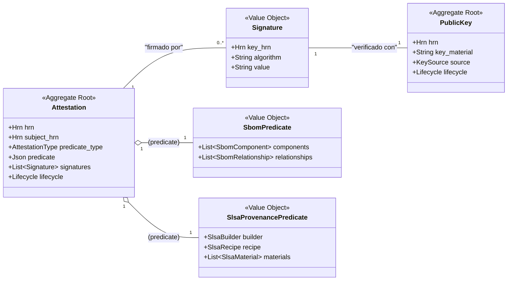

# Especificación Completa del Modelo de Datos: Crate `supply-chain`

**Versión:** 6.0
**Crate:** `crates/supply-chain`
**Contexto de Dominio:** Seguridad de la Cadena de Suministro

### 1\. Propósito y Responsabilidades

El crate `supply-chain` es el Bounded Context responsable de la **transparencia e integridad** de los artefactos. Su función no es encontrar vulnerabilidades, sino generar, almacenar y verificar **atestaciones**: pruebas verificables sobre cómo se construyó un artefacto, de qué está compuesto y quién lo respalda.

Sus responsabilidades clave son:

* Gestionar el ciclo de vida de las `Attestation`, el Agregado Raíz que representa cualquier tipo de evidencia sobre un artefacto.
* Modelar y persistir de forma estructurada los **Software Bill of Materials (SBOM)** en formatos estándar como CycloneDX y SPDX.
* Modelar y persistir la procedencia de la construcción de artefactos, siguiendo el estándar **SLSA**.
* Gestionar las **firmas digitales** (ej. Cosign) asociadas a las atestaciones y artefactos.
* Gestionar las **claves públicas** utilizadas para la verificación de firmas, estableciendo una cadena de confianza.

### 2\. Diagrama UML del Contexto



### 3\. Estructura de Ficheros del Dominio

```
crates/supply-chain/src/domain/
├── mod.rs
├── attestation.rs
├── public_key.rs
├── sbom.rs
├── slsa.rs
└── events.rs
```

### 4\. Definiciones Completas en `rust`

#### 4.1. Módulo de Atestación (`domain/attestation.rs`)

```rust
// crates/supply-chain/src/domain/attestation.rs

use crate::shared::hrn::{Hrn, OrganizationId, PackageVersionId, PublicKeyId};
use crate::shared::lifecycle::Lifecycle;
use crate::shared::security::CedarResource;
use serde::{Serialize, Deserialize};
use cedar_policy::{EntityUid, Expr};
use std::collections::HashMap;

/// Una prueba criptográficamente verificable sobre un artefacto (`PackageVersion`).
/// Es el Agregado Raíz principal de este contexto.
#[derive(Debug, Clone, Serialize, Deserialize)]
pub struct Attestation {
    /// El HRN único de la atestación.
    /// Formato: `hrn:hodei:supply-chain:<region>:<org_id>:attestation/<attestation_id>`
    pub hrn: Hrn,
    
    /// La organización a la que pertenece esta atestación.
    pub organization_hrn: OrganizationId,

    /// El HRN del `PackageVersion` al que se refiere esta prueba.
    pub subject_hrn: PackageVersionId,

    /// El tipo de prueba contenida en el predicado (SBOM, SLSA, etc.).
    pub predicate_type: AttestationType,

    /// El contenido de la prueba en formato JSON. Se deserializa a un struct específico
    /// (ej. `SbomPredicate`) en tiempo de ejecución, basado en `predicate_type`.
    pub predicate: serde_json::Value,

    /// Lista de firmas que validan la integridad de esta atestación.
    pub signatures: Vec<Signature>,

    /// Información de auditoría y ciclo de vida.
    pub lifecycle: Lifecycle,
}

/// Una firma digital sobre una atestación.
#[derive(Debug, Clone, Serialize, Deserialize)]
pub struct Signature {
    /// El HRN de la `PublicKey` utilizada para generar esta firma.
    pub key_hrn: PublicKeyId,
    
    /// El algoritmo de firma utilizado (ej. "rsassa-pss-sha256").
    pub algorithm: String,
    
    /// El valor de la firma, codificado en base64.
    pub value: String,
}

/// Tipos de atestaciones soportados por el sistema.
#[derive(Debug, Clone, Copy, PartialEq, Eq, Serialize, Deserialize)]
pub enum AttestationType {
    SbomCycloneDxV1_5Json,
    SbomSpdxV2_3Json,
    SlsaProvenanceV1_0,
    CosignSignature,
    GenericSignature, // Para otros tipos de firma
}

/// Implementación para que las atestaciones puedan ser recursos en políticas Cedar.
impl CedarResource for Attestation {
    fn cedar_entity_uid(&self) -> EntityUid { /* ... */ }

    fn cedar_attributes(&self) -> HashMap<String, Expr> {
        let mut attrs = HashMap::new();
        attrs.insert("predicate_type".to_string(), Expr::val(self.predicate_type.as_ref()));
        attrs
    }

    fn cedar_parents(&self) -> Vec<EntityUid> {
        // El padre de una atestación es el artefacto que describe.
        // Esto permite políticas como "El artefacto X debe tener una atestación de tipo Y".
        vec![EntityUid::from_str(self.subject_hrn.as_str()).unwrap()]
    }
}
```

#### 4.2. Módulo de Clave Pública (`domain/public_key.rs`)

```rust
// crates/supply-chain/src/domain/public_key.rs

use crate::shared::hrn::{Hrn, OrganizationId};
use crate::shared::lifecycle::Lifecycle;
use serde::{Serialize, Deserialize};
use time::OffsetDateTime;

/// Representa una clave pública utilizada para verificar firmas.
/// Es un Agregado Raíz, ya que su confianza y ciclo de vida se gestionan de forma independiente.
#[derive(Debug, Clone, Serialize, Deserialize)]
pub struct PublicKey {
    /// El HRN único de la clave.
    /// Formato: `hrn:hodei:supply-chain:global:<org_id>:public-key/<key_fingerprint>`
    pub hrn: Hrn,
    
    /// La organización propietaria de la clave.
    pub organization_hrn: OrganizationId,
    
    /// El material de la clave en un formato estándar (ej. PEM, JWK).
    pub key_material: String,
    
    /// El algoritmo de la clave (ej. "ecdsa-p256").
    pub algorithm: String,
    
    /// De dónde proviene esta clave y cómo se estableció su confianza.
    pub source: KeySource,
    
    /// Opcional: la clave solo es válida después de esta fecha.
    pub valid_after: Option<OffsetDateTime>,
    
    /// Opcional: la clave solo es válida antes de esta fecha.
    pub valid_until: Option<OffsetDateTime>,
    
    /// Información de auditoría y ciclo de vida.
    pub lifecycle: Lifecycle,
}

/// La fuente de una clave pública.
#[derive(Debug, Clone, Serialize, Deserialize)]
pub enum KeySource {
    /// La clave fue emitida por una autoridad de certificación como Sigstore Fulcio.
    CertificateAuthority { issuer: String },
    /// La clave fue subida manualmente por un usuario.
    ManualUpload { uploader_hrn: Hrn },
}
```

#### 4.3. Módulo SBOM (`domain/sbom.rs`)

```rust
// crates/supply-chain/src/domain/sbom.rs

use crate::shared::models::ContentHash;
use serde::{Serialize, Deserialize};
use std::collections::HashMap;

/// Estructura que representa el contenido de un predicado SBOM, serializable a/desde JSON.
#[derive(Debug, Clone, Serialize, Deserialize)]
pub struct SbomPredicate {
    pub spec_version: String,
    pub serial_number: Option<String>,
    pub components: Vec<SbomComponent>,
    pub relationships: Vec<SbomRelationship>,
    pub tools: Vec<Tool>,
}

/// Representa un componente de software dentro de un SBOM.
#[derive(Debug, Clone, Serialize, Deserialize)]
pub struct SbomComponent {
    /// Identificador PURL (Package URL) del componente.
    pub purl: String,
    pub component_type: ComponentType,
    pub name: String,
    pub version: String,
    pub supplier: Option<String>,
    pub hashes: Vec<ContentHash>,
    pub licenses: Vec<String>, // SPDX license identifiers
}

/// Representa una relación entre componentes en el SBOM.
#[derive(Debug, Clone, Serialize, Deserialize)]
pub struct SbomRelationship {
    /// El PURL del componente de origen.
    pub source_purl: String,
    /// El PURL del componente de destino.
    pub target_purl: String,
    /// El tipo de relación (ej. "DEPENDS_ON", "CONTAINS").
    pub relationship_type: String,
}

#[derive(Debug, Clone, Serialize, Deserialize)]
pub struct Tool {
    pub vendor: String,
    pub name: String,
    pub version: String,
}

#[derive(Debug, Clone, Copy, PartialEq, Eq, Serialize, Deserialize)]
pub enum ComponentType { Library, Application, Framework, OperatingSystem, Device, File }
```

#### 4.4. Módulo SLSA (`domain/slsa.rs`)

```rust
// crates/supply-chain/src/domain/slsa.rs

use crate::shared::models::ContentHash;
use serde::{Serialize, Deserialize};
use std::collections::HashMap;

/// Estructura que representa el contenido de un predicado de procedencia SLSA v1.0.
#[derive(Debug, Clone, Serialize, Deserialize)]
pub struct SlsaProvenancePredicate {
    pub builder: SlsaBuilder,
    pub recipe: SlsaRecipe,
    pub invocation: SlsaInvocation,
    pub materials: Vec<SlsaMaterial>,
    pub metadata: SlsaMetadata,
}

/// Identifica el constructor que generó el artefacto.
#[derive(Debug, Clone, Serialize, Deserialize)]
pub struct SlsaBuilder {
    pub id: String, // URI identificando el constructor
}

/// Describe cómo se construyó el artefacto.
#[derive(Debug, Clone, Serialize, Deserialize)]
pub struct SlsaRecipe {
    #[serde(rename = "type")]
    pub recipe_type: String, // URI
    #[serde(rename = "entryPoint")]
    pub entry_point: String,
    pub arguments: serde_json::Value,
}

/// Describe la ejecución específica del proceso de construcción.
#[derive(Debug, Clone, Serialize, Deserialize)]
pub struct SlsaInvocation {
    #[serde(rename = "configSource")]
    pub config_source: SlsaConfigSource,
    pub parameters: serde_json::Value,
    pub environment: serde_json::Value,
}

/// Materiales (ej. código fuente) utilizados en la construcción.
#[derive(Debug, Clone, Serialize, Deserialize)]
pub struct SlsaMaterial {
    pub uri: String,
    pub digest: HashMap<String, String>, // ej. {"sha1": "...", "sha256": "..."}
}

// ... otras structs de soporte para SLSA: SlsaMetadata, SlsaConfigSource
```

#### 4.5. Módulo de Eventos (`domain/events.rs`)

```rust
// crates/supply-chain/src/domain/events.rs

use crate::shared::hrn::{Hrn, PackageVersionId};
use crate::domain::attestation::AttestationType;
use serde::{Serialize, Deserialize};
use time::OffsetDateTime;

/// Eventos de dominio publicados por el contexto `supply-chain`.
#[derive(Debug, Clone, Serialize, Deserialize)]
pub enum SupplyChainEvent {
    /// Se ha generado y almacenado una nueva atestación para un artefacto.
    AttestationGenerated(AttestationGenerated),

    /// Se ha verificado la firma de una atestación.
    SignatureVerified(SignatureVerified),
    
    /// Se ha añadido una nueva clave pública al sistema.
    PublicKeyAdded(PublicKeyAdded),
}

#[derive(Debug, Clone, Serialize, Deserialize)]
pub struct AttestationGenerated {
    pub hrn: Hrn,
    pub subject_hrn: PackageVersionId,
    pub predicate_type: AttestationType,
    pub generated_by: Hrn,
    pub at: OffsetDateTime,
}

#[derive(Debug, Clone, Serialize, Deserialize)]
pub struct SignatureVerified {
    pub attestation_hrn: Hrn,
    pub key_hrn: Hrn,
    pub is_valid: bool,
    pub verified_by: Hrn,
    pub at: OffsetDateTime,
}

#[derive(Debug, Clone, Serialize, Deserialize)]
pub struct PublicKeyAdded {
    pub hrn: Hrn,
    pub source: String, // "ManualUpload", "CertificateAuthority"
    pub added_by: Hrn,
    pub at: OffsetDateTime,
}
```