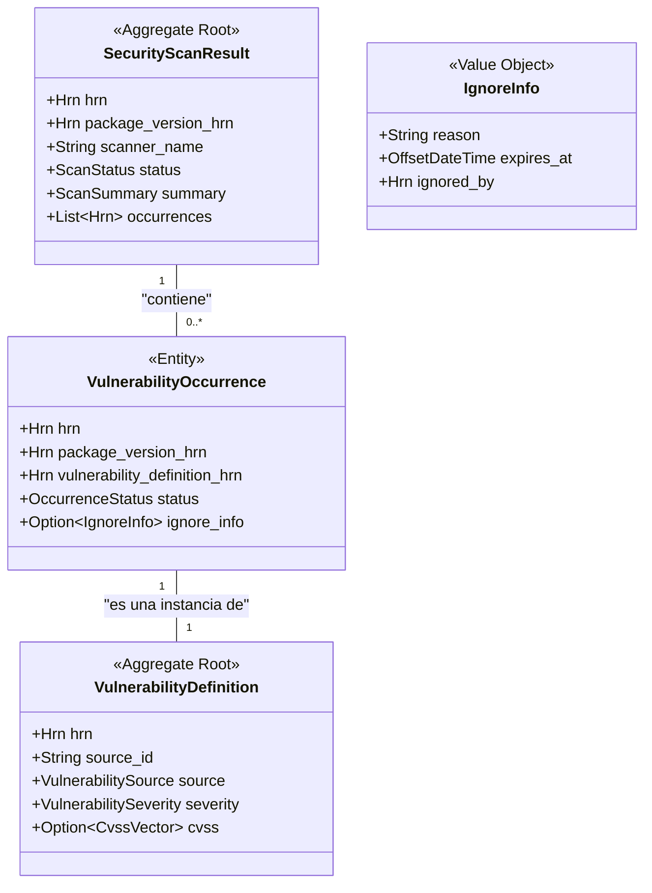

# Especificación Completa del Modelo de Datos: Crate `security`

**Versión:** 6.0
**Crate:** `crates/security`
**Contexto de Dominio:** Escaneo y Cumplimiento

### 1\. Propósito y Responsabilidades

El crate `security` es el Bounded Context responsable de la **evaluación de riesgos y la detección de fallos** en los artefactos de software. Es el complemento del crate `supply-chain`; mientras `supply-chain` se enfoca en la transparencia e integridad, `security` se enfoca en identificar problemas conocidos.

Sus responsabilidades clave son:

* Orquestar escaneos de seguridad asíncronos (vulnerabilidades, licencias, malware, etc.) sobre los `PackageVersion`.
* Gestionar el ciclo de vida del Agregado Raíz `SecurityScanResult`, que representa el resultado inmutable de un escaneo en un momento dado.
* Mantener una base de datos normalizada de definiciones de vulnerabilidades (`VulnerabilityDefinition`), actuando como una fuente de verdad canónica para CVEs, GHSAs, etc.
* Registrar las `VulnerabilityOccurrence`, que vinculan una definición de vulnerabilidad con un `PackageVersion` específico, incluyendo el contexto de la detección (ej. si ha sido parcheado o ignorado).
* Publicar eventos de dominio sobre los resultados de los escaneos para que otros sistemas puedan reaccionar (ej. poner en cuarentena un artefacto).

### 2\. Diagrama UML del Contexto



### 3\. Estructura de Ficheros del Dominio

```
crates/security/src/domain/
├── mod.rs
├── scan_result.rs
├── vulnerability.rs
└── events.rs
```

### 4\. Definiciones Completas en `rust`

#### 4.1. Módulo de Resultado de Escaneo (`domain/scan_result.rs`)

```rust
// crates/security/src/domain/scan_result.rs

use crate::shared::hrn::{Hrn, OrganizationId, PackageVersionId, VulnerabilityOccurrenceId};
use crate::shared::lifecycle::Lifecycle;
use crate::shared::security::HodeiResource;
use serde::{Serialize, Deserialize};
use time::OffsetDateTime;

/// Representa el resultado de un único escaneo de seguridad sobre un `PackageVersion`.
/// Es un Agregado Raíz inmutable; un nuevo escaneo crea un nuevo resultado.
#[derive(Debug, Clone, Serialize, Deserialize)]
pub struct SecurityScanResult {
    /// El HRN único del resultado del escaneo.
    /// Formato: `hrn:hodei:security:<region>:<org_id>:scan-result/<scan_id>`
    pub hrn: Hrn,

    /// La organización a la que pertenece este resultado.
    pub organization_hrn: OrganizationId,
    
    /// El HRN del `PackageVersion` que fue escaneado.
    pub package_version_hrn: PackageVersionId,

    /// El nombre de la herramienta de escaneo utilizada (ej. "Trivy", "Snyk").
    pub scanner_name: String,
    
    /// La versión de la herramienta de escaneo.
    pub scanner_version: String,
    
    /// El estado del proceso de escaneo.
    pub status: ScanStatus,
    
    /// Un resumen agregado de los hallazgos.
    pub summary: ScanSummary,

    /// Lista de HRNs a las `VulnerabilityOccurrence` encontradas en este escaneo.
    pub occurrences: Vec<VulnerabilityOccurrenceId>,
    
    /// Información de auditoría y ciclo de vida.
    pub lifecycle: Lifecycle,
}

/// Un resumen agregado de los hallazgos de un escaneo para una vista rápida.
#[derive(Debug, Clone, Serialize, Deserialize)]
pub struct ScanSummary {
    pub critical_count: u32,
    pub high_count: u32,
    pub medium_count: u32,
    pub low_count: u32,
    pub info_count: u32,
    pub unknown_count: u32,
    pub total: u32,
    /// Una puntuación de riesgo calculada (ej. 0.0 - 10.0).
    pub risk_score: f32,
}

/// El estado del ciclo de vida de un escaneo asíncrono.
#[derive(Debug, Clone, Copy, PartialEq, Eq, Serialize, Deserialize)]
pub enum ScanStatus { Pending, InProgress, Completed, Failed }
```

#### 4.2. Módulo de Vulnerabilidad (`domain/vulnerability.rs`)

```rust
// crates/security/src/domain/vulnerability.rs

use crate::shared::hrn::{Hrn, OrganizationId, PackageVersionId, VulnerabilityDefinitionId, UserId};
use crate::shared::lifecycle::Lifecycle;
use crate::shared::enums::VulnerabilitySeverity;
use serde::{Serialize, Deserialize};
use time::OffsetDateTime;

/// Representa la definición canónica y normalizada de una vulnerabilidad (ej. un CVE).
/// Se almacena una sola vez y se reutiliza en múltiples ocurrencias.
/// Es un Agregado Raíz.
#[derive(Debug, Clone, Serialize, Deserialize)]
pub struct VulnerabilityDefinition {
    /// HRN único para esta definición de vulnerabilidad.
    /// Formato: `hrn:hodei:security:global:vulnerability/<source>/<source_id>`
    pub hrn: VulnerabilityDefinitionId,
    
    /// El identificador de la vulnerabilidad en su fuente original (ej. "CVE-2021-44228").
    pub source_id: String,
    
    /// La base de datos de origen de la vulnerabilidad.
    pub source: VulnerabilitySource,
    
    /// La severidad asignada por la fuente.
    pub severity: VulnerabilitySeverity,
    
    /// Título o resumen corto de la vulnerabilidad.
    pub summary: String,
    
    /// Descripción detallada de la vulnerabilidad.
    pub details: String,
    
    /// Puntuación CVSS, si está disponible.
    pub cvss: Option<CvssVector>,
    
    /// Lista de URLs para más información (avisos, mitigaciones, etc.).
    pub references: Vec<String>,
    
    /// Información de auditoría (cuándo se añadió a la base de datos de Hodei).
    pub lifecycle: Lifecycle,
}

/// Representa la ocurrencia de una `VulnerabilityDefinition` en un `PackageVersion` específico.
/// Es una entidad que vive dentro del contexto de un `SecurityScanResult`.
#[derive(Debug, Clone, Serialize, Deserialize)]
pub struct VulnerabilityOccurrence {
    /// HRN único para esta ocurrencia específica.
    /// Formato: `hrn:hodei:security:<region>:<org_id>:occurrence/<occurrence_id>`
    pub hrn: Hrn,

    /// HRN del `PackageVersion` afectado.
    pub package_version_hrn: PackageVersionId,
    
    /// HRN de la `VulnerabilityDefinition` canónica.
    pub vulnerability_definition_hrn: VulnerabilityDefinitionId,
    
    /// El estado de esta ocurrencia (ej. si ha sido ignorada por un usuario).
    pub status: OccurrenceStatus,
    
    /// Información detallada si la ocurrencia ha sido ignorada.
    pub ignore_info: Option<IgnoreInfo>,
    
    /// Indica si existe una versión del paquete que corrige esta vulnerabilidad.
    pub fix_is_available: bool,
    
    /// Lista de versiones del paquete que contienen el parche.
    pub fixed_in_versions: Vec<String>,

    /// Información de auditoría.
    pub lifecycle: Lifecycle,
}

/// Vector CVSS v3.1 para una puntuación detallada.
#[derive(Debug, Clone, Serialize, Deserialize)]
pub struct CvssVector {
    pub version: String, // "3.1"
    pub vector_string: String, // "CVSS:3.1/AV:N/AC:L/PR:N/UI:N/S:C/C:H/I:H/A:H"
    pub base_score: f32,
    pub temporal_score: Option<f32>,
    pub environmental_score: Option<f32>,
}

/// Información sobre la decisión de ignorar una vulnerabilidad.
#[derive(Debug, Clone, Serialize, Deserialize)]
pub struct IgnoreInfo {
    pub reason: String,
    pub expires_at: Option<OffsetDateTime>,
    pub ignored_by: UserId,
}

/// La base de datos de origen de una vulnerabilidad.
#[derive(Debug, Clone, Copy, PartialEq, Eq, Serialize, Deserialize)]
pub enum VulnerabilitySource { Nvd, GitHubAdvisory, Osv, Trivy, Snyk, Other }

/// El estado de una ocurrencia de vulnerabilidad.
#[derive(Debug, Clone, Copy, PartialEq, Eq, Serialize, Deserialize)]
pub enum OccurrenceStatus { Unresolved, Patched, Ignored, FalsePositive }
```

#### 4.3. Módulo de Eventos (`domain/events.rs`)

```rust
// crates/security/src/domain/events.rs

use crate::shared::hrn::{Hrn, PackageVersionId, ScanResultId};
use crate::shared::enums::VulnerabilitySeverity;
use crate::domain::scan_result::ScanSummary;
use serde::{Serialize, Deserialize};
use time::OffsetDateTime;

/// Eventos de dominio publicados por el contexto `security`.
#[derive(Debug, Clone, Serialize, Deserialize)]
pub enum SecurityEvent {
    /// Se solicita un nuevo escaneo para un artefacto.
    /// Puede ser consumido por un orquestador de escaneos.
    ScanRequested(ScanRequested),

    /// Un escaneo se ha completado.
    ScanCompleted(ScanCompleted),

    /// Se ha encontrado una vulnerabilidad de alta criticidad para notificación inmediata.
    CriticalVulnerabilityFound(CriticalVulnerabilityFound),
    
    /// Una nueva definición de vulnerabilidad ha sido añadida a la base de datos.
    VulnerabilityDefinitionAdded(VulnerabilityDefinitionAdded),
}

#[derive(Debug, Clone, Serialize, Deserialize)]
pub struct ScanRequested {
    pub package_version_hrn: PackageVersionId,
    pub requested_by: Hrn,
    pub at: OffsetDateTime,
}

#[derive(Debug, Clone, Serialize, Deserialize)]
pub struct ScanCompleted {
    pub hrn: ScanResultId,
    pub package_version_hrn: PackageVersionId,
    pub summary: ScanSummary,
    pub at: OffsetDateTime,
}

#[derive(Debug, Clone, Serialize, Deserialize)]
pub struct CriticalVulnerabilityFound {
    pub occurrence_hrn: Hrn,
    pub package_version_hrn: PackageVersionId,
    pub vulnerability_id: String, // ej. "CVE-2021-44228"
    pub severity: VulnerabilitySeverity, // Siempre será 'Critical'
    pub at: OffsetDateTime,
}

#[derive(Debug, Clone, Serialize, Deserialize)]
pub struct VulnerabilityDefinitionAdded {
    pub hrn: Hrn,
    pub source_id: String,
    pub source: String,
    pub severity: VulnerabilitySeverity,
    pub at: OffsetDateTime,
}
```