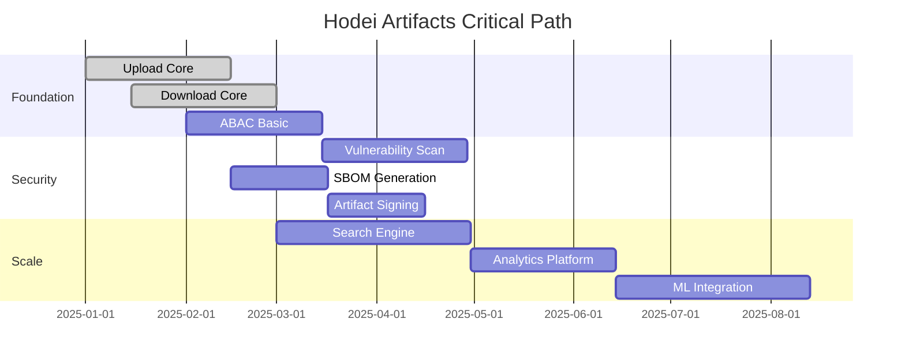

# Plan Maestro de Features y Roadmap - Hodei Artifacts
Estado: Draft v1.0  
Fecha: 2025-08-24  
Fuente: Análisis completo PRD + Evento Catalog + VSA Architecture

## 1. Resumen Ejecutivo del Plan

Este documento presenta un **plan maestro de features** organizado en **épicas estratégicas** con roadmap de 18 meses. Se identificaron **200+ features** agrupadas en **12 épicas principales** y **4 épicas transversales**, priorizadas por valor de negocio, riesgo técnico y dependencias.

### 1.1 Métricas del Plan
- **Features Totales**: 200+
- **Épicas Principales**: 12
- **Épicas Transversales**: 4  
- **Releases Mayores**: 6 (cada 3 meses)
- **Vertical Slices**: 8 slices completamente definidos
- **Eventos Identificados**: 120+ (del catálogo de eventos)

### 1.2 Estrategia de Entrega
| Horizonte | Enfoque | Objetivo |
|-----------|---------|----------|
| **Q1 2025** | MVP Core + Foundations | Sistema funcional básico |
| **Q2 2025** | Security & Compliance | Cadena suministro segura |
| **Q3 2025** | Advanced Features | Diferenciadores competitivos |
| **Q4 2025** | Scale & Performance | Optimización empresarial |
| **Q1 2026** | Ecosystem Integration | Integraciones avanzadas |
| **Q2 2026** | AI/ML & Innovation | Capacidades futuras |

## 2. Épicas Principales (Core Business Value)

### Épica E1: 🔄 Artifact Lifecycle Management
**Objetivo**: Gestión completa del ciclo de vida de artefactos  
**Valor de Negocio**: Funcionalidad core - sin esto no hay producto  
**Complejidad**: ⭐⭐⭐ (Alta)

#### Features Principales (20 features)
| Feature ID | Nombre | Descripción | Prioridad | Estimación | Dependencies |
|------------|--------|-------------|-----------|------------|--------------|
| E1.F01 | **Artifact Upload Core** | Upload básico con hash SHA-256 | P0 | 13 pts | - |
| E1.F02 | **Artifact Upload Multipart** | Upload streaming para archivos >100MB | P0 | 8 pts | E1.F01 |
| E1.F03 | **Artifact Metadata Extraction** | Extracción automática metadata por tipo | P1 | 5 pts | E1.F01 |
| E1.F04 | **Artifact Validation Engine** | Validación sintáctica y semántica | P0 | 8 pts | E1.F01 |
| E1.F05 | **Duplicate Detection** | Detección y manejo duplicados | P1 | 5 pts | E1.F01 |
| E1.F06 | **Upload Progress Tracking** | Seguimiento progreso upload tiempo real | P2 | 3 pts | E1.F02 |
| E1.F07 | **Batch Upload Operations** | Subida múltiples artefactos en lote | P2 | 8 pts | E1.F01 |
| E1.F08 | **Upload Resume Support** | Reanudar uploads interrumpidos | P2 | 5 pts | E1.F02 |
| E1.F09 | **Artifact Versioning Logic** | Lógica semantic versioning + tags | P1 | 5 pts | E1.F01 |
| E1.F10 | **Content-Type Detection** | Auto-detección tipo MIME avanzada | P2 | 3 pts | E1.F03 |
| E1.F11 | **Upload Bandwidth Throttling** | Control ancho banda uploads | P2 | 3 pts | E1.F02 |
| E1.F12 | **Artifact Preview Generation** | Thumbnails/previews para UI | P3 | 5 pts | E1.F03 |
| E1.F13 | **Upload Analytics Events** | Eventos telemetría detallados | P1 | 3 pts | E1.F01 |
| E1.F14 | **Multi-Repository Upload** | Upload simultáneo múltiples repos | P2 | 8 pts | E1.F01 |
| E1.F15 | **Upload Scheduling** | Programar uploads para horarios específicos | P3 | 5 pts | E1.F01 |
| E1.F16 | **Artifact Transformation** | Conversión formatos on-the-fly | P3 | 13 pts | E1.F03 |
| E1.F17 | **Upload Conflict Resolution** | Estrategias resolución conflictos | P2 | 5 pts | E1.F05 |
| E1.F18 | **Artifact Checksums Multiple** | Soporte MD5, SHA-1, SHA-512 | P2 | 3 pts | E1.F01 |
| E1.F19 | **Upload Webhook Notifications** | Notificaciones externas upload | P2 | 3 pts | E1.F13 |
| E1.F20 | **Upload Performance Optimization** | Optimizaciones rendimiento específicas | P1 | 8 pts | E1.F02 |

#### Eventos Relacionados (del catálogo)
- ArtifactUploadStarted, ArtifactUploaded, ArtifactUploadFailed
- ArtifactValidationFailed, DuplicateArtifactDetected
- ArtifactHashCalculated, ArtifactMetadataEnriched

---

### Épica E2: 📥 Artifact Retrieval & Distribution
**Objetivo**: Descarga eficiente y distribución optimizada  
**Valor de Negocio**: Performance crítica para adopción  
**Complejidad**: ⭐⭐ (Media)

#### Features Principales (18 features)
| Feature ID | Nombre | Descripción | Prioridad | Estimación |
|------------|--------|-------------|-----------|------------|
| E2.F01 | **Download Core Engine** | Descarga básica con autorización | P0 | 8 pts |
| E2.F02 | **Presigned URL Generation** | URLs temporales S3 | P0 | 5 pts |
| E2.F03 | **Range Request Support** | HTTP Range para descargas parciales | P1 | 5 pts |
| E2.F04 | **Download Resume Support** | Reanudar descargas interrumpidas | P1 | 5 pts |
| E2.F05 | **Conditional Downloads** | ETag, If-Modified-Since, 304 responses | P1 | 3 pts |
| E2.F06 | **Download Bandwidth Control** | Throttling dinámico | P2 | 3 pts |
| E2.F07 | **CDN Integration** | Integración CloudFront/CloudFlare | P2 | 8 pts |
| E2.F08 | **Geographic Distribution** | Edge locations por región | P2 | 13 pts |
| E2.F09 | **Download Analytics** | Métricas detalladas uso | P1 | 3 pts |
| E2.F10 | **Batch Download API** | Descarga múltiples artefactos | P2 | 8 pts |
| E2.F11 | **Download Caching Strategy** | Cache inteligente cliente/proxy | P1 | 5 pts |
| E2.F12 | **Download Authentication** | Múltiples métodos auth | P0 | 5 pts |
| E2.F13 | **Download Rate Limiting** | Límites por usuario/IP | P1 | 3 pts |
| E2.F14 | **Download Virus Scanning** | Escaneo en tiempo real | P2 | 8 pts |
| E2.F15 | **Download Compression** | Compresión on-the-fly | P2 | 5 pts |
| E2.F16 | **Download Link Sharing** | URLs compartibles con expiración | P2 | 3 pts |
| E2.F17 | **Download Mirrors** | Múltiples fuentes redundantes | P3 | 8 pts |
| E2.F18 | **Download Statistics Dashboard** | Dashboard tiempo real | P2 | 5 pts |

#### Eventos Relacionados
- ArtifactDownloadRequested, ArtifactDownloadCompleted
- PresignedUrlGenerated, ArtifactAccessGranted/Denied

---

### Épica E3: 🔍 Search & Discovery Engine
**Objetivo**: Búsqueda avanzada y descubrimiento inteligente  
**Valor de Negocio**: Usabilidad y experiencia desarrollador  
**Complejidad**: ⭐⭐⭐ (Alta)

#### Features Principales (22 features)
| Feature ID | Nombre | Descripción | Prioridad | Estimación |
|------------|--------|-------------|-----------|------------|
| E3.F01 | **Basic Search Engine** | Búsqueda texto nombre/versión | P0 | 8 pts |
| E3.F02 | **Advanced Query Parser** | Sintaxis query avanzada | P1 | 8 pts |
| E3.F03 | **Full-Text Search** | Búsqueda contenido/metadata | P1 | 5 pts |
| E3.F04 | **Faceted Search** | Filtros por categorías | P1 | 5 pts |
| E3.F05 | **Search Suggestions** | Auto-completado inteligente | P2 | 5 pts |
| E3.F06 | **Search Analytics** | Métricas queries populares | P2 | 3 pts |
| E3.F07 | **Saved Searches** | Búsquedas guardadas por usuario | P2 | 3 pts |
| E3.F08 | **Search API Rate Limiting** | Protección abuse | P1 | 3 pts |
| E3.F09 | **Search Indexing Pipeline** | Pipeline indexación tiempo real | P0 | 13 pts |
| E3.F10 | **Search Result Ranking** | Algoritmo relevancia personalizable | P1 | 8 pts |
| E3.F11 | **Search by Hash** | Búsqueda por SHA-256 exacto | P1 | 3 pts |
| E3.F12 | **Search by License** | Filtros por tipo licencia | P2 | 3 pts |
| E3.F13 | **Search by Vulnerability** | Filtros por vulnerabilidades | P1 | 5 pts |
| E3.F14 | **Search Export** | Exportar resultados CSV/JSON | P2 | 3 pts |
| E3.F15 | **Search Personalization** | Resultados personalizados | P2 | 8 pts |
| E3.F16 | **Search Performance Optimization** | Índices optimizados | P1 | 5 pts |
| E3.F17 | **Search Federation** | Búsqueda múltiples repositorios | P2 | 8 pts |
| E3.F18 | **Search Alerts** | Notificaciones nuevos artefactos | P2 | 5 pts |
| E3.F19 | **Search API Documentation** | Docs interactiva API búsqueda | P2 | 3 pts |
| E3.F20 | **Search Monitoring** | Monitoreo performance búsquedas | P1 | 3 pts |
| E3.F21 | **Search Cache Layer** | Cache consultas frecuentes | P1 | 5 pts |
| E3.F22 | **Search ML Recommendations** | Recomendaciones ML básicas | P3 | 13 pts |

#### Eventos Relacionados
- SearchQueryExecuted, SearchResultClicked
- ArtifactIndexed, PopularSearchDetected, SlowSearchDetected

---

### Épica E4: 🔐 Authorization & Access Control (ABAC)
**Objetivo**: Control acceso granular basado atributos  
**Valor de Negocio**: Seguridad y cumplimiento empresarial  
**Complejidad**: ⭐⭐⭐⭐ (Muy Alta)

#### Features Principales (25 features)
| Feature ID | Nombre | Descripción | Prioridad | Estimación |
|------------|--------|-------------|-----------|------------|
| E4.F01 | **Cedar Policy Engine Integration** | Integración motor Cedar | P0 | 13 pts |
| E4.F02 | **Policy CRUD Operations** | Crear/leer/actualizar/eliminar políticas | P0 | 8 pts |
| E4.F03 | **Policy Validation Engine** | Validación sintaxis y semántica | P0 | 8 pts |
| E4.F04 | **Access Decision Cache** | Cache decisiones LRU con TTL | P0 | 5 pts |
| E4.F05 | **User Management System** | CRUD usuarios y atributos | P0 | 8 pts |
| E4.F06 | **Group Management** | Grupos y membresías | P1 | 5 pts |
| E4.F07 | **Role-Based Templates** | Plantillas roles comunes | P1 | 5 pts |
| E4.F08 | **Policy Testing Framework** | Testing políticas sandbox | P1 | 8 pts |
| E4.F09 | **Audit Trail System** | Log todas decisiones acceso | P0 | 5 pts |
| E4.F10 | **Policy Versioning** | Versionado inmutable políticas | P1 | 5 pts |
| E4.F11 | **Policy Conflict Detection** | Detección conflictos automática | P1 | 8 pts |
| E4.F12 | **Access Request Workflow** | Flujo solicitud permisos | P2 | 8 pts |
| E4.F13 | **Time-Based Access** | Políticas temporales | P2 | 5 pts |
| E4.F14 | **IP-Based Restrictions** | Control por IP/geolocalización | P1 | 3 pts |
| E4.F15 | **API Key Management** | Gestión claves API | P1 | 5 pts |
| E4.F16 | **Service Account Management** | Cuentas servicio automáticas | P0 | 5 pts |
| E4.F17 | **Policy Migration Tools** | Herramientas migración | P2 | 5 pts |
| E4.F18 | **Access Analytics Dashboard** | Dashboard métricas acceso | P2 | 8 pts |
| E4.F19 | **Policy Performance Monitoring** | Monitoreo latencias evaluación | P1 | 3 pts |
| E4.F20 | **Delegation Support** | Delegación permisos | P2 | 8 pts |
| E4.F21 | **Emergency Access Procedures** | Procedimientos acceso emergencia | P2 | 5 pts |
| E4.F22 | **Policy Documentation Generator** | Auto-generación docs políticas | P2 | 5 pts |
| E4.F23 | **External Identity Integration** | LDAP/AD/OIDC integration | P1 | 13 pts |
| E4.F24 | **Risk-Based Access Control** | Control basado en riesgo | P3 | 13 pts |
| E4.F25 | **Policy Machine Learning** | ML optimización políticas | P3 | 21 pts |

#### Eventos Relacionados
- PolicyCreated/Updated/Deleted, AccessDecisionMade
- UserCreated/Updated, SuspiciousAccessAttempt

---

### Épica E5: 🏗️ Repository Management
**Objetivo**: Gestión completa repositorios y namespaces  
**Valor de Negocio**: Organización y gobierno datos  
**Complejidad**: ⭐⭐ (Media)

#### Features Principales (18 features)
| Feature ID | Nombre | Descripción | Prioridad | Estimación |
|------------|--------|-------------|-----------|------------|
| E5.F01 | **Repository CRUD** | Crear/gestionar repositorios | P0 | 8 pts |
| E5.F02 | **Repository Types Support** | Maven, npm, Docker, etc. | P0 | 13 pts |
| E5.F03 | **Repository Configuration** | Configuración flexible | P1 | 5 pts |
| E5.F04 | **Retention Policy Engine** | Políticas retención automática | P1 | 8 pts |
| E5.F05 | **Storage Quota Management** | Límites almacenamiento | P1 | 5 pts |
| E5.F06 | **Repository Statistics** | Métricas uso y almacenamiento | P1 | 5 pts |
| E5.F07 | **Repository Archival** | Archivado/restauración repos | P2 | 8 pts |
| E5.F08 | **Virtual Repository Support** | Repos virtuales agregados | P2 | 13 pts |
| E5.F09 | **Repository Mirroring** | Mirrors automáticos | P2 | 8 pts |
| E5.F10 | **Repository Cleanup Jobs** | Jobs limpieza automática | P1 | 5 pts |
| E5.F11 | **Repository Access Logs** | Logs acceso detallados | P1 | 3 pts |
| E5.F12 | **Repository Health Checks** | Verificación integridad | P1 | 5 pts |
| E5.F13 | **Repository Backup/Restore** | Backup incremental/completo | P2 | 13 pts |
| E5.F14 | **Repository Migration Tools** | Migración entre sistemas | P2 | 8 pts |
| E5.F15 | **Repository Metadata Management** | Gestión metadata extendida | P2 | 5 pts |
| E5.F16 | **Repository Webhooks** | Webhooks eventos repositorio | P2 | 5 pts |
| E5.F17 | **Repository Performance Monitoring** | Monitoreo performance | P1 | 3 pts |
| E5.F18 | **Repository Template System** | Plantillas configuración | P2 | 5 pts |

#### Eventos Relacionados
- RepositoryCreated/Updated/Deleted, StorageQuotaExceeded
- RetentionPolicyTriggered, ArtifactPurged

---

### Épica E6: 🛡️ Security & Vulnerability Management
**Objetivo**: Seguridad cadena suministro integral  
**Valor de Negocio**: Diferenciador competitivo crítico  
**Complejidad**: ⭐⭐⭐⭐ (Muy Alta)

#### Features Principales (28 features)
| Feature ID | Nombre | Descripción | Prioridad | Estimación |
|------------|--------|-------------|-----------|------------|
| E6.F01 | **Vulnerability Scanner Integration** | Integración múltiples scanners | P1 | 13 pts |
| E6.F02 | **SBOM Generation** | Generación automática SBOM | P1 | 8 pts |
| E6.F03 | **Artifact Signing** | Firma digital artefactos | P1 | 8 pts |
| E6.F04 | **Signature Verification** | Verificación firmas | P1 | 5 pts |
| E6.F05 | **CVE Database Integration** | Integración bases CVE | P1 | 8 pts |
| E6.F06 | **Vulnerability Reporting** | Reportes vulnerabilidades | P1 | 5 pts |
| E6.F07 | **Security Policy Enforcement** | Enforcement políticas seguridad | P1 | 8 pts |
| E6.F08 | **License Compliance Scanner** | Scanner cumplimiento licencias | P1 | 8 pts |
| E6.F09 | **Malware Detection** | Detección malware | P2 | 13 pts |
| E6.F10 | **Supply Chain Analysis** | Análisis cadena suministro | P2 | 13 pts |
| E6.F11 | **Security Alerts System** | Sistema alertas automáticas | P1 | 5 pts |
| E6.F12 | **Security Dashboard** | Dashboard centralizado | P1 | 8 pts |
| E6.F13 | **Compliance Reporting** | Reportes cumplimiento | P2 | 8 pts |
| E6.F14 | **Security Metrics** | Métricas seguridad KPI | P1 | 3 pts |
| E6.F15 | **Quarantine System** | Cuarentena artefactos | P2 | 5 pts |
| E6.F16 | **Security Workflow Automation** | Workflows automáticos | P2 | 8 pts |
| E6.F17 | **Third-Party Security Integration** | Integración herramientas externas | P2 | 8 pts |
| E6.F18 | **Security Training Integration** | Integración training developers | P3 | 5 pts |
| E6.F19 | **Penetration Testing Support** | Soporte pen testing | P3 | 8 pts |
| E6.F20 | **Security Incident Response** | Respuesta incidentes | P2 | 8 pts |
| E6.F21 | **Zero-Day Vulnerability Management** | Gestión 0-days | P2 | 13 pts |
| E6.F22 | **Security Configuration Scanner** | Scanner configuraciones | P2 | 5 pts |
| E6.F23 | **Cryptographic Standards Compliance** | Cumplimiento estándares crypto | P1 | 5 pts |
| E6.F24 | **Security Audit Trails** | Trails auditoría seguridad | P1 | 3 pts |
| E6.F25 | **Risk Assessment Engine** | Motor evaluación riesgos | P2 | 13 pts |
| E6.F26 | **Security Policy Templates** | Plantillas políticas seguridad | P2 | 5 pts |
| E6.F27 | **Threat Intelligence Integration** | Integración threat intel | P3 | 13 pts |
| E6.F28 | **Security Machine Learning** | ML detección amenazas | P3 | 21 pts |

#### Eventos Relacionados
- SecurityScanStarted/Completed, VulnerabilityDetected
- ArtifactSigned, SignatureVerified, CriticalVulnerabilityFound

---

### Épica E7: 📊 Analytics & Business Intelligence
**Objetivo**: Inteligencia negocio y analytics avanzado  
**Valor de Negocio**: Insights operacionales  
**Complejidad**: ⭐⭐⭐ (Alta)

#### Features Principales (20 features)
| Feature ID | Nombre | Descripción | Prioridad | Estimación |
|------------|--------|-------------|-----------|------------|
| E7.F01 | **Usage Analytics Engine** | Motor analytics uso | P2 | 8 pts |
| E7.F02 | **Real-time Dashboards** | Dashboards tiempo real | P2 | 8 pts |
| E7.F03 | **Custom Reports Builder** | Constructor reportes personalizados | P2 | 13 pts |
| E7.F04 | **Trend Analysis** | Análisis tendencias | P2 | 8 pts |
| E7.F05 | **Anomaly Detection** | Detección anomalías | P2 | 8 pts |
| E7.F06 | **Predictive Analytics** | Analytics predictivo | P3 | 13 pts |
| E7.F07 | **Cost Analytics** | Análisis costes almacenamiento | P2 | 5 pts |
| E7.F08 | **Performance Analytics** | Analytics rendimiento | P1 | 5 pts |
| E7.F09 | **User Behavior Analytics** | Analytics comportamiento | P2 | 8 pts |
| E7.F10 | **Repository Health Analytics** | Analytics salud repos | P2 | 5 pts |
| E7.F11 | **Download Pattern Analysis** | Análisis patrones descarga | P2 | 5 pts |
| E7.F12 | **License Usage Analytics** | Analytics uso licencias | P2 | 5 pts |
| E7.F13 | **Security Analytics** | Analytics seguridad | P1 | 5 pts |
| E7.F14 | **Data Export/Import** | Export/import datos analytics | P2 | 5 pts |
| E7.F15 | **Analytics API** | API para herramientas externas | P2 | 5 pts |
| E7.F16 | **Scheduled Reports** | Reportes programados | P2 | 5 pts |
| E7.F17 | **Analytics Alerting** | Alertas basadas analytics | P2 | 3 pts |
| E7.F18 | **Data Retention Management** | Gestión retención datos analytics | P2 | 3 pts |
| E7.F19 | **Analytics Performance Optimization** | Optimización queries analytics | P2 | 5 pts |
| E7.F20 | **Machine Learning Insights** | Insights ML automáticos | P3 | 13 pts |

---

### Épica E8: 🔗 Ecosystem Integration
**Objetivo**: Integraciones ecosistema desarrollo  
**Valor de Negocio**: Adopción y experiencia desarrollador  
**Complejidad**: ⭐⭐ (Media)

#### Features Principales (24 features)
| Feature ID | Nombre | Descripción | Prioridad | Estimación |
|------------|--------|-------------|-----------|------------|
| E8.F01 | **Maven Integration** | Soporte completo Maven | P0 | 13 pts |
| E8.F02 | **npm Integration** | Soporte completo npm | P0 | 13 pts |
| E8.F03 | **Docker Registry** | Registry Docker completo | P0 | 13 pts |
| E8.F04 | **NuGet Integration** | Soporte NuGet | P1 | 8 pts |
| E8.F05 | **PyPI Integration** | Soporte PyPI | P1 | 8 pts |
| E8.F06 | **Helm Chart Repository** | Repository Helm charts | P1 | 8 pts |
| E8.F07 | **Go Module Proxy** | Proxy módulos Go | P1 | 8 pts |
| E8.F08 | **RubyGems Integration** | Soporte RubyGems | P2 | 8 pts |
| E8.F09 | **Gradle Plugin** | Plugin Gradle oficial | P1 | 5 pts |
| E8.F10 | **Jenkins Plugin** | Plugin Jenkins | P1 | 5 pts |
| E8.F11 | **GitLab CI Integration** | Integración GitLab CI/CD | P1 | 5 pts |
| E8.F12 | **GitHub Actions** | Actions GitHub | P1 | 5 pts |
| E8.F13 | **CLI Tool** | Herramienta línea comandos | P1 | 8 pts |
| E8.F14 | **IDE Plugins** | Plugins IDE (VS Code, IntelliJ) | P2 | 8 pts |
| E8.F15 | **Kubernetes Operator** | Operator Kubernetes | P2 | 13 pts |
| E8.F16 | **Terraform Provider** | Provider Terraform | P2 | 8 pts |
| E8.F17 | **REST API SDKs** | SDKs múltiples lenguajes | P1 | 13 pts |
| E8.F18 | **Webhook Integrations** | Integraciones webhook | P1 | 5 pts |
| E8.F19 | **LDAP/Active Directory** | Integración LDAP/AD | P1 | 8 pts |
| E8.F20 | **SAML/OIDC Integration** | Integración SSO | P1 | 8 pts |
| E8.F21 | **Slack/Teams Notifications** | Notificaciones chat | P2 | 3 pts |
| E8.F22 | **Jira Integration** | Integración tracking issues | P2 | 5 pts |
| E8.F23 | **Confluence Integration** | Integración documentación | P2 | 3 pts |
| E8.F24 | **Custom Integration Framework** | Framework integraciones custom | P2 | 13 pts |

---

## 3. Épicas Transversales (Cross-Cutting Concerns)

### Épica T1: 🔧 Platform Engineering
**Objetivo**: Infraestructura, deployment y operaciones  

#### Features (15 features)
- Kubernetes Helm Charts, Docker multi-stage builds
- CI/CD pipelines completos, Infrastructure as Code
- Auto-scaling, Health checks, Circuit breakers
- Monitoring, Alerting, Log aggregation
- Backup/restore procedures, Disaster recovery

### Épica T2: 📈 Observability & Performance
**Objetivo**: Visibilidad completa sistema  

#### Features (12 features)
- OpenTelemetry integration, Distributed tracing
- Prometheus metrics, Grafana dashboards
- Performance profiling, Load testing framework
- SLA monitoring, Capacity planning

### Épica T3: 🎨 User Experience & UI
**Objetivo**: Interfaz usuario y experiencia  

#### Features (16 features)
- Web UI completa, Mobile responsive design
- API documentation interactive (Swagger)
- User onboarding, Help system
- Accessibility compliance, Internationalization

### Épica T4: 🧪 Quality Assurance
**Objetivo**: Testing y calidad de código  

#### Features (10 features)
- Test automation framework, Performance testing
- Security testing, Chaos engineering
- Code quality gates, Documentation standards

## 4. Roadmap Estratégico (18 meses)

### 4.1 Release Plan Overview
| Release | Timeframe | Theme | Features | Epic Focus |
|---------|-----------|-------|----------|------------|
| **v0.1 Alpha** | Q1 2025 | Foundation | 25 | E1, E2, E4 basic |
| **v0.5 Beta** | Q2 2025 | Security First | 35 | E6, E4 advanced, E5 |
| **v1.0 GA** | Q3 2025 | Production Ready | 40 | E3, E8 core, T1 |
| **v1.5** | Q4 2025 | Scale & Performance | 35 | E7, T2, optimization |
| **v2.0** | Q1 2026 | Enterprise Features | 40 | E8 advanced, E4 ML |
| **v2.5** | Q2 2026 | AI/ML Integration | 25 | E6 ML, E7 predictive |

### 4.2 Quarterly Breakdown

#### Q1 2025: Foundation (v0.1 Alpha)
**Epic Priorities**: E1 (100%), E2 (70%), E4 (40%), T1 (60%)
- ✅ Core upload/download functionality  
- ✅ Basic ABAC with Cedar
- ✅ MongoDB + S3 storage layers
- ✅ Event bus with Kafka
- ✅ Container deployment

**Key Features**:
- E1.F01-F05: Upload core + validation
- E2.F01-F03: Download + presigned URLs  
- E4.F01-F05: Cedar integration + basic policies
- T1.F01-F04: K8s deployment + CI/CD

**Exit Criteria**: 
- Upload/download 1GB files <1min
- 100 concurrent users supported
- Basic security policies functional

#### Q2 2025: Security First (v0.5 Beta)
**Epic Priorities**: E6 (70%), E4 (80%), E5 (60%), E3 (40%)
- ✅ Vulnerability scanning pipeline
- ✅ SBOM generation + artifact signing  
- ✅ Advanced ABAC policies
- ✅ Repository management
- ✅ Basic search functionality

**Key Features**:
- E6.F01-F08: Security scanning + SBOM
- E4.F06-F15: Advanced authorization  
- E5.F01-F06: Repository CRUD + quotas
- E3.F01-F04: Basic search engine

**Exit Criteria**:
- 100% artifacts scanned + signed
- Sub-2ms authorization decisions
- Multi-repository support

#### Q3 2025: Production Ready (v1.0 GA)
**Epic Priorities**: E3 (80%), E8 (60%), T1 (100%), T2 (70%)
- ✅ Advanced search capabilities
- ✅ Core ecosystem integrations (Maven, npm, Docker)
- ✅ Production-grade observability
- ✅ Complete platform engineering

**Key Features**:
- E3.F05-F16: Advanced search + analytics
- E8.F01-F07: Core ecosystem support
- T1.F05-F15: Full platform capabilities  
- T2.F01-F08: Complete observability

**Exit Criteria**:
- <50ms p99 search latency
- Maven Central proxy working
- 99.9% uptime SLA met

#### Q4 2025: Scale & Performance (v1.5)
**Epic Priorities**: E7 (70%), T2 (100%), E2 (100%), optimization across all
- ✅ Business intelligence platform
- ✅ Performance optimization
- ✅ Advanced distribution features
- ✅ Cost optimization

**Key Features**:
- E7.F01-F14: Full analytics platform
- E2.F04-F18: Advanced download features
- Performance tuning across all components
- Cost optimization and capacity planning

#### Q1 2026: Enterprise Features (v2.0)
**Epic Priorities**: E8 (100%), E4 ML features, E5 advanced
- ✅ Complete ecosystem integration
- ✅ Enterprise-grade features
- ✅ Advanced repository management
- ✅ ML-powered features phase 1

#### Q2 2026: AI/ML Integration (v2.5)
**Epic Priorities**: E6 ML, E7 predictive, innovation features
- ✅ AI-powered security analysis
- ✅ Predictive analytics  
- ✅ Automated optimization
- ✅ Next-generation features

### 4.3 Dependencies & Critical Path

## 5. Risk Assessment & Mitigation

### 5.1 High-Risk Features
| Feature | Risk Level | Mitigation Strategy |
|---------|------------|-------------------|
| E4.F25: Policy ML | 🔴 Very High | Spike + external expertise |
| E6.F28: Security ML | 🔴 Very High | Partner integration first |
| E8.F15: K8s Operator | 🟡 Medium | Community contribution |
| E3.F22: ML Recommendations | 🟡 Medium | Simple algorithms first |

### 5.2 Technical Debt Management
- **Performance debt**: Dedicated optimization sprints Q4 2025
- **Security debt**: Continuous security reviews  
- **Code quality debt**: 90% test coverage maintained
- **Documentation debt**: Living documentation approach

## 6. Success Metrics & KPIs

### 6.1 Feature Delivery Metrics
| Metric | Target | Current |
|--------|--------|---------|
| **Features delivered on time** | >85% | TBD |
| **Epic completion rate** | >90% | TBD |
| **Defect escape rate** | <5% | TBD |

### 6.2 Business Impact Metrics
| Epic | KPI | Target | Business Value |
|------|-----|--------|----------------|
| E1 | Upload throughput | >500/min | Core functionality |
| E2 | Download latency p99 | <50ms | User experience |
| E4 | Authorization latency | <2ms | Security performance |
| E6 | Vulnerability coverage | 100% | Security compliance |

## 7. Resource Planning

### 7.1 Team Structure (Recommended)
| Epic Owner | Skills Required | Capacity |
|------------|-----------------|----------|
| **E1/E2: Core Features** | Rust, Tokio, S3 | 2 developers |
| **E3: Search** | Elasticsearch, indexing | 1 developer |
| **E4: Authorization** | Cedar, security | 1 developer |
| **E6: Security** | Security tools, compliance | 1 developer |
| **Platform/DevOps** | Kubernetes, CI/CD | 1 DevOps |

### 7.2 External Dependencies
- **Cedar Policy Engine**: AWS open source (stable)
- **Security Scanners**: Trivy, Syft (free), Snyk (paid)
- **ML/AI Services**: Initially basic, cloud ML later

## 8. Conclusion

Este plan maestro define **200+ features** organizadas en **12 épicas principales** con roadmap de 18 meses. La estrategia prioriza:

1. **Foundation First**: Core functionality Q1-Q2
2. **Security by Design**: Integrado desde v0.5
3. **Performance Focus**: Optimización continua  
4. **Ecosystem Integration**: Adopción developer-friendly
5. **Innovation Pipeline**: ML/AI features futuras

El plan es **evolutivo** y se ajustará basado en feedback del mercado, performance de releases y cambios en el ecosistema tecnológico.

---
**Próximas Actualizaciones**: Mensuales con métricas de progreso y ajustes de prioridades basados en datos reales de uso.

## Tareas realizadas

- Se corrigió el retorno de `aggregate_id` en Shared (DomainEvent) para devolver `String`.
- Se configuró el arranque del servidor HTTP en la API (`hodei-artifacts-api`) usando `hyper::Server::bind` y se añadió la dependencia en `Cargo.toml`.
- Se implementó el puerto `SbomRepository` en Supply Chain con una implementación en memoria para `SbomSummary`.
