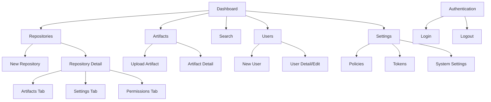

# Hodei Artifacts UI/UX Specification

## Introduction

This document defines the user experience goals, information architecture, user flows, and visual design specifications for Hodei Artifacts' user interface. It serves as the foundation for visual design and frontend development, ensuring a cohesive and user-centered experience.

### Overall UX Goals & Principles

**Rationale:** Establishing clear UX goals and design principles is fundamental for creating a user-centered interface. It ensures that all design decisions are aligned with the needs of the target users and the overall product vision. Defining target user personas helps in empathizing with users and designing for their specific needs.

#### Target User Personas (Propuesta Revisada)

*   **Desarrollador:**
    *   **Objetivo:** Subir, descargar y buscar artefactos de manera eficiente. Integrar Hodei Artifacts en sus flujos de trabajo de desarrollo.
    *   **Puntos de Dolor:** Dificultad para encontrar versiones correctas, procesos de subida complejos, falta de visibilidad sobre dependencias.
    *   **Tareas Típicas:** `npm publish`, `mvn deploy`, `pip install`, buscar paquetes, ver metadatos.
*   **Ingeniero de DevOps/CI/CD:**
    *   **Objetivo:** Automatizar la gestión de artefactos en pipelines CI/CD. Asegurar la fiabilidad y el rendimiento de las operaciones.
    *   **Puntos de Dolor:** Integraciones manuales, errores en pipelines, falta de visibilidad sobre el estado de los artefactos.
    *   **Tareas Típicas:** Configurar repositorios, automatizar subidas/descargas, monitorear el uso.
*   **Analista de Seguridad:**
    *   **Objetivo:** Monitorear la postura de seguridad de los artefactos, identificar vulnerabilidades y gestionar políticas de seguridad.
    *   **Puntos de Dolor:** Falta de visibilidad sobre SBOMs, dificultad para aplicar políticas, procesos manuales de escaneo.
    *   **Tareas Típicas:** Revisar SBOMs, consultar estados de seguridad, gestionar políticas ABAC.
*   **Administrador:**
    *   **Objetivo:** Gestionar usuarios, grupos, repositorios y la configuración general del sistema. Asegurar el cumplimiento y la gobernanza.
    *   **Puntos de Dolor:** Gestión de permisos compleja, falta de herramientas de auditoría, dificultad para escalar el sistema.
    *   **Tareas Típicas:** Crear/editar usuarios, configurar repositorios, definir políticas de retención, revisar logs de auditoría.

#### Key Usability Goals (Propuesta Revisada)

*   **Facilidad de Aprendizaje:** Nuevos usuarios deben poder completar tareas básicas (ej. subir/descargar un artefacto) en menos de 5 minutos.
*   **Eficiencia de Uso:** Usuarios experimentados deben poder realizar tareas frecuentes (ej. buscar un artefacto, gestionar un repositorio) con un mínimo de clics y tiempo de respuesta inferior a 1 segundo.
*   **Prevención de Errores:** El sistema debe proporcionar validación en tiempo real y feedback claro para evitar errores, especialmente en operaciones destructivas.
*   **Consistencia:** Mantener patrones de UI/UX consistentes en toda la aplicación para reducir la carga cognitiva.
*   **Accesibilidad:** Cumplimiento con WCAG 2.1 AA como estándar mínimo, asegurando la usabilidad para todos los usuarios.
*   **Rendimiento:** La interfaz de usuario debe ser rápida y responsiva, con un Time to Interactive (TTI) inferior a 3 segundos y un Lighthouse Score superior a 90.

#### Principios Centrales de Diseño (Directamente de la documentación, con aclaración)

Estos principios guían todas las decisiones de diseño y desarrollo del frontend:

1.  **Component-Driven Development:** Construir la UI a partir de componentes reutilizables y aislados.
2.  **Mobile-First:** Diseñar y desarrollar priorizando la experiencia en dispositivos móviles, asegurando una adaptación fluida a pantallas más grandes.
3.  **Accessibility First:** Integrar la accesibilidad desde el inicio del proceso de diseño y desarrollo, buscando el cumplimiento WCAG 2.1 AA.
4.  **Design System:** Utilizar un sistema de diseño consistente con tokens de diseño para asegurar la coherencia visual y de interacción.
5.  **Performance:** Optimizar el rendimiento de la aplicación para garantizar una experiencia de usuario fluida y rápida.
6.  **Type Safety:** Utilizar TypeScript para asegurar la seguridad de tipos en todo el código frontend, previniendo errores en tiempo de desarrollo. **Este principio se refuerza con la API definida en `docs/openapi/`, que permite la generación automática de tipos TypeScript para una integración robusta y sin errores.**
7.  **Clarity over Complexity:** Priorizar la claridad y la simplicidad en la interfaz de usuario, evitando soluciones excesivamente complejas que puedan confundir al usuario.

### Change Log

| Date | Version | Description | Author |
|---|---|---|---|
| 2025-08-31 | 1.0 | Initial Draft based on PRD and Frontend Docs | Sally (UX Expert) |

## Information Architecture (IA)

**Rationale:** A well-defined Information Architecture is crucial for the usability of any application. It organizes content in a logical and intuitive way, making it easy for users to find what they need and understand where they are within the system. This section will define the site map and navigation structure, aligning with user mental models.

### Site Map / Screen Inventory (Propuesta Inicial)



### Navigation Structure (Propuesta Revisada)

**Primary Navigation:** La navegación principal se basará en un **Sidebar** persistente en el lado izquierdo de la pantalla, proporcionando acceso directo a las secciones de nivel superior: Dashboard, Repositorios, Artefactos, Búsqueda, Usuarios y Configuración. Los elementos de navegación se organizarán jerárquicamente con iconos y etiquetas claras.

**Secondary Navigation:** Dentro de secciones de nivel superior (ej. Detalle de Repositorio, Detalle de Artefacto), se utilizará la navegación secundaria a través de **pestañas (tabs)** para alternar entre diferentes vistas o subsecciones (ej. Pestañas de Artefactos, Configuración, Permisos dentro del Detalle de Repositorio).

**Breadcrumb Strategy:** Se implementarán **migas de pan (breadcrumbs)** en la parte superior de la página para indicar la ubicación actual del usuario dentro de la jerarquía de la aplicación. Esto proporcionará un rastro de navegación claro y permitirá a los usuarios volver fácilmente a niveles superiores.

**Consideraciones Adicionales (Basadas en el análisis de Artifactory):**

*   **Dashboard como Centro de Control:** El Dashboard (`/`) será el punto central de acceso, diseñado para ofrecer un resumen ejecutivo del estado del sistema, métricas clave y acceso rápido a las funcionalidades más utilizadas.
*   **Guías de Inicio Rápido y "Set Me Up":** Se integrarán guías contextuales y secciones "Set Me Up" en la UI, especialmente en la configuración de repositorios, para proporcionar comandos CLI y fragmentos de integración directamente, facilitando la adopción.
*   **Búsqueda Global Prominente:** La funcionalidad de búsqueda global en el Header será altamente visible y ofrecerá acceso rápido a la página de búsqueda avanzada, permitiendo a los usuarios encontrar artefactos de manera eficiente.
*   **Vistas Específicas por Tipo de Paquete:** Las páginas de detalle de artefactos (`/artifacts/:id`) y las vistas de listado (`/artifacts`) presentarán información y acciones relevantes de forma nativa para cada tipo de paquete (Maven, npm, PyPI, etc.), mejorando la experiencia del usuario.

## User Flows

**Rationale:** User flows are essential for understanding the step-by-step interactions a user will have with the system to achieve a specific goal. Mapping these flows helps in identifying potential usability issues, optimizing the user journey, and ensuring that the design supports the intended functionality.

### User Flow: Subida de Artefacto (Artifact Upload)

**User Goal:** Como usuario (desarrollador/sistema CI), quiero subir un artefacto al repositorio para que esté disponible para su consumo y gestión.

**Entry Points:**
*   Botón "Upload Artifact" en la página global de Artefactos (`/artifacts`).
*   Botón "Upload Artifact" en la pestaña de Artefactos del Detalle de Repositorio (`/repositories/:id/artifacts`).
*   Arrastrar y soltar un archivo en la zona de subida designada.

**Success Criteria:**
*   El artefacto se sube exitosamente al repositorio.
*   Se muestra un mensaje de confirmación al usuario.
*   El artefacto aparece en la lista de artefactos del repositorio.
*   Los metadatos del artefacto se extraen y almacenan correctamente.
*   Se inician los procesos de escaneo de seguridad y generación de SBOM.

#### Flow Diagram

```mermaid
graph TD
    A[Inicio: Página de Artefactos/Detalle de Repositorio] --> B{Acción de Subida de Artefacto}
    B -- Clic en "Subir Artefacto" --> C[Mostrar Modal/Página de Subida]
    B -- Arrastrar y Soltar Archivo --> C

    C --> D{Selección de Archivo y Metadatos}
    D -- Archivo Seleccionado --> E[Validar Archivo (tipo, tamaño)]
    E -- Metadatos Ingresados --> F[Validar Metadatos (nombre, versión, repo)]

    F -- Validación Exitosa --> G[Iniciar Proceso de Subida]
    G --> H[Mostrar Barra de Progreso/Estado de Subida]

    H --> I{Subida al Backend}
    I -- Éxito --> J[Backend: Almacenar Binario y Metadatos]
    J --> K[Backend: Publicar Evento ArtifactUploaded]
    K --> L[Backend: Iniciar Escaneo de Seguridad y Generación de SBOM (asíncrono)]
    L --> M[Backend: Retornar Confirmación]

    M --> N[Frontend: Mostrar Mensaje de Éxito]
    N --> O[Actualizar Lista de Artefactos]
    O --> P[Fin del Flujo]

    F -- Validación Fallida --> Q[Mostrar Mensaje de Error de Validación]
    Q --> D

    I -- Fallo --> R[Backend: Retornar Error]
    R --> S[Frontend: Mostrar Mensaje de Error de Subida]
    S --> P

    E -- Validación de Archivo Fallida --> T[Mostrar Mensaje de Error de Archivo]
    T --> D
```

#### Edge Cases & Error Handling:

*   **Archivo no válido:** Tipo de archivo no soportado, tamaño excede el límite.
    *   **Manejo:** Mensaje de error claro, evitar la subida, permitir al usuario corregir.
*   **Metadatos inválidos:** Nombre/versión/repositorio faltante o incorrecto.
    *   **Manejo:** Validación en tiempo real en el formulario, mensajes de error específicos por campo.
*   **Error de red durante la subida:** Conexión perdida, timeout.
    *   **Manejo:** Reintentos automáticos (si es posible), opción de reanudar la subida, mensaje de error informativo.
*   **Artefacto duplicado:** Intento de subir un artefacto con el mismo ID/coordenadas en el mismo repositorio.
    *   **Manejo:** Mensaje de conflicto, opción de sobrescribir (si permitido por políticas) o cancelar.
*   **Fallo en el backend:** Error interno del servidor, problemas de almacenamiento.
    *   **Manejo:** Mensaje de error genérico, ID de correlación para depuración, notificaciones al equipo de operaciones.
*   **Fallo de autenticación/autorización:** Usuario no tiene permisos para subir al repositorio.
    *   **Manejo:** Mensaje de error "Acceso Denegado", redirección a página de login si la sesión ha expirado.
*   **Artefacto malicioso detectado durante la subida:**
    *   **Manejo:** Cuarentena del artefacto, notificación al usuario y administradores, mensaje de error específico.

**Notes:**
*   El proceso de escaneo de seguridad y generación de SBOM es asíncrono y no bloquea la respuesta de subida al usuario. El estado del artefacto se actualizará posteriormente.
*   Se proporcionará feedback visual claro (barras de progreso, spinners, mensajes de éxito/error) en cada etapa del proceso.

### User Flow: Descarga de Artefacto (Artifact Download)

**User Goal:** Como usuario (desarrollador/sistema CI), quiero descargar un artefacto del repositorio para consumirlo en mi entorno local.

**Entry Points:**
*   Botón "Download" en la página de Detalle de Artefacto (`/artifacts/:id`).
*   Botón "Download" en la lista de artefactos dentro del Detalle de Repositorio (`/repositories/:id/artifacts`).
*   Comando de instalación/descarga desde la CLI (ej. `npm install`, `mvn dependency:resolve`).

**Success Criteria:**
*   El artefacto se descarga exitosamente al dispositivo del usuario.
*   Se muestra un mensaje de confirmación al usuario.
*   El artefacto es verificado por el escáner de virus (si aplica) y se confirma que está limpio.

#### Flow Diagram

```mermaid
graph TD
    A[Inicio: Página de Detalle de Artefacto/Lista de Artefactos] --> B{Acción de Descarga de Artefacto}
    B -- Clic en "Descargar" --> C[Frontend: Solicitar Descarga al Backend]

    C --> D{Backend: Autenticar y Autorizar Petición}
    D -- Petición Autorizada --> E[Backend: Obtener Binario del Almacenamiento de Objetos]
    E --> F[Backend: Iniciar Escaneo de Virus (si configurado)]

    F -- Escaneo Limpio --> G[Backend: Enviar Stream de Binario al Frontend]
    G --> H[Frontend: Iniciar Descarga en Navegador/CLI]
    H --> I[Frontend: Mostrar Barra de Progreso/Estado de Descarga]
    I --> J[Frontend: Mostrar Mensaje de Éxito]
    J --> K[Fin del Flujo]

    F -- Escaneo Malicioso --> L[Backend: Retornar Error de Artefacto Malicioso]
    L --> M[Frontend: Mostrar Mensaje de Error de Seguridad]
    M --> K

    D -- Petición No Autorizada --> N[Backend: Retornar Error de Autorización]
    N --> O[Frontend: Mostrar Mensaje de Error de Acceso]
    O --> K

    E -- Fallo al Obtener Binario --> P[Backend: Retornar Error Interno]
    P --> Q[Frontend: Mostrar Mensaje de Error de Descarga]
    Q --> K
```

#### Edge Cases & Error Handling:

*   **Artefacto no encontrado:** El ID del artefacto no existe.
    *   **Manejo:** Mensaje de error "Artefacto no encontrado" (404).
*   **Fallo de autenticación/autorización:** Usuario no tiene permisos para descargar el artefacto.
    *   **Manejo:** Mensaje de error "Acceso Denegado" (401/403), redirección a página de login si la sesión ha expirado.
*   **Artefacto malicioso:** El escáner de virus detecta contenido malicioso.
    *   **Manejo:** Bloquear la descarga, mostrar mensaje de advertencia de seguridad, notificar a los administradores.
*   **Error de red durante la descarga:** Conexión perdida, timeout.
    *   **Manejo:** Mensaje de error de red, opción de reintentar la descarga.
*   **Fallo en el backend:** Problemas con el almacenamiento de objetos o el servicio de escaneo.
    *   **Manejo:** Mensaje de error genérico, ID de correlación para depuración, notificaciones al equipo de operaciones.
*   **Artefacto corrupto:** Checksum no coincide después de la descarga.
    *   **Manejo:** Mensaje de advertencia de integridad, sugerir reintentar la descarga o contactar soporte.

**Notes:**
*   El escaneo de virus puede ser síncrono (bloqueando la descarga hasta que se complete) o asíncrono (permitiendo la descarga y notificando si se detecta algo). El diagrama asume un escaneo síncrono que bloquea la descarga si es malicioso.
*   Para descargas grandes, se utilizará streaming para evitar problemas de memoria.
*   Se proporcionará feedback visual claro (barras de progreso, spinners, mensajes de éxito/error) durante el proceso de descarga.

### User Flow: Búsqueda de Artefacto (Artifact Search)

**User Goal:** Como usuario, quiero encontrar artefactos específicos o explorar artefactos por criterios para descubrir componentes relevantes.

**Entry Points:**
*   Barra de búsqueda global en el Header.
*   Campo de búsqueda en la página global de Artefactos (`/artifacts`).
*   Campo de búsqueda en la página de Búsqueda Avanzada (`/search`).

**Success Criteria:**
*   El usuario encuentra los artefactos deseados de manera eficiente.
*   Los resultados de la búsqueda son relevantes y se presentan de forma clara.
*   El usuario puede refinar la búsqueda utilizando filtros y facetas.
*   El rendimiento de la búsqueda es rápido.

#### Flow Diagram

```mermaid
graph TD
    A[Inicio: Cualquier Página con Barra de Búsqueda] --> B{Acción de Búsqueda}
    B -- Escribir en Barra de Búsqueda --> C[Frontend: Mostrar Sugerencias de Búsqueda (opcional)]
    C --> D{Seleccionar Sugerencia / Presionar Enter}
    D -- Presionar Enter --> E[Frontend: Redireccionar a Página de Búsqueda Avanzada / Mostrar Resultados]
    D -- Seleccionar Sugerencia --> E

    E --> F[Frontend: Mostrar Resultados de Búsqueda Iniciales]
    F --> G{Usuario Refina Búsqueda (Filtros/Facetas)}
    G -- Aplicar Filtro --> H[Frontend: Actualizar Resultados de Búsqueda]
    G -- Seleccionar Faceta --> H

    H --> I{Backend: Realizar Búsqueda}
    I -- Éxito --> J[Backend: Retornar Resultados de Búsqueda]
    J --> K[Frontend: Renderizar Resultados Actualizados]
    K --> L[Fin del Flujo]

    I -- Fallo --> M[Backend: Retornar Error de Búsqueda]
    M --> N[Frontend: Mostrar Mensaje de Error de Búsqueda]
    N --> L

    F --> O[Frontend: Mostrar Mensaje "No se encontraron resultados"]
    O --> L
```

#### Edge Cases & Error Handling:

*   **No se encontraron resultados:** La búsqueda no arroja ningún artefacto.
    *   **Manejo:** Mensaje claro "No se encontraron resultados", sugerencias para modificar la búsqueda, o enlaces a categorías populares.
*   **Query inválida:** El término de búsqueda o los filtros son malformados.
    *   **Manejo:** Validación en el frontend, mensajes de error específicos, sugerencias de formato.
*   **Error de red:** Problemas de conectividad con el backend.
    *   **Manejo:** Mensaje de error de red, opción de reintentar la búsqueda.
*   **Fallo en el servicio de búsqueda:** El backend no puede procesar la solicitud de búsqueda.
    *   **Manejo:** Mensaje de error genérico, ID de correlación para depuración, notificaciones al equipo de operaciones.
*   **Resultados de búsqueda muy grandes:** Demasiados resultados para mostrar eficientemente.
    *   **Manejo:** Paginación, infinite scroll, o sugerir refinar la búsqueda.
*   **Permisos insuficientes:** El usuario no tiene permisos para ver ciertos artefactos.
    *   **Manejo:** Los resultados de búsqueda deben filtrar automáticamente los artefactos no autorizados, o mostrar un mensaje indicando que algunos resultados pueden estar ocultos debido a permisos.

**Notes:**
*   La búsqueda global en el Header puede ofrecer resultados rápidos o redirigir a la página de búsqueda avanzada para refinar.
*   La indexación de artefactos en el backend es un proceso asíncrono que asegura que los resultados de búsqueda estén actualizados.
*   Se proporcionará feedback visual (spinners, mensajes de carga) durante la ejecución de la búsqueda.

### User Flow: Autenticación de Usuario (User Authentication)

**User Goal:** Como usuario, quiero iniciar sesión en Hodei Artifacts para acceder a las funcionalidades de la plataforma.

**Entry Points:**
*   Acceder a la URL principal de la aplicación (`/`).
*   Intentar acceder a una ruta protegida sin estar autenticado.
*   Hacer clic en el botón "Login" o "Sign In" en la UI.

**Success Criteria:**
*   El usuario inicia sesión exitosamente y es redirigido al Dashboard o a la página solicitada.
*   La sesión del usuario se establece correctamente.
*   Se muestra un mensaje de bienvenida o confirmación de inicio de sesión.

#### Flow Diagram

```mermaid
graph TD
    A[Inicio: Usuario Accede a Hodei Artifacts] --> B{Estado de Autenticación}
    B -- No Autenticado --> C[Frontend: Redirigir a Página de Login]
    B -- Autenticado --> D[Frontend: Cargar Página Solicitada]
    D --> E[Fin del Flujo]

    C --> F[Frontend: Mostrar Formulario de Login]
    F --> G{Usuario Ingresa Credenciales}
    G -- Credenciales Válidas --> H[Frontend: Enviar Credenciales a Backend (API Gateway)]
    H --> I[Backend: Validar Credenciales con Keycloak]
    I -- Credenciales Válidas --> J[Backend: Generar Tokens de Sesión]
    J --> K[Backend: Retornar Tokens al Frontend]
    K --> L[Frontend: Almacenar Tokens y Establecer Sesión]
    L --> M[Frontend: Redirigir a Dashboard/Página Solicitada]
    M --> E

    G -- Credenciales Inválidas --> N[Frontend: Mostrar Mensaje de Error (Credenciales Inválidas)]
    N --> F

    I -- Fallo de Keycloak --> O[Backend: Retornar Error Interno]
    O --> P[Frontend: Mostrar Mensaje de Error Genérico]
    P --> E

    H -- Error de Red --> Q[Frontend: Mostrar Mensaje de Error de Conexión]
    Q --> F
```

#### Edge Cases & Error Handling:

*   **Credenciales inválidas:** Usuario ingresa un nombre de usuario o contraseña incorrectos.
    *   **Manejo:** Mensaje de error claro "Credenciales inválidas", sin revelar qué campo es incorrecto.
*   **Cuenta bloqueada/inactiva:** El usuario existe pero su cuenta está bloqueada o inactiva.
    *   **Manejo:** Mensaje de error específico, con instrucciones para contactar al administrador si es necesario.
*   **Error de conexión con Keycloak:** El servicio de Keycloak no está disponible.
    *   **Manejo:** Mensaje de error genérico, reintentos automáticos (si aplica), notificación al equipo de operaciones.
*   **Token expirado/inválido:** El usuario tiene un token pero ya no es válido.
    *   **Manejo:** Redirección automática a la página de login, con un mensaje indicando que la sesión ha expirado.
*   **Ataques de fuerza bruta:** Múltiples intentos fallidos de inicio de sesión.
    *   **Manejo:** Bloqueo temporal de la cuenta o de la IP después de N intentos fallidos, CAPTCHA.
*   **Problemas de red:** El usuario pierde la conexión durante el proceso de login.
    *   **Manejo:** Mensaje de error de conexión, opción de reintentar.

**Notes:**
*   El flujo asume que la UI de Hodei Artifacts maneja la redirección a Keycloak y el procesamiento del callback.
*   Se utilizarán tokens JWT para la gestión de sesiones, con un mecanismo de refresh token para mantener la sesión activa de forma segura.
*   Se proporcionará feedback visual (spinners, mensajes de carga) durante el proceso de autenticación.

### User Flow: Creación de Repositorio (Repository Creation)

**User Goal:** Como administrador, quiero crear un nuevo repositorio para organizar y almacenar artefactos.

**Entry Points:**
*   Botón "+ New Repo" en la página de Lista de Repositorios (`/repositories`).

**Success Criteria:**
*   El repositorio se crea exitosamente.
*   Se muestra un mensaje de confirmación al usuario.
*   El nuevo repositorio aparece en la lista de repositorios.
*   Las propiedades del repositorio (nombre, tipo, descripción, etc.) se configuran correctamente.

#### Flow Diagram

```mermaid
graph TD
    A[Inicio: Página de Lista de Repositorios] --> B{Acción de Creación de Repositorio}
    B -- Clic en "+ New Repo" --> C[Frontend: Mostrar Modal/Formulario de Creación de Repositorio]

    C --> D{Usuario Ingresa Datos del Repositorio}
    D -- Datos Válidos --> E[Frontend: Validar Datos del Formulario]
    E -- Validación Exitosa --> F[Frontend: Enviar Datos a Backend]

    F --> G{Backend: Autenticar y Autorizar Petición}
    G -- Petición Autorizada --> H[Backend: Crear Repositorio en DB]
    H --> I[Backend: Retornar Confirmación]

    I --> J[Frontend: Mostrar Mensaje de Éxito]
    J --> K[Frontend: Actualizar Lista de Repositorios]
    K --> L[Fin del Flujo]

    E -- Validación Fallida --> M[Frontend: Mostrar Mensaje de Error de Validación]
    M --> D

    G -- Petición No Autorizada --> N[Backend: Retornar Error de Autorización]
    N --> O[Frontend: Mostrar Mensaje de Error de Acceso]
    O --> L

    H -- Fallo en Backend (ej. nombre duplicado) --> P[Backend: Retornar Error de Creación]
    P --> Q[Frontend: Mostrar Mensaje de Error Específico]
    Q --> L
```

#### Edge Cases & Error Handling:

*   **Nombre de repositorio duplicado:** El usuario intenta crear un repositorio con un nombre que ya existe.
    *   **Manejo:** Mensaje de error claro "El nombre del repositorio ya existe", validación en tiempo real en el formulario.
*   **Datos de formulario inválidos:** Campos obligatorios vacíos, formato incorrecto.
    *   **Manejo:** Validación en el frontend, mensajes de error específicos por campo, deshabilitar el botón de envío hasta que el formulario sea válido.
*   **Fallo de autenticación/autorización:** El usuario no tiene permisos de administrador para crear repositorios.
    *   **Manejo:** Mensaje de error "Acceso Denegado", redirección a página de login si la sesión ha expirado.
*   **Error de red:** Problemas de conectividad con el backend.
    *   **Manejo:** Mensaje de error de red, opción de reintentar el envío del formulario.
*   **Fallo en el backend:** Error interno del servidor, problemas con la base de datos.
    *   **Manejo:** Mensaje de error genérico, ID de correlación para depuración, notificaciones al equipo de operaciones.

**Notes:**
*   El formulario de creación de repositorio debe ser intuitivo y guiar al usuario a través de las opciones de configuración (tipo de repositorio, políticas de retención, etc.).
*   Se proporcionará feedback visual (spinners, mensajes de carga) durante el envío del formulario.

### User Flow: Gestión de Políticas ABAC (ABAC Policy Management)

**User Goal:** Como administrador de seguridad, quiero crear, editar, probar y gestionar políticas de control de acceso basadas en atributos (ABAC) para definir permisos granulares en Hodei Artifacts.

**Entry Points:**
*   Navegar a la página "Políticas" en la sección de Configuración (`/settings/policies`).

**Success Criteria:**
*   El administrador puede crear nuevas políticas ABAC.
*   El administrador puede editar políticas existentes.
*   El administrador puede probar el efecto de las políticas antes de aplicarlas.
*   Las políticas se guardan y aplican correctamente en el sistema.
*   Se muestra un mensaje de confirmación al usuario.

#### Flow Diagram

```mermaid
graph TD
    A[Inicio: Página de Gestión de Políticas] --> B{Acción de Gestión de Políticas}
    B -- Clic en "Nueva Política" --> C[Frontend: Mostrar Editor de Políticas (Vacío)]
    B -- Clic en "Editar Política" --> D[Frontend: Cargar Política Existente en Editor]

    C --> E[Usuario Edita/Crea Política (Código Cedar)]
    D --> E

    E --> F{Acción de Prueba de Política}
    F -- Clic en "Probar" --> G[Frontend: Enviar Política y Contexto de Prueba a Backend]
    G --> H[Backend: Evaluar Política con Motor Cedar]
    H -- Resultado de Prueba --> I[Frontend: Mostrar Resultado de Prueba (Permitido/Denegado)]
    I --> E

    E --> J{Acción de Guardar Política}
    J -- Clic en "Guardar" --> K[Frontend: Enviar Política a Backend]
    K --> L[Backend: Validar y Persistir Política]
    L -- Éxito --> M[Backend: Retornar Confirmación]
    M --> N[Frontend: Mostrar Mensaje de Éxito]
    N --> O[Frontend: Actualizar Lista de Políticas]
    O --> P[Fin del Flujo]

    K -- Fallo de Validación/Persistencia --> Q[Backend: Retornar Error]
    Q --> R[Frontend: Mostrar Mensaje de Error Específico]
    R --> P

    H -- Fallo de Evaluación --> S[Backend: Retornar Error de Evaluación]
    S --> T[Frontend: Mostrar Mensaje de Error de Prueba]
    T --> E
```

#### Edge Cases & Error Handling:

*   **Sintaxis de política inválida:** El código Cedar ingresado tiene errores de sintaxis.
    *   **Manejo:** Resaltado de sintaxis en el editor, mensajes de error detallados del motor Cedar.
*   **Política con efectos no deseados:** La política permite o deniega acceso de forma inesperada durante la prueba.
    *   **Manejo:** El entorno de prueba debe ser un sandbox, con feedback claro sobre los resultados de la evaluación.
*   **Conflicto de políticas:** La nueva política entra en conflicto con políticas existentes.
    *   **Manejo:** El backend debe detectar conflictos y proporcionar mensajes de advertencia/error.
*   **Fallo de autenticación/autorización:** El usuario no tiene permisos para gestionar políticas.
    *   **Manejo:** Mensaje de error "Acceso Denegado".
*   **Error de red:** Problemas de conectividad con el backend.
    *   **Manejo:** Mensaje de error de red, opción de reintentar.
*   **Fallo en el backend:** Problemas con el motor Cedar o la base de datos de políticas.
    *   **Manejo:** Mensaje de error genérico, ID de correlación para depuración, notificaciones al equipo de operaciones.

**Notes:**
*   El editor de políticas debe proporcionar resaltado de sintaxis y autocompletado para Cedar.
*   El entorno de prueba de políticas debe ser seguro y aislado, sin afectar los permisos en producción.
*   Se proporcionará feedback visual (spinners, mensajes de carga) durante las operaciones de prueba y guardado.

## Wireframes & Mockups

**Rationale:** Wireframes and mockups are crucial for translating abstract ideas into concrete visual designs. They help in visualizing the layout, structure, and key elements of the user interface, facilitating early feedback and iteration before significant development effort is invested. This section clarifies where these designs will be created and how they will be referenced.

**Proposal:**

**Primary Design Files:** Los diseños detallados (wireframes de alta fidelidad, mockups y prototipos interactivos) se crearán y mantendrán en **Figma**. Se proporcionará un enlace al archivo principal de Figma para acceso y colaboración.

**Key Screen Layouts:** Para las pantallas clave, se conceptualizarán los layouts principales, identificando los elementos clave y las notas de interacción. Estos se vincularán directamente a los frames específicos en Figma.

## Component Library / Design System

**Rationale:** A well-defined component library and design system are crucial for ensuring consistency, reusability, and efficiency in frontend development. It provides a single source of truth for UI components, accelerating development, improving maintainability, and ensuring a cohesive user experience across the application.

**Proposal:**

**Design System Approach:** Hodei Artifacts will implement its own custom Design System, built upon **Atomic Design principles**. This approach ensures a hierarchical organization of UI components (Atoms, Molecules, Organisms, Templates) for maximum reusability and maintainability. The design system will leverage **Tailwind CSS** for utility-first styling and **Headless UI** for accessible, unstyled components, allowing for full control over the visual presentation while ensuring accessibility.

**Core Components (Foundational Atoms):**

*   **Button:**
    *   **Purpose:** Basic interactive element for user actions.
    *   **Variants:** `primary`, `secondary`, `ghost`, `danger`.
    *   **States:** Normal, hover, focus, active, disabled, loading.
*   **Input:**
    *   **Purpose:** Basic form input field.
    *   **Variants:** `default`, `error`, `success`.
    *   **States:** Normal, focus, disabled, loading.
*   **Badge:**
    *   **Purpose:** Visual indicator for states, categories, or metadata.
    *   **Variants:** `default`, `primary`, `success`, `warning`, `error`.
*   **Icon:**
    *   **Purpose:** Wrapper for consistent icons (e.g., Lucide React).
    *   **Sizes:** `xs`, `sm`, `md`, `lg`, `xl`.
*   **Spinner:**
    *   **Purpose:** Loading indicator.
    *   **Sizes:** `xs`, `sm`, `md`, `lg`.
*   **Card:**
    *   **Purpose:** Flexible container for grouped information.
    *   **Variants:** `default`, `elevated`, `outlined`.
    *   **Subcomponents:** `Card.Header`, `Card.Body`, `Card.Footer`.

## Branding & Style Guide

**Rationale:** A consistent branding and style guide is essential for creating a cohesive and recognizable user experience. It defines the visual identity of the application, including color palettes, typography, and iconography, ensuring that the UI reflects the desired brand image and maintains a professional appearance.

**Proposal:**

### Visual Identity

**Brand Guidelines:** The visual identity of Hodei Artifacts will be defined by a comprehensive set of design tokens and guidelines, primarily documented in `docs/frontend/style-guide.json`. This JSON-based style guide serves as the single source of truth for all visual elements, ensuring consistency across the application.

### Color Palette

The color palette is defined in `docs/frontend/style-guide.json` and includes a range of colors for primary actions, secondary elements, success, warning, and error states, along with a neutral palette for text and backgrounds.

| Color Type | Hex Code (Example) | Usage |
|---|---|---|
| Primary | `#3b82f6` (Blue-500) | Main interactive elements, branding accents |
| Secondary | `#64748b` (Slate-500) | Secondary actions, subtle UI elements |
| Success | `#22c55e` (Green-500) | Positive feedback, confirmations |
| Warning | `#f59e0b` (Yellow-500) | Cautions, important notices |
| Error | `#ef4444` (Red-500) | Errors, destructive actions |
| Neutral | `#737373` (Gray-500) | Text, borders, backgrounds |

### Typography

The typography is defined in `docs/frontend/style-guide.json`, specifying font families, font sizes, font weights, and letter spacing.

**Font Families:**
*   **Primary:** `Inter` (sans-serif)
*   **Monospace:** `JetBrains Mono` (monospace)
*   **Display:** `Cal Sans` (sans-serif)

**Type Scale (Examples):**

| Element | Size (rem) | Weight | Line Height |
|---|---|---|---|
| H1 | `3.75rem` | `bold` | `1` |
| H2 | `2.25rem` | `bold` | `2.5rem` |
| Body | `1rem` | `normal` | `1.5rem` |

### Iconography

**Icon Library:** Icons will be sourced from a consistent library (e.g., Lucide React, as implied by `docs/frontend/architecture.md`).

**Usage Guidelines:** Icons will be used to enhance usability, provide visual cues, and reinforce meaning. Consistency in size, color, and style will be maintained.

### Spacing & Layout

**Grid System:** A flexible grid system will be used for consistent layout and alignment, leveraging Tailwind CSS's utility classes.

**Spacing Scale:** A predefined spacing scale (e.g., `0.25rem` increments) will be used for consistent padding, margins, and gaps between elements, as defined in `docs/frontend/style-guide.json`.

## Accessibility Requirements

**Rationale:** Accessibility is a core principle for Hodei Artifacts, ensuring that the application is usable by the widest possible range of users, including those with disabilities. Defining clear accessibility requirements and a testing strategy from the outset is crucial for building an inclusive and compliant UI.

**Proposal:**

### Compliance Target

**Standard:** WCAG 2.1 AA (Web Content Accessibility Guidelines 2.1 Level AA)

### Key Requirements

**Visual:**
*   **Color contrast ratios:** All text and important visual elements will meet a minimum contrast ratio of 4.5:1 for normal text and 3:1 for large text (WCAG 2.1 AA).
*   **Focus indicators:** Clear and visible focus indicators will be provided for all interactive elements (buttons, links, form fields) to assist keyboard and screen reader users.
*   **Text sizing:** Users will be able to resize text up to 200% without loss of content or functionality.

**Interaction:**
*   **Keyboard navigation:** All interactive elements will be fully navigable and operable using only a keyboard, following a logical tab order.
*   **Screen reader support:** The UI will be fully compatible with popular screen readers (e.g., NVDA, VoiceOver), providing meaningful alternative text for images, proper ARIA attributes, and clear heading structures.
*   **Touch targets:** Touch targets for interactive elements will be sufficiently large (minimum 44x44 CSS pixels) to prevent accidental activation on touch devices.

**Content:**
*   **Alternative text:** All non-text content (images, icons conveying meaning) will have appropriate alternative text.
*   **Heading structure:** A logical and hierarchical heading structure (H1, H2, H3, etc.) will be used to convey content organization.
*   **Form labels:** All form fields will have clearly associated and descriptive labels.

### Testing Strategy

**Accessibility Testing:** Accessibility will be integrated into the development workflow through:
*   **Automated Testing:** Using tools like `axe-core` (integrated with Jest/Vitest and Playwright) for automated checks in CI/CD.
*   **Manual Testing:** Regular manual audits using keyboard navigation, screen readers, and accessibility browser extensions.
*   **User Testing:** Including users with disabilities in user testing sessions.
*   **Visual Regression Testing:** Using tools like Chromatic to detect unintended visual changes that might impact accessibility.

## Responsiveness Strategy

**Rationale:** A robust responsiveness strategy is essential for ensuring that the Hodei Artifacts UI provides an optimal user experience across a wide range of devices and screen sizes. It defines how the layout, navigation, and content will adapt to different breakpoints, aligning with the "Mobile-First" design principle.

**Proposal:**

### Breakpoints

The responsiveness strategy will be based on the following breakpoints, aligning with Tailwind CSS defaults:

| Breakpoint | Min Width | Max Width | Target Devices |
|---|---|---|---|
| Mobile | `0px` | `639px` | Smartphones (portrait & landscape) |
| Tablet | `640px` | `767px` | Small tablets (portrait & landscape) |
| Desktop | `768px` | `1023px` | Large tablets, small laptops |
| Large Desktop | `1024px` | `1279px` | Standard laptops, desktop monitors |
| XL Desktop | `1280px` | `1535px` | Large desktop monitors |
| 2XL Desktop | `1536px` | `-` | Ultra-wide monitors |

### Adaptation Patterns

*   **Layout Changes:**
    *   **Mobile:** Single-column layouts, stacked elements, simplified navigation.
    *   **Tablet:** Two-column layouts where appropriate, expanded navigation.
    *   **Desktop:** Multi-column layouts, full navigation, increased information density.
*   **Navigation Changes:**
    *   **Mobile:** Collapsible sidebar (hamburger menu), bottom navigation bar for primary actions.
    *   **Tablet/Desktop:** Persistent sidebar navigation.
*   **Content Priority:** Prioritize essential information and actions on smaller screens, progressively revealing more details on larger screens.
*   **Interaction Changes:** Optimize touch interactions for mobile devices (larger tap targets, swipe gestures) and hover/click interactions for desktop.

## Animation & Micro-interactions

**Rationale:** Thoughtful use of animation and micro-interactions can significantly enhance the user experience by providing visual feedback, guiding user attention, and adding a sense of polish and delight to the interface. This section defines the principles and key animations that will be incorporated into the UI.

**Proposal:**

### Motion Principles

*   **Purposeful:** Animations will serve a clear purpose, such as providing feedback, indicating state changes, or guiding user attention. Avoid gratuitous or distracting animations.
*   **Subtle & Fast:** Animations will be subtle and quick to avoid hindering user flow or causing motion sickness. Durations will align with the `animations.duration.fast` and `animations.duration.normal` tokens from the style guide.
*   **Consistent:** Animation patterns will be consistent across the application for similar interactions.
*   **Accessible:** Animations will respect user preferences (e.g., `prefers-reduced-motion` media query) and avoid triggering vestibular disorders.
*   **Delightful:** Micro-interactions will add a touch of delight and personality to the UI without compromising usability.

### Key Animations

*   **Button Hover/Active States:** Subtle background color changes and slight scaling for interactive feedback. (Duration: `150ms`, Easing: `ease-in-out`)
*   **Form Field Focus:** Border color change and subtle shadow for focus indication. (Duration: `150ms`, Easing: `ease-in-out`)
*   **Modal/Drawer Transitions:** Smooth fade-in/fade-out and slide-in/slide-out animations for opening and closing overlays. (Duration: `300ms`, Easing: `ease-out`)
*   **Notification Toasts:** Slide-in from edge and fade-out animations for temporary notifications. (Duration: `300ms`, Easing: `ease-out`)
*   **Loading Indicators:** Smooth spinning or pulsating animations for spinners and skeleton loaders. (Continuous, Easing: `linear`)
*   **Navigation Transitions:** Subtle fade or slide effects when navigating between pages or tabs. (Duration: `300ms`, Easing: `ease-in-out`)

## Performance Considerations

**Rationale:** Frontend performance directly impacts user experience, engagement, and conversion. This section outlines the key performance goals and the design strategies that will be employed to achieve a fast and fluid user interface, aligning with the "Performance" design principle.

**Proposal:**

### Performance Goals

*   **Page Load:** Time to First Contentful Paint (FCP) < 1.5 seconds; Largest Contentful Paint (LCP) < 2.5 seconds.
*   **Interaction Response:** Interaction to Next Paint (INP) < 200 milliseconds.
*   **Animation FPS:** Maintain a consistent 60 frames per second (FPS) for all animations and transitions.
*   **Bundle Size:** Initial JavaScript bundle size < 500KB (as per `roadmap.md`).

### Design Strategies

*   **Code Splitting:** Implement route-level and component-level code splitting using `React.lazy()` and `Suspense` to load only necessary code for the current view.
*   **Lazy Loading:** Lazy load images, videos, and other non-critical assets to reduce initial page load time.
*   **Memoization:** Utilize `React.memo()`, `useMemo()`, and `useCallback()` to prevent unnecessary re-renders of React components and optimize expensive computations.
*   **Virtual Scrolling:** Implement virtual scrolling for large lists and tables to render only visible items, improving performance and memory usage.
*   **Image Optimization:** Optimize images for web delivery (compression, responsive images, modern formats like WebP).
*   **Efficient State Management:** Leverage `React Query` for server state management to handle caching, background re-fetching, and data synchronization efficiently. Use `Zustand` for lean global client state.
*   **Minimal CSS:** Utilize Tailwind CSS's utility-first approach to generate minimal and optimized CSS bundles.
*   **Critical CSS:** Extract and inline critical CSS for the initial page load.
*   **Asset Caching:** Implement aggressive caching strategies for static assets (JavaScript, CSS, images) using service workers and HTTP caching headers.
*   **Progressive Enhancement:** Ensure a basic functional experience for all users, progressively enhancing it with advanced features and animations.

## Next Steps

**Rationale:** This section provides a clear roadmap for the project after the UI/UX specification is complete. It outlines the immediate actions, the handoff process to other teams (Design Architect for frontend architecture, stakeholders for review), and identifies any remaining open questions or decisions.

**Proposal:**

### Immediate Actions

1.  **Stakeholder Review:** Present this UI/UX Specification to key stakeholders (Product Owner, Backend Architects, Development Leads) for review and approval.
2.  **Visual Design & Prototyping:** Begin creating high-fidelity visual designs and interactive prototypes in Figma, based on this specification.
3.  **Frontend Architecture Handoff:** Prepare for a detailed handoff to the Design Architect (or Frontend Lead) for the creation of the Frontend Architecture Document, which will translate these UI/UX specifications into technical implementation details.

### Design Handoff Checklist

*   All user flows documented
*   Component inventory complete
*   Accessibility requirements defined
*   Responsive strategy clear
*   Brand guidelines incorporated
*   Performance goals established
