# Hodei Artifacts - Product Requirements Document (PRD)

## 1. Executive Summary

**Hodei Artifacts** es una plataforma de gestión de la cadena de suministro de software de última generación, nativa de la nube y desarrollada en Rust. Se posiciona como una **alternativa moderna y superior a productos consolidados como Artifactory y Nexus**, enfocándose en tres pilares fundamentales:

1. **Seguridad basada en Policy-as-Code**: Implementación robusta de políticas de seguridad mediante Cedar, con el sistema **Hodei Resource Name (HRN)** como núcleo de identificación universal.

2. **Rendimiento extremo**: Latencias sub-50ms para operaciones críticas y capacidad para manejar altos volúmenes de tráfico sin degradación del servicio.

3. **Compatibilidad transparente con flujos de trabajo existentes**: Soporte nativo para protocolos estándar (Maven, npm, Docker, etc.) sin requerir modificaciones en pipelines, scripts o herramientas de línea de comandos.

La plataforma está construida con una arquitectura **multi-crate** basada en **Vertical Slice Architecture (VSA)** y **Clean Architecture**, permitiendo un desarrollo modular, escalable y mantenible. Cada bounded context es un crate independiente que encapsula toda su funcionalidad, incluyendo sus adaptadores de infraestructura.

## 2. Goals & Context

### 2.1 Strategic Goals

* **Garantizar la integridad y seguridad de la cadena de suministro** mediante verificación automática de firmas digitales, árboles de Merkle y análisis de dependencias transitivas.

* **Ofrecer rendimiento líder en la industria** con latencias sub-50ms para operaciones críticas y capacidad para manejar picos de carga sin degradación del servicio.

* **Proporcionar una experiencia de migración sin fricción** que permita a los equipos adoptar Hodei Artifacts en horas en lugar de semanas, manteniendo sus herramientas y flujos de trabajo existentes.

* **Implementar gobernanza basada en código** mediante Cedar, permitiendo políticas de acceso y seguridad que se validan automáticamente durante el ciclo de vida del artefacto.

* **Ofrecer visibilidad completa de la cadena de suministro** mediante un grafo de dependencias en tiempo real y análisis de impacto de vulnerabilidades.

* **Minimizar la complejidad operativa** mediante despliegue cloud-native en Kubernetes con observabilidad integral (métricas, trazas y logs estructurados).

### 2.2 Context and Key Concepts

Hodei Artifacts se fundamenta en una arquitectura híbrida que combina **Vertical Slice Architecture** para la organización funcional, **Arquitectura Hexagonal** para el desacoplamiento del núcleo de negocio y **Arquitectura Orientada a Eventos (EDA)** para la comunicación asíncrona. Este diseño permite un desarrollo ágil y modular, desplegado inicialmente como un "monolito modular" con una ruta de evolución clara hacia microservicios.

**Conceptos Fundamentales:**

* **Hodei Resource Name (HRN):** Sistema de identificación jerárquica universal para todos los recursos que sigue el formato `hrn:hodei:<service>:<region>:<account-id>:<resource-type>:<resource-id>`.

* **Policy-as-Code:** Implementación de políticas de seguridad y acceso mediante código declarativo evaluado por Cedar, con capacidad de validación previa mediante un "playground" interactivo.

* **Árbol de Merkle:** Estructura criptográfica integrada en el proceso de ingesta para garantizar la integridad de los artefactos y habilitar verificación eficiente.

* **Multi-Protocolo Nativo:** Implementación fiel de los protocolos estándar (Maven, npm, Docker, etc.) que permite a los clientes existentes interactuar sin modificaciones.

## 3. Requirements

### 3.1 Functional Requirements

#### 3.1.1 Artifact Core Management (artifact crate)

* **FR-ART-1 (Basic Artifact Operations):** The system must allow basic CRUD operations for artifacts:
  * Upload artifacts with metadata
  * Download artifacts with integrity verification
  * Delete artifacts with proper versioning considerations
  * **AC-ART-1.1:** Support for SHA-256, SHA-512 and other standard hash algorithms
  * **AC-ART-1.2:** Generation of HRN in the format `hrn:hodei:artifact::physical-artifact/<hash>`

* **FR-ART-2 (Multipart Upload):** The system must support streaming uploads for large files (>100MB):
  * Upload in chunks with progress tracking
  * Resume interrupted uploads
  * Bandwidth throttling
  * **AC-ART-2.1:** Support for concurrent chunk uploads
  * **AC-ART-2.2:** Validation of complete artifact after reassembly

* **FR-ART-3 (Duplicate Detection):** The system must detect and handle duplicate artifacts:
  * Identify duplicates based on hash comparison
  * Provide options for handling duplicates (block, overwrite, version increment)
  * **AC-ART-3.1:** Real-time duplicate detection during upload
  * **AC-ART-3.2:** Historical duplicate tracking for audit purposes

* **FR-ART-4 (Versioning Logic):** The system must implement semantic versioning:
  * Validate semantic version format
  * Handle pre-release and build metadata
  * Support for version ranges in dependencies
  * **AC-ART-4.1:** Integration with semantic versioning standards
  * **AC-ART-4.2:** Custom versioning schemes for specific protocols

#### 3.1.2 Protocol Distribution (distribution crate)

* **FR-DIST-1 (Maven Protocol Support):** The system must implement Maven protocol natively:
  * Support for `mvn deploy` and `mvn install`
  * Correct directory structure (groupId/artifactId/version)
  * Generation of `maven-metadata.xml` for snapshots and releases
  * **AC-DIST-1.1:** Compatibility with Maven 3.8+
  * **AC-DIST-1.2:** Support for Maven snapshots and releases

* **FR-DIST-2 (npm Protocol Support):** The system must implement npm protocol natively:
  * Support for `npm publish` and `npm install`
  * Scope support and authentication via tokens in headers
  * Correct metadata handling from `package.json`
  * **AC-DIST-2.1:** Compatibility with npm 8+
  * **AC-DIST-2.2:** Support for scoped packages

* **FR-DIST-3 (Docker Protocol Support):** The system must implement Docker Registry API v2:
  * Support for `docker push` and `docker pull`
  * Layered image storage
  * Manifest handling
  * **AC-DIST-3.1:** Compatibility with Docker CLI 20.10+
  * **AC-DIST-3.2:** Support for OCI image format

* **FR-DIST-4 (Other Protocol Support):** The system must implement protocols for:
  * PyPI (Twine upload and pip install)
  * NuGet
  * Helm
  * Go
  * RubyGems

#### 3.1.3 Identity & Access Management (iam crate)

* **FR-IAM-1 (User Management):** The system must allow user management:
  * Create, update, and delete users
  * Group management
  * Role assignment
  * **AC-IAM-1.1:** HRN for users (`hrn:hodei:iam::system:organization/<org>/user/<username>`)
  * **AC-IAM-1.2:** Support for user attributes and claims

* **FR-IAM-2 (Authentication):** The system must support authentication:
  * Local credentials
  * Integration with external identity providers (OIDC, SAML, LDAP)
  * Multi-factor authentication (MFA)
  * **AC-IAM-2.1:** Simplified configuration for common providers (Google, GitHub, Azure AD)
  * **AC-IAM-2.2:** Support for token-based authentication

#### 3.1.4 Policy Engine (policies crate)

* **FR-POL-1 (Policy Management):** The system must allow policy definition and management:
  * Definition of ABAC policies using Cedar
  * Interactive policy validation through "playground"
  * Policy versioning and history
  * **AC-POL-1.1:** Real-time policy evaluation at all access points
  * **AC-POL-1.2:** Coverage reports and gap analysis

* **FR-POL-2 (Policy Enforcement):** The system must enforce policies:
  * Integration with HRN for resource identification
  * Context-aware policy evaluation
  * Audit logging of policy decisions
  * **AC-POL-2.1:** Support for Service Control Policies (SCPs)
  * **AC-POL-2.2:** Hierarchical policy inheritance

#### 3.1.5 Organization Management (organization crate)

* **FR-ORG-1 (Organization Structure):** The system must support hierarchical organization structure:
  * Organization and organizational units
  * Resource sharing between units
  * Quotas and limits per organization
  * **AC-ORG-1.1:** HRN for organizations (`hrn:hodei:iam::system:organization/<name>`)
  * **AC-ORG-1.2:** Support for multi-tenancy

* **FR-ORG-2 (SCP Management):** The system must support Service Control Policies:
  * Definition of SCPs using Cedar
  * Hierarchical policy inheritance
  * Policy simulation and validation
  * **AC-ORG-2.1:** Integration with policies crate for evaluation
  * **AC-ORG-2.2:** Support for policy overrides

#### 3.1.6 Repository Management (repository crate)

* **FR-REPO-1 (Repository CRUD):** The system must allow repository management:
  * Create, update, and delete repositories
  * Repository types: local, proxy, virtual
  * Repository group management
  * **AC-REPO-1.1:** HRN for repositories (`hrn:hodei:artifact::repository/<org>/<name>`)
  * **AC-REPO-1.2:** Support for repository replication

* **FR-REPO-2 (Repository Policies):** The system must support repository-specific policies:
  * Access control at repository level
  * Storage quota management
  * Retention policies
  * **AC-REPO-2.1:** Integration with policies crate
  * **AC-REPO-2.2:** Support for repository-specific metadata

#### 3.1.7 Supply Chain Security (supply-chain crate)

* **FR-SCS-1 (Dependency Graph):** The system must model dependencies as a directed graph:
  * Storage in SurrealDB for recursive queries
  * Historical tracking of dependency changes
  * Visualization capabilities
  * **AC-SCS-1.1:** Real-time dependency analysis
  * **AC-SCS-1.2:** Support for transitive dependency analysis

* **FR-SCS-2 (Vulnerability Impact Analysis):** The system must identify affected artifacts:
  * Integration with vulnerability feeds (CVE, OSS Index)
  * Identification of directly and transitively affected artifacts
  * Blast radius reports with severity levels
  * **AC-SCS-2.1:** Integration with vulnerability scanners (Snyk, Trivy)
  * **AC-SCS-2.2:** Automatic triggering of security actions

* **FR-SCS-3 (SBOM Generation):** The system must generate SBOMs:
  * Support for SPDX and CycloneDX formats
  * Automatic generation during artifact ingestion
  * Integration with build systems
  * **AC-SCS-3.1:** Verification of SBOM integrity
  * **AC-SCS-3.2:** Support for SBOM enrichment

* **FR-SCS-4 (Artifact Signing):** The system must support artifact signing:
  * Integration with cosign for artifact notarization
  * Support for in-toto for provenance verification
  * Automatic signature verification during download
  * **AC-SCS-4.1:** Integration with Fulcio for certificate issuance
  * **AC-SCS-4.2:** Malware scanning integration

#### 3.1.8 Search Engine (search crate)

* **FR-SEARCH-1 (Unified Search):** The system must provide unified search capabilities:
  * Search by metadata, full-text, and Merkle root
  * Advanced filtering and sorting
  * Dependency-based search
  * **AC-SEARCH-1.1:** Support for fuzzy search
  * **AC-SEARCH-1.2:** Integration with SurrealDB full-text search

* **FR-SEARCH-2 (Search Analytics):** The system must provide search analytics:
  * Popular search terms tracking
  * Search performance metrics
  * User behavior analysis
  * **AC-SEARCH-2.1:** Integration with business intelligence tools
  * **AC-SEARCH-2.2:** Predictive search suggestions

### 3.2 Non-Functional Requirements

* **NFR-1 (Performance):**
  * Metadata operations p99 latency < 50ms
  * Artifact operations p99 latency < 200ms
  * Support for 10,000 concurrent operations per node

* **NFR-2 (Scalability):**
  * Horizontal scaling based on load
  * Support for clusters up to 100 nodes
  * Capacity for 100M+ artifacts with complete metadata

* **NFR-3 (Compatibility):**
  * Passing official test suites for Maven (3.8+), npm (8+), Docker CLI
  * Support for advanced use cases specific to each protocol
  * Detailed documentation of differences with reference implementations

* **NFR-4 (Security):**
  * AES-256 encryption for data at rest
  * TLS 1.3 for data in transit
  * Complete audit trail for sensitive operations

* **NFR-5 (Reliability):**
  * 99.95% availability in SLA
  * Intelligent retry mechanisms with exponential backoff
  * Dead-Letter Queues (DLQs) for error processing

* **NFR-6 (Quality):**
  * Test coverage > 85% for critical logic
  * Load testing with Locust and k6
  * Integration of static security tools (cargo-audit, Trivy)

* **NFR-7 (Contract-First API):**
  * OpenAPI 3.0 as source of truth
  * Automated "drift" validation in CI pipelines
  * Automatic SDK generation for multiple languages

* **NFR-8 (Event Resilience):**
  * Guaranteed reliability in asynchronous communication
  * Retry strategies and DLQs for events
  * Idempotent event processing

* **NFR-9 (Internationalization):**
  * Support for multiple languages in UI
  * Regional formats for dates, numbers, and currencies
  * Cultural adaptation of content

* **NFR-10 (Zero Downtime Updates):**
  * Support for configuration hot-reload
  * Code updates without downtime using advanced deployment strategies
  * Automated rollback capabilities

## 4. Bounded Contexts and Crates Structure

### 4.1 Crate Structure Overview

```
.
├── Cargo.toml
├── crates/
│   ├── artifact/                # Artifact Core Management
│   ├── distribution/            # Protocol Distribution
│   ├── iam/                     # Identity & Access Management
│   ├── policies/                # Policy Engine
│   ├── organization/            # Organization Management
│   ├── repository/              # Repository Management
│   ├── supply-chain/            # Supply Chain Security
│   ├── search/                  # Search Engine
│   └── shared/                  # Shared Kernel
├── services/
│   └── api-http/                # HTTP API Service
│   └── event-processor/         # Event Processing Service
└── ...
```

### 4.2 Artifact Crate (artifact)

**Responsibility:** Core artifact lifecycle management, independent of protocols and policies.

**Structure:**
```
crates/artifact/
├── Cargo.toml
├── src/
│   ├── lib.rs
│   ├── domain/
│   │   ├── hrn.rs               # HRN implementation
│   │   ├── merkle.rs            # Merkle Tree implementation
│   │   ├── version.rs           # Versioning logic
│   │   └── mod.rs               # Domain exports
│   └── features/
│       ├── upload_core/         # Basic artifact upload
│       │   ├── mod.rs
│       │   ├── use_case.rs
│       │   ├── ports.rs
│       │   ├── adapter.rs
│       │   ├── dto.rs
│       │   ├── error.rs
│       │   ├── event_handler.rs
│       │   ├── di.rs
│       │   ├── mocks.rs
│       │   ├── use_case_test.rs
│       │   └── event_handler_test.rs
│       ├── upload_multipart/    # Multipart upload
│       │   └── ... (same structure)
│       ├── duplicate_detection/ # Duplicate detection
│       │   └── ... (same structure)
│       ├── versioning_logic/    # Versioning logic
│       │   └── ... (same structure)
│       └── ...                  # Other features
├── tests/                       # Integration tests
│   ├── it_upload_core_test.rs
│   ├── it_upload_multipart_test.rs
│   └── ...
└── ...
```

**Key Features:**
- E1.F01: Artifact Upload Core
- E1.F02: Artifact Upload Multipart
- E1.F05: Duplicate Detection
- E1.F09: Artifact Versioning Logic
- E1.F18: Artifact Checksums Multiple

### 4.3 Distribution Crate (distribution)

**Responsibility:** Implementation of specific protocols that use the artifact core.

**Structure:**
```
crates/distribution/
├── Cargo.toml
├── src/
│   ├── lib.rs
│   ├── domain/
│   │   ├── maven/               # Maven specifications
│   │   │   ├── pom_parser.rs    # POM XML processing
│   │   │   ├── metadata.rs      # Maven metadata generation
│   │   │   └── mod.rs           # Maven domain exports
│   │   ├── npm/                 # npm specifications
│   │   │   ├── package_parser.rs # package.json processing
│   │   │   ├── metadata.rs      # npm metadata generation
│   │   │   └── mod.rs           # npm domain exports
│   │   ├── docker/              # Docker specifications
│   │   │   └── ...
│   │   └── protocol.rs          # Protocol types and common logic
│   └── features/
│       ├── maven_support/       # Maven protocol support
│       │   ├── mod.rs
│       │   ├── use_case.rs
│       │   ├── ports.rs
│       │   ├── adapter.rs
│       │   ├── dto.rs
│       │   ├── error.rs
│       │   ├── event_handler.rs
│       │   ├── di.rs
│       │   ├── mocks.rs
│       │   ├── use_case_test.rs
│       │   └── event_handler_test.rs
│       ├── npm_support/         # npm protocol support
│       │   └── ... (same structure)
│       ├── docker_support/      # Docker protocol support
│       │   └── ... (same structure)
│       └── ...                  # Other protocol supports
├── tests/                       # Integration tests
│   ├── it_maven_test.rs
│   ├── it_npm_test.rs
│   └── ...
└── ...
```

**Key Features:**
- E1.F03: Artifact Metadata Extraction (protocol-specific)
- Maven, npm, Docker, PyPI protocol implementations
- Protocol-specific validation

### 4.4 IAM Crate (iam)

**Responsibility:** Identity and authentication management.

**Structure:**
```
crates/iam/
├── Cargo.toml
├── src/
│   ├── lib.rs
│   ├── domain/
│   │   ├── user.rs             # User entity
│   │   ├── token.rs            # Token management
│   │   ├── mfa.rs              # MFA support
│   │   └── mod.rs              # Domain exports
│   └── features/
│       ├── user_management/    # User management
│       │   ├── mod.rs
│       │   ├── use_case.rs
│       │   ├── ports.rs
│       │   ├── adapter.rs
│       │   ├── dto.rs
│       │   ├── error.rs
│       │   ├── event_handler.rs
│       │   ├── di.rs
│       │   ├── mocks.rs
│       │   ├── use_case_test.rs
│       │   └── event_handler_test.rs
│       ├── oidc_integration/   # OIDC integration
│       │   └── ... (same structure)
│       ├── saml_integration/   # SAML integration
│       │   └── ... (same structure)
│       └── ...
├── tests/                      # Integration tests
│   ├── it_user_management_test.rs
│   ├── it_oidc_test.rs
│   └── ...
└── ...
```

**Key Features:**
- User and group management
- Authentication via local credentials
- Integration with external identity providers
- MFA support

### 4.5 Policies Crate (policies)

**Responsibility:** Policy evaluation and management.

**Structure:**
```
crates/policies/
├── Cargo.toml
├── src/
│   ├── lib.rs
│   ├── domain/
│   │   ├── policy.rs           # Cedar policy model
│   │   ├── hrn_validator.rs    # HRN validation
│   │   ├── evaluation.rs       # Policy evaluation logic
│   │   └── mod.rs              # Domain exports
│   └── features/
│       ├── policy_evaluation/  # Real-time evaluation
│       │   ├── mod.rs
│       │   ├── use_case.rs
│       │   ├── ports.rs
│       │   ├── adapter.rs
│       │   ├── dto.rs
│       │   ├── error.rs
│       │   ├── event_handler.rs
│       │   ├── di.rs
│       │   ├── mocks.rs
│       │   ├── use_case_test.rs
│       │   └── event_handler_test.rs
│       ├── policy_playground/  # Interactive editor
│       │   └── ... (same structure)
│       ├── policy_validation/  # Static validation
│       │   └── ... (same structure)
│       └── ...
├── tests/                      # Integration tests
│   ├── it_policy_evaluation_test.rs
│   ├── it_policy_playground_test.rs
│   └── ...
└── ...
```

**Key Features:**
- Policy evaluation in real-time
- Interactive policy playground
- Static policy validation
- Policy coverage reports

### 4.6 Organization Crate (organization)

**Responsibility:** Hierarchical organization structure management.

**Structure:**
```
crates/organization/
├── Cargo.toml
├── src/
│   ├── lib.rs
│   ├── domain/
│   │   ├── organization.rs     # Organization model
│   │   ├── scp.rs              # Service Control Policies
│   │   ├── hierarchy.rs        # Hierarchical structure
│   │   └── mod.rs              # Domain exports
│   └── features/
│       ├── organization_create/ # Organization creation
│       │   ├── mod.rs
│       │   ├── use_case.rs
│       │   ├── ports.rs
│       │   ├── adapter.rs
│       │   ├── dto.rs
│       │   ├── error.rs
│       │   ├── event_handler.rs
│       │   ├── di.rs
│       │   ├── mocks.rs
│       │   ├── use_case_test.rs
│       │   └── event_handler_test.rs
│       ├── scp_management/     # SCP management
│       │   └── ... (same structure)
│       ├── quota_management/   # Quota management
│       │   └── ... (same structure)
│       └── ...
├── tests/                      # Integration tests
│   ├── it_organization_test.rs
│   ├── it_scp_test.rs
│   └── ...
└── ...
```

**Key Features:**
- Organization and organizational unit management
- Service Control Policies (SCPs)
- Quotas and limits per organization
- Hierarchical policy inheritance

### 4.7 Repository Crate (repository)

**Responsibility:** Repository management and configuration.

**Structure:**
```
crates/repository/
├── Cargo.toml
├── src/
│   ├── lib.rs
│   ├── domain/
│   │   ├── repository.rs       # Repository model
│   │   ├── repo_type.rs        # Types: local, proxy, virtual
│   │   ├── repo_hrn.rs         # Repository HRN
│   │   └── mod.rs              # Domain exports
│   └── features/
│       ├── repository_crud/    # Repository CRUD
│       │   ├── mod.rs
│       │   ├── use_case.rs
│       │   ├── ports.rs
│       │   ├── adapter.rs
│       │   ├── dto.rs
│       │   ├── error.rs
│       │   ├── event_handler.rs
│       │   ├── di.rs
│       │   ├── mocks.rs
│       │   ├── use_case_test.rs
│       │   └── event_handler_test.rs
│       ├── virtual_repository/ # Virtual repositories
│       │   └── ... (same structure)
│       ├── proxy_repository/   # Proxy repositories
│       │   └── ... (same structure)
│       └── ...
├── tests/                      # Integration tests
│   ├── it_repository_test.rs
│   ├── it_virtual_repo_test.rs
│   └── ...
└── ...
```

**Key Features:**
- Repository CRUD operations
- Repository types (local, proxy, virtual)
- Repository-specific policies
- Repository replication

### 4.8 Supply Chain Security Crate (supply-chain)

**Responsibility:** Comprehensive software supply chain security.

**Structure:**
```
crates/supply-chain/
├── Cargo.toml
├── src/
│   ├── lib.rs
│   ├── domain/
│   │   ├── graph.rs            # Dependency graph model
│   │   ├── sbom.rs             # SBOM generation
│   │   ├── vulnerability.rs    # Vulnerability analysis
│   │   └── mod.rs              # Domain exports
│   └── features/
│       ├── dependency_graph/   # Dependency graph
│       │   ├── mod.rs
│       │   ├── use_case.rs
│       │   ├── ports.rs
│       │   ├── adapter.rs
│       │   ├── dto.rs
│       │   ├── error.rs
│       │   ├── event_handler.rs
│       │   ├── di.rs
│       │   ├── mocks.rs
│       │   ├── use_case_test.rs
│       │   └── event_handler_test.rs
│       ├── vulnerability_scan/ # Vulnerability scanning
│       │   └── ... (same structure)
│       ├── sbom_generation/    # SBOM generation
│       │   └── ... (same structure)
│       ├── artifact_signing/   # Artifact signing
│       │   └── ... (same structure)
│       └── ...
├── tests/                      # Integration tests
│   ├── it_dependency_graph_test.rs
│   ├── it_vulnerability_scan_test.rs
│   └── ...
└── ...
```

**Key Features:**
- Dependency graph modeling
- Vulnerability impact analysis
- SBOM generation in multiple formats
- Artifact signing and verification

### 4.9 Search Crate (search)

**Responsibility:** Unified search engine for artifacts and metadata.

**Structure:**
```
crates/search/
├── Cargo.toml
├── src/
│   ├── lib.rs
│   ├── domain/
│   │   ├── query.rs            # Query model
│   │   ├── index.rs            # Index management
│   │   ├── result.rs           # Search results
│   │   └── mod.rs              # Domain exports
│   └── features/
│       ├── basic_search/       # Basic search
│       │   ├── mod.rs
│       │   ├── use_case.rs
│       │   ├── ports.rs
│       │   ├── adapter.rs
│       │   ├── dto.rs
│       │   ├── error.rs
│       │   ├── event_handler.rs
│       │   ├── di.rs
│       │   ├── mocks.rs
│       │   ├── use_case_test.rs
│       │   └── event_handler_test.rs
│       ├── advanced_search/    # Advanced search
│       │   └── ... (same structure)
│       ├── dependency_search/  # Dependency search
│       │   └── ... (same structure)
│       └── ...
├── tests/                      # Integration tests
│   ├── it_basic_search_test.rs
│   ├── it_advanced_search_test.rs
│   └── ...
└── ...
```

**Key Features:**
- Basic and advanced search capabilities
- Dependency-based search
- Search analytics and reporting
- Integration with business intelligence

### 4.10 Shared Crate (shared)

**Responsibility:** Truly shared and stable elements across bounded contexts.

**Structure:**
```
crates/shared/
├── Cargo.toml
├── src/
│   ├── lib.rs
│   ├── domain/
│   │   ├── hrn.rs              # HRN base definition
│   │   ├── events.rs           # Shared domain events
│   │   ├── id.rs               # Shared ID types
│   │   └── mod.rs              # Domain exports
│   ├── auth.rs                 # Authentication traits
│   ├── logging.rs              # Logging configuration
│   ├── error.rs                # Common error types
│   ├── security/
│   │   ├── resources.rs        # HodeiResource trait
│   │   └── mod.rs              # Security exports
│   └── mod.rs                  # Public exports
└── ...
```

**Key Elements:**
- HRN base definition and parser
- Authentication context provider trait
- Common error types and utilities
- Shared domain events
- Logging and tracing configuration
- HodeiResource trait for policy integration

## 5. Technical Architecture

### 5.1 Technology Stack

* **Language/Runtime:** Rust (1.75+) with Tokio for efficient asynchronous concurrency
* **Web Framework:** Axum with tower-http for robust middlewares
* **Database/Event Bus:** SurrealDB as the single source of truth for:
  * Structured metadata (relational tables)
  * Dependency graph (recursive queries)
  * Full-text search (full-text indexes)
  * Real-time events (SurrealQL channels)
* **Object Storage:** `object_store` (Rust crate) for multi-cloud abstraction (S3, GCS, Azure Blob)
* **Authorization Engine:** Cedar with integration at all access points
* **Observability:**
  * Metrics: Prometheus with controlled cardinality
  * Tracing: OpenTelemetry with adaptive sampling
  * Logs: Structured JSON with Loki/Graylog
* **API Contract:** OpenAPI 3.0 as the source of truth with automatic validation

### 5.2 Architecture Diagram

```mermaid
flowchart TD
    subgraph "Hodei Artifacts Platform"
        direction TB
        
        subgraph "API Surface"
            A[HTTP API Service] -->|REST| D[distribution]
            A -->|REST| R[repository]
            A -->|REST| SC[supply-chain]
            A -->|REST| S[search]
            A -->|REST| IAM[iam]
        end
        
        subgraph "Core Bounded Contexts"
            D[distribution] -->|Uses| ART[artifact]
            D -->|Queries| SC[supply-chain]
            D -->|Queries| S[search]
            D -->|Auth| IAM[iam]
            D -->|Policies| POL[policies]
            
            R[repository] -->|Manages| ART[artifact]
            R -->|Queries| SC[supply-chain]
            R -->|Uses| ORG[organization]
            R -->|Policies| POL[policies]
            
            SC[supply-chain] -->|Stores| ART[artifact]
            SC -->|Queries| S[search]
            SC -->|Uses| ORG[organization]
            SC -->|Policies| POL[policies]
            
            S[search] -->|Indexes| ART[artifact]
            S -->|Indexes| SC[supply-chain]
            S -->|Indexes| R[repository]
            
            ORG[organization] -->|Manages| POL[policies]
            ORG -->|Manages| IAM[iam]
            ORG -->|Manages| R[repository]
            
            POL[policies] -->|Evaluates| IAM[iam]
            POL -->|Evaluates| ART[artifact]
            POL -->|Evaluates| R[repository]
            POL -->|Evaluates| SC[supply-chain]
        end
        
        subgraph "Shared Kernel"
            SH[shared] -.->|Provides| D
            SH -.->|Provides| R
            SH -.->|Provides| SC
            SH -.->|Provides| S
            SH -.->|Provides| ORG
            SH -.->|Provides| POL
            SH -.->|Provides| IAM
            SH -.->|Provides| ART
        end
    end
    
    subgraph "Infrastructure"
        DB[(SurrealDB)] -.->|Metadata Storage| ART
        DB -.->|Graph Storage| SC
        DB -.->|Search Index| S
        DB -.->|Policy Storage| POL
        DB -.->|Organization Data| ORG
        DB -.->|Identity Data| IAM
        
        STORAGE[(Object Storage\nS3/Azure/GCS)] -.->|Binary Storage| ART
        
        EVENT[(Event Bus\nSurrealDB Channels)] -.->|Domain Events| ART
        EVENT -.->|Domain Events| D
        EVENT -.->|Domain Events| SC
        EVENT -.->|Domain Events| S
    end
    
    subgraph "External Systems"
        CI_CD["CI/CD Systems\n(Jenkins, GitHub Actions)"] -->|API Calls| A
        MAVEN["Maven Clients"] -->|Maven Protocol| D
        NPM["npm Clients"] -->|npm Protocol| D
        DOCKER["Docker Clients"] -->|Docker Protocol| D
        IDP["Identity Providers\n(Google, GitHub, Azure AD)"] -->|OIDC/SAML| IAM
        VULN_DB["Vulnerability DBs\n(CVE, OSS Index)"] -->|Feeds| SC
        SIEM["SIEM Systems"] -->|Security Events| SC
    end
    
    classDef boundedContext fill:#4CAF50,stroke:#388E3C,color:white;
    classDef shared fill:#FFC107,stroke:#FFA000;
    classDef infrastructure fill:#607D8B,stroke:#455A64,color:white;
    classDef external fill:#9C27B0,stroke:#7B1FA2,color:white;
    classDef apiService fill:#2196F3,stroke:#1976D2,color:white;
    
    class ART,D,R,SC,S,ORG,POL,IAM boundedContext;
    class SH shared;
    class DB,STORAGE,EVENT infrastructure;
    class A apiService;
    class CI_CD,MAVEN,NPM,DOCKER,IDP,VULN_DB,SIEM external;
    
    style A fill:#2196F3,stroke:#1976D2,color:white
    style SH fill:#FFC107,stroke:#FFA000
```



### 5.3 Communication Patterns

1. **Domain Events:** Bounded contexts communicate via domain events published to SurrealDB channels
   ```rust
   // Example domain event
   pub enum DomainEvent {
       ArtifactUploaded {
           hrn: String,
           protocol: String,
           merkle_root: String,
           timestamp: chrono::DateTime<Utc>,
       },
       PolicyEvaluated {
           principal: String,
           action: String,
           resource: String,
           allowed: bool,
           timestamp: chrono::DateTime<Utc>,
       },
       // Other events...
   }
   ```

2. **API Calls:** When direct API calls are necessary, they use well-defined ports from the shared crate
   ```rust
   // Example port from shared crate
   pub trait ArtifactStorage: Send + Sync {
       fn save(&self, artifact: &PhysicalArtifact) -> Result<PhysicalArtifactId, StorageError>;
       fn exists(&self, id: &PhysicalArtifactId) -> Result<bool, StorageError>;
   }
   ```

3. **HRN-Based References:** Resources are referenced by HRN, not by direct dependencies
   ```rust
   // HRN format examples
   hrn:hodei:iam::system:organization/my-org
   hrn:hodei:iam::system:organization/my-org/user/alice
   hrn:hodei:artifact::repository/my-org/maven-repo
   hrn:hodei:artifact::physical-artifact/sha256:abc123
   ```

## 6. Quality Assurance

### 6.1 Code Quality Rules

* **Error-Free Compilation:** All crate code must compile without errors (`cargo check`)
* **Warning-Free Code:** All warnings must be resolved (`cargo clippy`)
* **Mandatory Tests:** All tests must pass (`cargo nextest run`)

### 6.2 Testing Strategy

* **Unit Testing:**
  * Focus on use cases and API logic
  * Mock all external dependencies
  * Test domain events emitted
  * Use tracing for internal behavior verification

* **Integration Testing:**
  * Use `testcontainers-rs` for SurrealDB and storage backends
  * Test real client interactions (Maven, npm)
  * Validate protocol compatibility

* **Load Testing:**
  * Locust for realistic traffic simulation
  * k6 for high-concurrency scenarios
  * Focus on critical paths (upload, download, metadata)

* **Security Testing:**
  * OWASP ZAP integration in CI
  * cargo-audit for Rust dependencies
  * Trivy for container scanning

### 6.3 Continuous Integration

* **Build Pipeline:**
  1. Run `cargo check` and `cargo clippy`
  2. Execute unit tests with `cargo nextest`
  3. Run integration tests with testcontainers
  4. Perform load and security testing
  5. Validate OpenAPI contract compliance

* **Quality Gates:**
  - Code coverage > 85% for critical paths
  - No high-severity security issues
  - All performance benchmarks met
  - No OpenAPI contract drift

## 7. Development Process

### 7.1 Workflow for New Feature

1. **Requirement Analysis:**
  - Review PRD and existing implementation
  - Define feature structure and components
  - Create detailed task list

2. **Implementation:**
  - Create feature directory with required files
  - Implement domain models and validation
  - Define ports and adapters
  - Implement use case and API
  - Write unit and integration tests

3. **Validation:**
  - Verify compilation without errors
  - Ensure no warnings with clippy
  - Confirm all tests pass
  - Validate against PRD requirements

### 7.2 Feature Structure Template

```
features/<feature_name>/
├── mod.rs
├── use_case.rs              # Main business logic
├── ports.rs                 # Segregated interfaces for external services
├── adapter.rs               # Concrete implementations of ports
├── dto.rs                   # Data transfer objects
├── error.rs                 # Feature-specific errors
├── event_handler.rs         # Domain event handler
├── di.rs                    # Dependency injection configuration
├── mocks.rs                 # Mocks for testing
├── use_case_test.rs         # Unit tests for use case
└── event_handler_test.rs    # Tests for event handler
```

### 7.3 Mandatory File Structure Rules

* **use_case.rs:** Must contain the main business logic with no external dependencies
* **ports.rs:** Must define segregated interfaces following SOLID principles
* **adapter.rs:** Must implement concrete adapters for the defined ports
* **All tests:** Must be implemented with proper mocks and coverage

## 8. Roadmap

### Q3 2024 (Foundation)
- [ ] Artifact core functionality (upload, download, metadata)
- [ ] Maven and npm protocol support
- [ ] Basic identity management
- [ ] Policy playground
- [ ] Organization structure

### Q4 2024 (Security & Integration)
- [ ] Docker and PyPI protocol support
- [ ] CI/CD integrations (Jenkins, GitLab CI, GitHub Actions)
- [ ] Alert management
- [ ] Artifact signing
- [ ] Basic vulnerability scanning

### Q1 2025 (Advanced Capabilities)
- [ ] Complete multi-protocol support
- [ ] Advanced automation
- [ ] SIEM integration
- [ ] Risk engine
- [ ] ML for threat detection

## 9. Getting Started Guide

### 9.1 Prerequisites

* Rust 1.75+ (with `rustup`) 2024
* Docker and Docker Compose
* SurrealDB CLI
* Node.js 18+ (for UI development)

#### Arquitectura y Stack Tecnológico
- Lenguaje y Runtime: Rust (última versión estable) con el runtime asíncrono Tokio.
- Framework Web: Axum. (última versión estable)
- Base de Datos y Bus de Eventos: SurrealDB como la única fuente de verdad, aprovechando sus capacidades de base de datos de grafos, búsqueda de texto completo y eventos en tiempo real.
- Almacenamiento de Objetos: Se utilizará la crate object_store de Rust para la abstracción del almacenamiento, permitiendo el soporte de S3, Azure Blob Storage, Google Cloud Storage, etc.
- Motor de Autorización (última versión estable): Cedar, integrado de forma nativa en cada endpoint de la API para la aplicación de políticas.

### 9.2 Setup Development Environment

1. Clone the repository:
   ```bash
   git clone https://github.com/hodei-artifacts/platform.git
   cd platform
   ```

2. Install Rust toolchain:
   ```bash
   rustup update
   rustup component add clippy
   cargo install cargo-nextest
   ```

3. Start dependencies with Docker:
   ```bash
   docker compose -f docker-compose.dev.yml up -d
   ```

4. Build and run the application:
   ```bash
   cargo build
   cargo run -p api-http
   ```

### 9.3 Running Tests

* Run all unit tests:
  ```bash
  cargo nextest run
  ```

* Run integration tests:
  ```bash
  cargo test -p artifact --test it_*
  ```

* Run load tests:
  ```bash
  locust -f tests/load/locustfile.py
  ```

### 9.4 Development Workflow

1. Create a new feature branch:
   ```bash
   git checkout -b feature/your-feature-name
   ```

2. Implement your feature following the structure guidelines

3. Verify your changes:
   ```bash
   cargo check
   cargo clippy
   cargo nextest run
   ```

4. Commit and push your changes:
   ```bash
   git commit -m "feat: implement your feature"
   git push origin feature/your-feature-name
   ```

5. Create a pull request with:
  - Description of changes
  - Reference to relevant PRD section
  - Test coverage report
  - Performance impact analysis

## 10. Appendix: Quality Checklist

Before merging any changes, verify:

- [ ] Code compiles without errors (`cargo check`)
- [ ] No warnings (`cargo clippy`)
- [ ] All tests pass (`cargo nextest run`)
- [ ] Bounded context is in its own crate
- [ ] Feature has all required files
- [ ] Ports are segregated and feature-specific
- [ ] Dependencies are injected via traits
- [ ] No direct coupling between bounded contexts
- [ ] Unit tests are implemented with mocks
- [ ] Tracing is used instead of println!
- [ ] File names follow Clean Architecture standards
- [ ] Shared kernel only contains truly shared elements
- [ ] Domain events are verified in tests
- [ ] HRN is used consistently for resource identification
- [ ] Cedar policy integration is properly implemented
- [ ] Documentation is updated with the feature
