# 5. Technical Architecture

## 5.1 Technology Stack

* **Language/Runtime:** Rust (1.75+) with Tokio for efficient asynchronous concurrency
* **Web Framework:** Axum with tower-http for robust middlewares
* **Database/Event Bus:** SurrealDB as the single source of truth for:
  * Structured metadata (relational tables)
  * Dependency graph (recursive queries)
  * Full-text search (full-text indexes)
  * Real-time events (SurrealQL channels)
* **Object Storage:** `object_store` (Rust crate) for multi-cloud abstraction (S3, GCS, Azure Blob)
* **Authorization Engine:** Cedar with integration at all access points
* **Observability:**
  * Metrics: Prometheus with controlled cardinality
  * Tracing: OpenTelemetry with adaptive sampling
  * Logs: Structured JSON with Loki/Graylog
* **API Contract:** OpenAPI 3.0 as the source of truth with automatic validation

## 5.2 Architecture Diagram

```mermaid
flowchart TD
    subgraph "Hodei Artifacts Platform"
        direction TB
        
        subgraph "API Surface"
            A[HTTP API Service] -->|REST| D[distribution]
            A -->|REST| R[repository]
            A -->|REST| SC[supply-chain]
            A -->|REST| S[search]
            A -->|REST| IAM[iam]
        end
        
        subgraph "Core Bounded Contexts"
            D[distribution] -->|Uses| ART[artifact]
            D -->|Queries| SC[supply-chain]
            D -->|Queries| S[search]
            D -->|Auth| IAM[iam]
            D -->|Policies| POL[policies]
            
            R[repository] -->|Manages| ART[artifact]
            R -->|Queries| SC[supply-chain]
            R -->|Uses| ORG[organization]
            R -->|Policies| POL[policies]
            
            SC[supply-chain] -->|Stores| ART[artifact]
            SC -->|Queries| S[search]
            SC -->|Uses| ORG[organization]
            SC -->|Policies| POL[policies]
            
            S[search] -->|Indexes| ART[artifact]
            S -->|Indexes| SC[supply-chain]
            S -->|Indexes| R[repository]
            
            ORG[organization] -->|Manages| POL[policies]
            ORG -->|Manages| IAM[iam]
            ORG -->|Manages| R[repository]
            
            POL[policies] -->|Evaluates| IAM[iam]
            POL -->|Evaluates| ART[artifact]
            POL -->|Evaluates| R[repository]
            POL -->|Evaluates| SC[supply-chain]
        end
        
        subgraph "Shared Kernel"
            SH[shared] -.->|Provides| D
            SH -.->|Provides| R
            SH -.->|Provides| SC
            SH -.->|Provides| S
            SH -.->|Provides| ORG
            SH -.->|Provides| POL
            SH -.->|Provides| IAM
            SH -.->|Provides| ART
        end
    end
    
    subgraph "Infrastructure"
        DB[(SurrealDB)] -.->|Metadata Storage| ART
        DB -.->|Graph Storage| SC
        DB -.->|Search Index| S
        DB -.->|Policy Storage| POL
        DB -.->|Organization Data| ORG
        DB -.->|Identity Data| IAM
        
        STORAGE[(Object Storage\nS3/Azure/GCS)] -.->|Binary Storage| ART
        
        EVENT[(Event Bus\nSurrealDB Channels)] -.->|Domain Events| ART
        EVENT -.->|Domain Events| D
        EVENT -.->|Domain Events| SC
        EVENT -.->|Domain Events| S
    end
    
    subgraph "External Systems"
        CI_CD["CI/CD Systems\n(Jenkins, GitHub Actions)"] -->|API Calls| A
        MAVEN["Maven Clients"] -->|Maven Protocol| D
        NPM["npm Clients"] -->|npm Protocol| D
        DOCKER["Docker Clients"] -->|Docker Protocol| D
        IDP["Identity Providers\n(Google, GitHub, Azure AD)"] -->|OIDC/SAML| IAM
        VULN_DB["Vulnerability DBs\n(CVE, OSS Index)"] -->|Feeds| SC
        SIEM["SIEM Systems"] -->|Security Events| SC
    end
    
    classDef boundedContext fill:#4CAF50,stroke:#388E3C,color:white;
    classDef shared fill:#FFC107,stroke:#FFA000;
    classDef infrastructure fill:#607D8B,stroke:#455A64,color:white;
    classDef external fill:#9C27B0,stroke:#7B1FA2,color:white;
    classDef apiService fill:#2196F3,stroke:#1976D2,color:white;
    
    class ART,D,R,SC,S,ORG,POL,IAM boundedContext;
    class SH shared;
    class DB,STORAGE,EVENT infrastructure;
    class A apiService;
    class CI_CD,MAVEN,NPM,DOCKER,IDP,VULN_DB,SIEM external;
    
    style A fill:#2196F3,stroke:#1976D2,color:white
    style SH fill:#FFC107,stroke:#FFA000
```



## 5.3 Communication Patterns

1. **Domain Events:** Bounded contexts communicate via domain events published to SurrealDB channels
   ```rust
   // Example domain event
   pub enum DomainEvent {
       ArtifactUploaded {
           hrn: String,
           protocol: String,
           merkle_root: String,
           timestamp: chrono::DateTime<Utc>,
       },
       PolicyEvaluated {
           principal: String,
           action: String,
           resource: String,
           allowed: bool,
           timestamp: chrono::DateTime<Utc>,
       },
       // Other events...
   }
   ```

2. **API Calls:** When direct API calls are necessary, they use well-defined ports from the shared crate
   ```rust
   // Example port from shared crate
   pub trait ArtifactStorage: Send + Sync {
       fn save(&self, artifact: &PhysicalArtifact) -> Result<PhysicalArtifactId, StorageError>;
       fn exists(&self, id: &PhysicalArtifactId) -> Result<bool, StorageError>;
   }
   ```

3. **HRN-Based References:** Resources are referenced by HRN, not by direct dependencies
   ```rust
   // HRN format examples
   hrn:hodei:iam::system:organization/my-org
   hrn:hodei:iam::system:organization/my-org/user/alice
   hrn:hodei:artifact::repository/my-org/maven-repo
   hrn:hodei:artifact::physical-artifact/sha256:abc123
   ```
