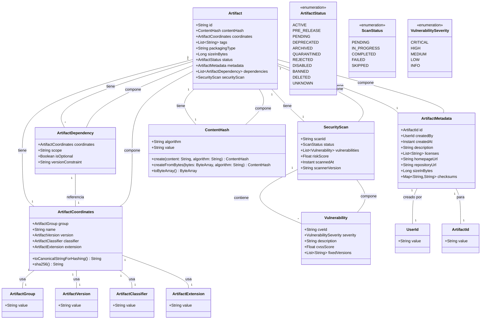
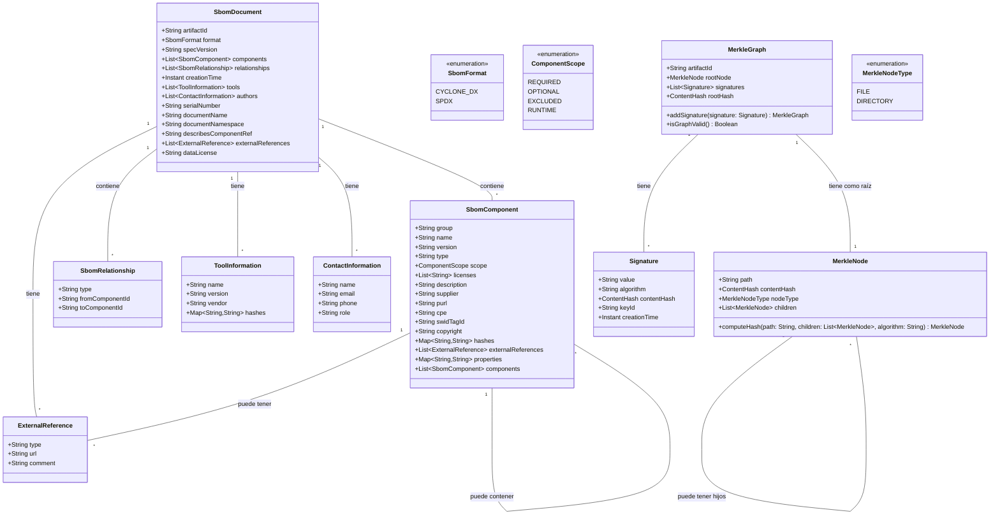

# **PRD: Hodei Artifacts**

## **1\. Visión General**

Hodei Artifacts es un sistema de repositorio de artefactos de alto rendimiento construido en Rust, diseñado como una alternativa moderna a soluciones como Nexus, Artifactory y Archiva. La solución implementa arquitecturas avanzadas (Hexagonal, Vertical Slice) con un enfoque **Contract First** y ofrece soporte nativo para almacenamiento compatible con S3, utilizando MinIO como implementación de referencia.

## **2\. Objetivos del Sistema**

* **Alto Rendimiento:** Aprovechar las capacidades de concurrencia y la eficiencia de memoria de Rust para ofrecer tiempos de respuesta inferiores a 50ms en operaciones críticas de lectura/escritura de metadatos.
* **Escalabilidad Horizontal:** Diseñado desde su concepción para despliegues nativos en la nube sobre Kubernetes, con capacidad de autoescalado basado en métricas de rendimiento (CPU, memoria, peticiones por segundo).
* **Soporte Multi-formato:** Brindar soporte nativo y de primera clase para los ecosistemas de artefactos más comunes, incluyendo **Maven, npm, Docker, NuGet y PyPI**, en un único sistema unificado.
* **Almacenamiento S3-Compatible:** Implementar una capa de almacenamiento flexible a través de un puerto (StorageDriver) con una implementación nativa de referencia para **MinIO**, garantizando la compatibilidad con cualquier proveedor de almacenamiento de objetos compatible con S3.
* **Arquitecturas Modernas:** El diseño se basa estrictamente en los principios de **Arquitectura Hexagonal** para el desacoplamiento y **Vertical Slice** para la organización del código por funcionalidad, maximizando la cohesión y minimizando el acoplamiento.
* **Desarrollo Contract First:** El ciclo de vida del desarrollo estará guiado por contratos de API definidos en **OpenAPI**. Esto incluye la generación automática de código para clientes y stubs de servidor, asegurando la consistencia y permitiendo el desarrollo en paralelo.

## **3\. Arquitectura Técnica: Principios Fundamentales**

La arquitectura de Hodei Artifacts se fundamenta en el patrón de **Arquitectura Hexagonal (Puertos y Adaptadores)** para garantizar un núcleo de negocio aislado y flexible.

### **3.1. Puertos Principales**

Los siguientes puertos (definidos como traits en Rust) constituyen los contratos clave que el núcleo de la aplicación utiliza para interactuar con la infraestructura externa:

* **ArtifactRepository:** Define las operaciones para la gestión de metadatos de artefactos (crear, leer, actualizar, eliminar, buscar).
* **StorageDriver:** Abstrae el almacenamiento físico de los binarios de los artefactos (subir, descargar, eliminar).
* **UserRepository:** Define la gestión de usuarios, roles y permisos.
* **EventPublisher:** Proporciona una interfaz para la publicación de eventos de dominio a un bus de mensajería.
* **PolicyRepository:** Abstrae el almacenamiento y la consulta de políticas de autorización para el motor ABAC.

## **4\. Usuarios y Roles Objetivo (Personas)**

* **Desarrollador de Software:** Interactúa con Hodei Artifacts para publicar y recuperar artefactos de desarrollo y dependencias. Requiere un acceso rápido y fiable, así como una documentación de API clara.
* **Sistema de CI/CD (Actor Automatizado):** El usuario principal de Hodei Artifacts. Envía artefactos de compilación, extrae dependencias para las etapas posteriores del pipeline y activa escaneos de seguridad automatizados. Requiere puntos finales de API robustos y de alto rendimiento, así como mecanismos de autenticación fiables (por ejemplo, tokens OIDC).
* **Auditor de Seguridad / Ingeniero de DevSecOps:** Interactúa con Hodei Artifacts para auditar artefactos, revisar SBOMs, verificar firmas y aplicar políticas de control de acceso. Requiere un registro completo, pistas de eventos auditables y controles de seguridad sólidos.
* **Administrador de Sistemas / SRE:** Responsable del despliegue, mantenimiento y monitorización de la plataforma Hodei Artifacts. Requiere guías de despliegue claras (Helm charts), una observabilidad robusta (métricas, registros, trazas) y procedimientos operativos bien definidos.

## **5\. Principios Arquitectónicos Rectores**

Esta sección codifica las decisiones arquitectónicas fundamentales que gobernarán el diseño y la implementación del sistema, garantizando la coherencia, la calidad y la alineación con los objetivos a largo plazo del proyecto.

### **5.1. El Modelo Arquitectónico Unificado: Una Síntesis de Patrones**

La arquitectura de Hodei Artifacts es una síntesis deliberada de tres patrones complementarios: Arquitectura de Slice Vertical (VSA), Arquitectura Hexagonal y Arquitectura Orientada a Eventos (EDA). Este enfoque híbrido está diseñado para maximizar la agilidad, la mantenibilidad y la escalabilidad.

* **VSA** proporciona la organización a nivel macro, estructurando el código base en torno a las capacidades de negocio en lugar de las capas técnicas. Esto apoya directamente el desarrollo ágil al permitir que los equipos trabajen en funcionalidades en paralelo con una fricción mínima.1
* La **Arquitectura Hexagonal** proporciona la estructura a nivel micro *dentro* de cada slice vertical. Aísla la lógica de negocio central (el "dominio") de las preocupaciones externas como bases de datos, intermediarios de mensajes o frameworks web. Esto se logra a través de "puertos" (interfaces que definen interacciones) y "adaptadores" (implementaciones concretas para tecnologías específicas).4 Este principio no es negociable, ya que garantiza la capacidad de prueba y la flexibilidad tecnológica.
* **EDA** sirve como el tejido conectivo entre los slices, permitiendo una comunicación asíncrona y débilmente acoplada. Esto mejora la resiliencia del sistema, ya que el fallo de un slice no se propaga en cascada y derriba a otros, y soporta el procesamiento escalable y en paralelo de tareas.7

La combinación de estos patrones da como resultado un "monolito modular escalable" que está preparado para una futura evolución hacia microservicios. Cada slice vertical, con su núcleo hexagonal y su comunicación basada en eventos, es un candidato natural para ser extraído a un servicio separado y desplegable de forma independiente. Esta arquitectura mitiga el alto coste inicial y la complejidad de un enfoque de microservicios completo, al tiempo que conserva la opción de una futura descomposición sin una reescritura importante. El sistema está estructurado internamente como un conjunto de microservicios pero se despliega como una única unidad, proporcionando los beneficios de desarrollo de la modularidad sin la complejidad operativa inmediata de la distribución. Cuando un slice específico requiera escalado o despliegue independiente, podrá ser extraído con cambios mínimos en el código, ya que sus límites y patrones de comunicación ya están definidos. Esta es una decisión estratégica que equilibra la velocidad a corto plazo con la flexibilidad arquitectónica a largo plazo.3

### **5.2. Vertical Slices como Límites de Funcionalidad**

Cada capacidad de negocio o caso de uso distinto se implementará como un slice vertical autocontenido. Un slice abarca todo el código necesario para satisfacer una solicitud, desde la definición del punto final de la API hasta la lógica de acceso a los datos.11

El principio fundamental es **maximizar la cohesión dentro de un slice y minimizar el acoplamiento entre slices**.2 Los cambios en una funcionalidad deben localizarse en su slice correspondiente, reduciendo drásticamente el riesgo de efectos secundarios no deseados y simplificando el mantenimiento.3

El intercambio de lógica entre slices debe minimizarse. Cualquier lógica compartida debe ser cuidadosamente evaluada y ubicada en una biblioteca compartida dedicada y bien definida, entendiendo que esto introduce un punto de acoplamiento que debe ser gestionado.3

### **5.3. El Núcleo Hexagonal dentro de los Slices**

Dentro de cada slice vertical, la lógica de negocio central (entidades de dominio, servicios y casos de uso) debe ser completamente independiente de cualquier framework o tecnología de infraestructura específica.4

Las dependencias siempre deben apuntar hacia adentro: la capa de infraestructura (por ejemplo, un adaptador de repositorio de MongoDB) depende de la capa de dominio (por ejemplo, un puerto/interfaz ArtifactRepository), nunca al revés. Esta es la esencia del Principio de Inversión de Dependencias.4

Esta estructura hace que la lógica central sea eminentemente comprobable de forma aislada, utilizando adaptadores simulados para dependencias como bases de datos o APIs externas, lo que mejora significativamente la velocidad y fiabilidad de las pruebas.5

### **5.4. Asíncrono por Defecto, Síncrono cuando sea Necesario**

La comunicación entre slices será principalmente asíncrona, mediada por un bus de eventos central (Kafka). Cuando un slice completa una acción (por ejemplo, ArtefactoIngestado), publicará un evento. Otros slices interesados se suscribirán a este evento y reaccionarán en consecuencia (por ejemplo, IniciarEscaneoVulnerabilidades, ActualizarIndiceBusqueda).7

La comunicación síncrona a través de APIs REST se reserva para las interacciones iniciadas por clientes externos (usuarios, sistemas de CI/CD). Estas solicitudes son manejadas por un "adaptador de entrada" dedicado dentro de un slice vertical específico.5

### **5.5. Mandato de Contract-First para todas las APIs Síncronas**

Todas las APIs síncronas (RESTful) deben definirse utilizando la especificación OpenAPI 3.x *antes* de que se escriba cualquier código de implementación. Este contrato sirve como la única fuente de verdad para el comportamiento de la API.16

El contrato OpenAPI se almacenará en el repositorio de código fuente y se utilizará para generar automáticamente bibliotecas cliente de API, stubs de servidor y documentación. Esta práctica permite el desarrollo en paralelo, ya que los equipos de frontend/cliente pueden trabajar con servidores simulados generados a partir del contrato mientras la implementación del backend está en curso.16

Se aplicará una estricta guía de estilo de API para garantizar la coherencia en todos los puntos finales en términos de convenciones de nomenclatura, manejo de errores y códigos de estado.16

## **6\. Requisitos Funcionales (Funcionalidades como Vertical Slices)**

Cada subsección aquí representa un slice vertical autocontenido. La implementación de cada slice se adherirá a los principios Hexagonales y Orientados a Eventos descritos en la Sección II. Las definiciones de API seguirán el mandato de Contract-First.

### **6.1. Slice: Ingesta y Almacenamiento de Artefactos**

* **Historia de Usuario:** Como Sistema de CI/CD, quiero subir un artefacto de software con sus metadatos asociados para que pueda ser almacenado de forma segura y estar disponible para que otros sistemas lo consuman.
* **Requisitos Funcionales:**
  * El sistema debe aceptar la subida de artefactos a través de una solicitud HTTP POST multipart/form-data.
  * El sistema debe soportar artefactos de hasta 10 GB de tamaño.
  * El sistema debe extraer metadatos clave de la solicitud (por ejemplo, nombre del artefacto, versión, ruta del repositorio, tipo de contenido).
  * El sistema debe calcular un hash criptográfico (SHA-256) del contenido del artefacto al recibirlo para garantizar la integridad.
  * Los datos binarios del artefacto deben almacenarse en una solución de almacenamiento de objetos duradera y compatible con S3.20
  * Los metadatos del artefacto y una referencia a su ubicación de almacenamiento deben persistir en la base de datos de metadatos (MongoDB).22
  * Tras una ingesta exitosa, el sistema debe publicar un evento ArtifactUploaded en el bus de eventos.9
* **Punto Final de API (Contract-First):**
  * POST /v1/repositories/{repo\_path}/artifacts
  * Cuerpo de la Solicitud: multipart/form-data conteniendo el archivo del artefacto y una parte JSON de metadatos.
  * Respuesta: 202 Accepted con una cabecera Location apuntando al recurso del artefacto recién creado.

### **6.2. Slice: Recuperación y Versionado de Artefactos**

* **Historia de Usuario:** Como Desarrollador, quiero descargar una versión específica de un artefacto de software de un repositorio para poder usarlo como dependencia en mi proyecto.
* **Requisitos Funcionales:**
  * El sistema debe proporcionar un enlace de descarga seguro para cualquier artefacto almacenado a través de una solicitud HTTP GET.
  * El sistema debe soportar la recuperación de artefactos por su versión exacta (por ejemplo, 1.2.3) o por una etiqueta de versión (por ejemplo, latest).
  * El acceso a los artefactos debe estar controlado por las reglas de autorización definidas en el slice "Autenticación y Autorización".
  * El sistema debe registrar todos los intentos de descarga de artefactos, incluyendo la identidad del usuario y la marca de tiempo.
* **Punto Final de API (Contract-First):**
  * GET /v1/repositories/{repo\_path}/artifacts/{artifact\_name}/{version}
  * Respuesta: 200 OK con el binario del artefacto en el cuerpo de la respuesta, o 302 Found redirigiendo a una URL de S3 pre-firmada.

### **6.3. Slice: Búsqueda e Indexación de Metadatos (Consumidor de Eventos)**

* **Historia de Usuario:** Como Ingeniero de DevSecOps, quiero buscar artefactos basándome en sus metadatos (por ejemplo, nombre, versión, hash, etiquetas personalizadas) para poder localizar rápidamente activos para auditoría o análisis.
* **Requisitos Funcionales:**
  * Este slice actuará como consumidor del evento ArtifactUploaded.
  * Al recibir un evento ArtifactUploaded, este slice actualizará un índice de búsqueda dedicado en MongoDB con los metadatos del artefacto.24
  * El sistema debe proporcionar una API de búsqueda que permita consultar artefactos por varios campos de metadatos.
  * La API de búsqueda debe soportar paginación, ordenación y filtrado.
* **Punto Final de API (Contract-First):**
  * GET /v1/search/artifacts?q={query\_string}\&page={num}\&sort={field}
  * Respuesta: 200 OK con un array JSON de metadatos de artefactos coincidentes.

### **6.4. Slice: Autenticación y Autorización**

* **Historia de Usuario:** Como Administrador de Sistemas, quiero definir políticas de acceso granular para los repositorios para poder controlar qué usuarios y sistemas pueden leer o escribir en ellos.
* **Requisitos Funcionales:**
  * El sistema debe asegurar todos los puntos finales de la API. Las solicitudes no autenticadas deben ser rechazadas con un estado 401 Unauthorized.
  * La autenticación se basará en JSON Web Tokens (JWTs) emitidos por un proveedor de identidad externo (por ejemplo, Zitadel, como se menciona en 12).
  * La autorización se implementará utilizando un modelo de **Control de Acceso Basado en Atributos (ABAC)**. Esto proporciona más flexibilidad que el tradicional Control de Acceso Basado en Roles (RBAC).26
  * Las políticas se definirán en función de los atributos del sujeto (por ejemplo, grupo del usuario, nombre de la cuenta de servicio), el recurso (por ejemplo, nivel de sensibilidad del repositorio) y la acción (por ejemplo, read, write, delete).26
  * El motor de políticas se implementará utilizando el crate de Rust **cedar-policy**. Cedar es un lenguaje de políticas de código abierto diseñado para definir permisos detallados como políticas que describen quién debe tener acceso a qué.29 Este enfoque permite desacoplar la lógica de autorización del código de la aplicación y soporta de forma nativa modelos comunes como el Control de Acceso Basado en Roles (RBAC) y el Control de Acceso Basado en Atributos (ABAC), alineándose perfectamente con los requisitos del sistema.31 La integración se realizará directamente en la aplicación utilizando el motor de evaluación de Cedar proporcionado por el crate.29
* **Puntos Finales de API (Contract-First):**
  * POST /v1/auth/policies
  * GET /v1/auth/policies/{policy\_id}

La elección de ABAC sobre RBAC es una decisión crítica que apoya directamente el objetivo del sistema de ser una pieza fundamental de una cadena de suministro *segura*. Mientras que RBAC es más simple, a menudo es demasiado grueso para los permisos complejos requeridos en un SDLC moderno (por ejemplo, "Permitir que los trabajos de CI de la rama 'production' envíen al repositorio 'release', pero solo entre las 2 AM y las 4 AM"). ABAC proporciona esta capacidad de autorización contextual y dinámica necesaria. Este modelo es más flexible y potente, ya que define políticas basadas en atributos del usuario, recurso, acción y entorno, algo imposible de modelar limpiamente con RBAC.26 La existencia de bibliotecas maduras de Rust como

cedar-policy 29 hace que esta elección sea técnicamente factible, representando una inversión inicial más compleja que ofrece dividendos significativos en seguridad y flexibilidad a largo plazo.

## **7\. Especificación de API y Catálogo de Eventos**

### **7.1. Visión General de la API REST (OpenAPI)**

Se creará y mantendrá un archivo openapi.yaml fundamental en la raíz del repositorio del proyecto. Este archivo servirá como el contrato maestro para todas las APIs síncronas.

Inicialmente, definirá los puntos finales, esquemas y esquemas de seguridad para los slices detallados en la Sección III.

Se integrarán herramientas en el pipeline de CI/CD para validar el contrato y generar stubs de servidor y documentación a partir de este archivo, reforzando el enfoque Contract-First.17

### **7.2. Definiciones de Eventos**

La comunicación asíncrona del sistema se regirá por un conjunto bien definido de eventos de dominio. Cada evento representa un cambio de estado significativo dentro de un límite de dominio (un slice vertical).

Los eventos seguirán el patrón de **Transferencia de Estado Llevada por Evento (Event-Carried State Transfer)**, donde la carga útil del evento contiene toda la información necesaria para que los consumidores actúen sin necesidad de consultar al servicio de origen para obtener más datos. Esto mejora el desacoplamiento y la resiliencia.8

### **Tabla: Catálogo de Eventos de Dominio**

**Propósito:** Esta tabla sirve como un registro central para todos los mensajes asíncronos en el sistema. Asegura que todos los equipos tengan una comprensión clara y consistente de los eventos, su propósito y sus estructuras de datos, lo cual es crítico para mantener una arquitectura débilmente acoplada. Actúa como la "especificación OpenAPI" para la parte asíncrona de nuestro sistema, obligando a los desarrolladores a pensar explícitamente sobre los datos que necesitan ser comunicados entre slices y promoviendo el patrón de Transferencia de Estado Llevada por Evento.15


| Nombre del Evento | Slice Emisor             | Descripción                                                                    | Esquema de Carga Útil (JSON Schema)                                                                                   | Consumidores Potenciales                       |
| :---------------- | :----------------------- | :------------------------------------------------------------------------------ | :--------------------------------------------------------------------------------------------------------------------- | :--------------------------------------------- |
| ArtifactUploaded  | Ingesta de Artefactos    | Se dispara cuando un nuevo artefacto ha sido subido y almacenado con éxito.    | { "artifactId": "...", "repository": "...", "version": "...", "sha256": "...", "uploader": "..." }                     | Búsqueda, Escaneo de Seguridad, Notificación |
| RepositoryCreated | Gestión de Repositorios | Se dispara cuando se crea un nuevo espacio de nombres de repositorio.           | { "repositoryId": "...", "path": "...", "visibility": "private", "creator": "..." }                                    | Auditoría, Control de Acceso                  |
| ScanCompleted     | Escaneo de Seguridad     | Se dispara cuando se completa un escaneo de vulnerabilidades para un artefacto. | { "artifactId": "...", "status": "succeeded/failed", "vulnerabilityCount": { "critical": 0,... }, "reportUrl": "..." } | Notificación, Aplicación de Políticas       |

### **7.3. Manejo de Errores Asíncronos: Dead Letter Queues (DLQs)**

Para cada tema principal de Kafka, se aprovisionará un tema de Dead Letter Queue (DLQ) correspondiente (por ejemplo, artifact-uploads \-\> artifact-uploads-dlq).

Si un consumidor no logra procesar un mensaje después de un número configurado de reintentos (por ejemplo, 3 intentos con retroceso exponencial), el mensaje se moverá a la DLQ.35

El mensaje movido a la DLQ se aumentará con metadatos sobre el fallo, como el mensaje de error, el ID del grupo de consumidores y la marca de tiempo del fallo.

Se configurará una monitorización y alertas dedicadas para todas las DLQs para notificar al equipo de operaciones sobre fallos de procesamiento que requieran intervención manual. El objetivo es manejar errores transitorios con reintentos y errores persistentes a través de la DLQ, evitando que un solo mensaje defectuoso detenga todo un pipeline de procesamiento.35

Los consumidores deben ser diseñados para ser **idempotentes**. Dado que Kafka proporciona semántica de entrega de al menos una vez, un consumidor podría recibir el mismo mensaje más de una vez. El patrón estándar será rastrear los IDs de los mensajes procesados en la base de datos para evitar el procesamiento duplicado.37

## **8\. Requisitos No Funcionales (NFRs)**

Estos requisitos definen los atributos de calidad del sistema y son tan críticos como los requisitos funcionales.

### **8.1. Rendimiento y Escalabilidad**

El sistema debe estar diseñado para un alto rendimiento y baja latencia, particularmente para la ingesta y recuperación de artefactos, que están en la ruta crítica para los pipelines de CI/CD.

La pila tecnológica de Rust, incluyendo el framework web axum y el tiempo de ejecución tokio, fue elegida específicamente para cumplir estos objetivos.40 Puede ser necesario un ajuste de rendimiento del tiempo de ejecución de Tokio para escenarios de latencia ultra baja.43

### **Tabla: Objetivos de Rendimiento**

**Propósito:** Establecer metas de rendimiento claras, medibles y no negociables. Esta tabla transforma requisitos vagos como "rápido" en objetivos de ingeniería concretos que pueden ser validados a través de pruebas de carga. Definir percentiles (p95, p99) es crucial para entender la latencia de cola, que es lo que los usuarios perciben como "lentitud".43 Los objetivos de rendimiento dictan la capacidad del sistema y son esenciales para la planificación de la infraestructura y la configuración del autoescalado.


| Métrica              | Operación                                          | Objetivo (al 80% de capacidad) |
| :-------------------- | :-------------------------------------------------- | :----------------------------- |
| Latencia de API (p95) | Subida de Artefacto (procesamiento de metadatos)    | \< 100ms                       |
| Latencia de API (p99) | Descarga de Artefacto (generación de redirección) | \< 50ms                        |
| Latencia de API (p95) | Búsqueda de Metadatos                              | \< 200ms                       |
| Rendimiento           | Ingestas de Artefactos                              | \> 500 artefactos/minuto       |
| Rendimiento           | Descargas de Artefactos                             | \> 5,000 artefactos/minuto     |

### **8.2. Seguridad e Integridad de la Cadena de Suministro de Software**

* **Cifrado de Datos:** Todos los datos deben ser cifrados tanto en tránsito (TLS 1.3 para toda la comunicación de red) como en reposo (utilizando las características de cifrado nativas del almacenamiento compatible con S3 y MongoDB).45
* **Comunicación Segura:** La comunicación con el clúster de Kafka debe ser asegurada utilizando SASL para la autenticación y TLS para el cifrado.48
* **Escaneo de Vulnerabilidades:** El pipeline de CI/CD debe incluir un paso obligatorio para escanear todas las dependencias de Rust en busca de vulnerabilidades conocidas utilizando cargo-audit.51 Las compilaciones con vulnerabilidades críticas deben fallar.
* **Generación de SBOM:** Por cada artefacto construido y almacenado, se debe generar una Lista de Materiales de Software (SBOM) en formato CycloneDX utilizando herramientas como cargo-sbom o cargo-cyclonedx.54 Este SBOM se almacenará junto con el artefacto.
* **Firma de Artefactos:** Todas las imágenes de contenedores y artefactos binarios críticos producidos por el pipeline de CI/CD deben ser firmados criptográficamente utilizando cosign con un flujo de firma sin clave que aproveche el proveedor OIDC de GitLab. La firma debe ser verificable contra el registro de transparencia.56

### **8.3. Observabilidad**

* **Registro (Logging):** Todos los servicios deben producir registros estructurados (formato JSON) que contengan un ID de correlación para rastrear una única solicitud a través de múltiples servicios/slices.
* **Métricas:** Todos los servicios deben exponer un punto final /metrics en formato Prometheus, proporcionando métricas clave de la aplicación (por ejemplo, tasas de solicitud, tasas de error, latencias) y métricas de tiempo de ejecución (por ejemplo, uso de memoria, pausas de GC).
* **Trazado (Tracing):** El trazado distribuido utilizando el estándar OpenTelemetry es obligatorio. Cada solicitud de API entrante y cada evento publicado debe iniciar o propagar una traza, permitiendo la visualización de todo el ciclo de vida de la solicitud a través de diferentes slices y límites asíncronos.59

## **9\. Pila Tecnológica y Estrategia de Despliegue**

### **9.1. Tecnologías Centrales**

* **Lenguaje/Tiempo de Ejecución:** Rust (última versión estable) con el tiempo de ejecución asíncrono Tokio.42
* **Framework Web:** Axum, por su rendimiento, ergonomía y estrecha integración con el ecosistema de Tokio.40
* **Almacenamiento de Metadatos:** MongoDB, por su esquema flexible y potentes capacidades de indexación, accedido a través del driver oficial de Rust.22
* **Almacenamiento de Objetos:** Cualquier servicio compatible con S3 (por ejemplo, AWS S3, MinIO), accedido a través de la crate de Rust aws-sdk-s3, configurado con un punto final personalizado para pruebas locales.20
* **Bus de Eventos:** Apache Kafka, por su alto rendimiento y durabilidad, accedido a través de la biblioteca de Rust rdkafka.64

### **9.2. Contenerización y Orquestación**

La aplicación se empaquetará como una imagen Docker mínima de varias etapas, basada en una imagen base delgada (por ejemplo, debian:bullseye-slim) para reducir la superficie de ataque y el tamaño de la imagen.67

El despliegue se gestionará a través de Kubernetes. Se creará un Helm chart completo para definir todos los recursos de Kubernetes necesarios (Deployments, Services, ConfigMaps, Secrets, etc.), permitiendo despliegues repetibles y versionados.68

### **9.3. Pipeline de CI/CD (GitLab CI)**

El pipeline, definido en .gitlab-ci.yml, será el único camino a producción. Constará de las siguientes etapas obligatorias:

1. **Lint & Format:** Ejecutar cargo fmt y cargo clippy para hacer cumplir el estilo de código y detectar errores comunes.
2. **Build:** Compilar la aplicación en modo de lanzamiento (cargo build \--release).
3. **Unit & Integration Test:** Ejecutar cargo test. Las pruebas de integración utilizarán la biblioteca **Testcontainers** para levantar contenedores Docker efímeros para dependencias como Kafka, MongoDB y MinIO, asegurando que las pruebas se ejecuten en un entorno limpio y aislado que refleje la producción.71
4. **Security Scan:** Ejecutar cargo-audit para buscar vulnerabilidades y cargo-deny para verificar la conformidad de las licencias.51
5. **Build & Push Image:** Construir la imagen Docker y subirla al Registro de Contenedores de GitLab, etiquetada con el SHA del commit.74
6. **Sign Artifacts:** Generar un SBOM y firmar la imagen del contenedor usando cosign.56
7. **Deploy to Staging:** Desplegar automáticamente la imagen firmada en un entorno de Kubernetes de staging utilizando el Helm chart.
8. **Promote to Production:** Un paso de aprobación manual para promover la imagen verificada al entorno de producción.

### **9.4. Estrategia de Promoción de Imágenes**

Se implementará una estrategia clara y automatizada para promover imágenes entre entornos dentro del Registro de Contenedores de GitLab.

* **Desarrollo:** Cada commit a una rama de funcionalidad construye una imagen etiquetada con el SHA del commit (por ejemplo, registry.example.com/group/project:sha-abcdef12).
* **Staging:** Cuando una solicitud de fusión se combina en la rama main, el pipeline de CI construye, prueba y firma la imagen. Si tiene éxito, la imagen se re-etiqueta como staging y se despliega en el entorno de staging.75
* **Producción:** Después de una validación exitosa en staging, un trabajo de pipeline manual o una etiqueta de Git activa la promoción. Esto implica re-etiquetar el mismo digest de imagen (que fue firmado y probado) con una etiqueta de versión (por ejemplo, v1.2.3) y la etiqueta latest. Esto asegura que el artefacto desplegado en producción es exactamente el mismo que fue verificado, evitando cualquier manipulación.75 Este re-etiquetado y envío es el núcleo de la estrategia de promoción, garantizando la inmutabilidad entre entornos.

## **Anexo A: Historias de Usuario para Arquitectura de Slice Vertical (VSA)**

## 🎯 Visión General

Sistema de repositorio de artefactos con capacidades avanzadas de seguridad, construido en Rust con arquitectura de **Vertical Slices**, inspirado en el análisis de JFrog Artifactory y XRay.

## 🏗️ Arquitectura de Vertical Slices

### 📋 **Slice 1: Upload de Artefactos con Validación de Seguridad**

**Descripción**: Upload de artefactos con escaneo proactivo de vulnerabilidades

```plaintext
API Endpoints:
  - POST /v1/artifacts/{repoType}/{groupId}/{artifactId}/{version}
  - POST /v1/artifacts/multipart (large files)

Componentes Core:
  - ArtifactUploadService
  - SecurityScannerIntegration
  - ChecksumValidator
  - MetadataExtractor

Adaptadores:
  - MinIOStorageAdapter
  - MongoDBArtifactRepository
  - CedarPolicyAuthorizer
  - VulnerabilityScannerAdapter

Eventos:
  - ArtifactUploadedEvent
  - SecurityScanStartedEvent
  - VulnerabilityDetectedEvent
```

### 📥 **Slice 2: Download Seguro con Control de Acceso**

**Descripción**: Distribución de artefactos con políticas granulares de acceso

```plaintext
API Endpoints:
  - GET /v1/artifacts/{repoType}/{groupId}/{artifactId}/{version}
  - GET /v1/artifacts/{repoType}/{groupId}/{artifactId}/{version}/content

Componentes Core:
  - ArtifactDownloadService
  - AccessControlService
  - LicenseValidator
  - UsageTracker

Adaptadores:
  - MinIODownloadAdapter
  - CDNDistributionAdapter
  - CedarPolicyEngine

Optimizaciones:
  - Range requests support
  - Conditional GET (ETag/If-Modified-Since)
  - Cache control headers
```

### 🔍 **Slice 3: Búsqueda y Análisis de Dependencias**

**Descripción**: Búsqueda avanzada con análisis de dependencias transitivas

```plaintext
API Endpoints:
  - GET /v1/search/artifacts?q={query}
  - GET /v1/search/dependencies?package={packageName}
  - POST /v1/analysis/dependency-graph

Componentes Core:
  - DependencyAnalysisService
  - VulnerabilityAggregator
  - LicenseComplianceChecker
  - SBOMGenerator

Adaptadores:
  - GraphDatabaseAdapter (Neo4j/JanusGraph)
  - ElasticSearchAdapter
  - MongoDBIndexAdapter

Características:
  - Full-text search avanzado
  - Análisis de dependencias transitivas
  - Detección de conflictos de licencias
  - Generación automática de SBOM
```

### 👥 **Slice 4: Gestión de Usuarios y Políticas ABAC**

**Descripción**: Sistema completo de gestión de acceso basado en atributos

```plaintext
API Endpoints:
  - POST /v1/users (crear usuario)
  - PUT /v1/users/{userId}/policies
  - GET /v1/groups/{groupId}/members
  - POST /v1/policies/validate

Componentes Core:
  - UserManagementService
  - PolicyManagementService
  - AccessDecisionPoint
  - AuditLogger

Adaptadores:
  - MongoDBUserRepository
  - CedarPolicyEngineAdapter
  - LDAP/AD Integration
  - SAML/OIDC Provider

Políticas ABAC:
  - Basadas en atributos de usuario
  - Basadas en propiedades de artefactos
  - Basadas en contexto de seguridad
  - Basadas en riesgo operacional
```

### 🏗️ **Slice 5: Administración de Repositorios Virtuales**

**Descripción**: Creación y gestión de repositorios virtuales agregados

```plaintext
API Endpoints:
  - POST /v1/repositories (crear repositorio)
  - PUT /v1/repositories/{repoId}/settings
  - POST /v1/repositories/{repoId}/cleanup
  - GET /v1/repositories/{repoId}/stats

Componentes Core:
  - RepositoryManager
  - RetentionPolicyEngine
  - StorageQuotaService
  - ReplicationCoordinator

Adaptadores:
  - MongoDBRepoRepository
  - MinIOQuotaAdapter
  - CrossRegionReplicator

Características:
  - Políticas de retención automática
  - Quotas de almacenamiento granular
  - Réplica automática multi-región
  - Limpieza inteligente de artefactos
```

### 📊 **Slice 6: Monitorización y Analytics de Seguridad**

**Descripción**: Sistema completo de monitorización y análisis de seguridad

```plaintext
API Endpoints:
  - GET /metrics (formato Prometheus)
  - GET /v1/security/dashboard
  - GET /v1/audit/logs
  - POST /v1/security/reports

Componentes Core:
  - SecurityMetricsCollector
  - VulnerabilityTrendAnalyzer
  - ComplianceAuditor
  - RiskAssessmentEngine

Adaptadores:
  - PrometheusExporter
  - OpenTelemetryAdapter
  - SIEMIntegrationAdapter
  - GrafanaDashboardManager

Métricas Clave:
  - Vulnerability distribution por severidad
  - Compliance status por proyecto
  - Risk score evolution
  - Security policy violation trends
```

### 🔐 **Slice 7: Autenticación Federada y SSO**

**Descripción**: Sistema de autenticación unificada con federación

```plaintext
API Endpoints:
  - POST /v1/auth/login
  - POST /v1/auth/token/refresh
  - GET /v1/auth/userinfo
  - POST /v1/auth/federation/sync

Componentes Core:
  - AuthenticationService
  - TokenManagementService
  - FederationService
  - SessionManager

Adaptadores:
  - LDAPAuthAdapter
  - OIDCProviderAdapter
  - SAMLServiceProvider
  - ActiveDirectorySync

Características:
  - Multi-factor authentication
  - Token revocation distribuida
  - Session clustering
  - Cross-instance federation
```

### 🚀 **Slice 8: Deployment y Configuración Cloud-Native**

**Descripción**: Gestión de despliegues y configuración en entornos cloud

```plaintext
API Endpoints:
  - GET /v1/config/current
  - POST /v1/config/update
  - GET /v1/health (health checks)
  - GET /v1/cluster/status

Componentes Core:
  - ConfigurationManager
  - DeploymentOrchestrator
  - HealthCheckService
  - ClusterCoordinator

Adaptadores:
  - KubernetesOperatorAdapter
  - ConsulConfigAdapter
  - VaultSecretManager
  - CloudMetadataService

Características:
  - Hot-reload de configuración
  - Health checks personalizables
  - Auto-scaling automático
  - Zero-downtime deployments
```

### 📦 **Slice 9: Soporte Multi-Formato con Escaneo Integrado**

**Descripción**: Soporte para múltiples formatos de paquetes con escaneo de seguridad

```plaintext
Formatos Soportados:
  - Maven (Java)
  - npm (JavaScript)
  - Docker (OCI)
  - NuGet (.NET)
  - PyPI (Python)
  - Go modules
  - RubyGems
  - Helm charts

Componentes Core:
  - PackageFormatDetector
  - MetadataExtractor
  - VulnerabilityMatcher
  - LicenseDetector

Adaptadores Específicos:
  - MavenMetadataAdapter
  - NpmPackageAnalyzer
  - DockerManifestScanner
  - NuGetDependencyResolver

Características:
  - Detección automática de formato
  - Extracción de metadatos enriquecidos
  - Escaneo recursivo de dependencias
  - Detección de licencias automática
```

### 🔄 **Slice 10: Event-Driven Security Pipeline**

**Descripción**: Procesamiento asíncrono de eventos de seguridad

```plaintext
Eventos Principales:
  - ArtifactUploadedEvent
  - SecurityScanCompletedEvent
  - VulnerabilityDetectedEvent
  - PolicyViolationEvent
  - LicenseComplianceEvent

Componentes Core:
  - EventDispatcher
  - SecurityPipelineManager
  - IncidentResponseCoordinator
  - WorkflowOrchestrator

Adaptadores:
  - KafkaEventAdapter
  - RabbitMQIntegration
  - WebhookDispatcher
  - NotificationService

Características:
  - Processing pipeline configurable
  - Dead-letter queue management
  - Retry mechanisms with backoff
  - Event sourcing for audit
```

## 🎯 Criterios de Implementación por Slice

Cada Vertical Slice debe implementar:

### ✅ **Contract First Development**

- Especificación OpenAPI completa para cada endpoint
- Client SDK generado automáticamente
- Validación automática de requests/responses
- Versionado semántico de APIs

### ✅ **Hexagonal Architecture**

- Puertos claramente definidos para cada adaptador
- Testabilidad mediante mocking de adaptadores
- Replaceability de componentes externos

### ✅ **Security by Design**

- Validación de inputs en todos los endpoints
- Autorización con políticas Cedar
- Audit logging de todas las operaciones
- Encryption de datos sensibles

### ✅ **Performance Optimization**

- Streaming eficiente para grandes archivos
- Caching estratégico de metadatos
- Concurrencia optimizada con async/await
- Database indexing avanzado

### ✅ **Observability**

- Metrics exposición en formato Prometheus
- Distributed tracing con OpenTelemetry
- Structured logging en JSON
- Health checks personalizables

## 📊 Métricas por Slice

Cada slice debe exponer métricas específicas:


| Slice    | Métricas Clave                         | Objetivo                      |
| -------- | --------------------------------------- | ----------------------------- |
| Upload   | Throughput, Latencia p95, Tasa de error | >100 RPS, <100ms p95          |
| Download | Bandwidth, Cache hit rate, Latencia     | >1 Gbps, >90% hit rate        |
| Search   | Query latency, Recall rate              | <50ms p95, >95% recall        |
| Security | Scan time, Vulnerability detection rate | <30s por scan, >99% detection |

## 🔄 Dependencies entre Slices

```
Security Pipeline → Upload, Download, Search
Authentication → All Slices
Monitoring → All Slices
Event System → Multiple Slices
```

## 🚀 Roadmap de Implementación

### Fase 1: Core Artifactory (2-3 meses)

1. **Slice 1**: Upload de artefactos con validación básica
2. **Slice 2**: Download con control de acceso
3. **Slice 9**: Soporte para Maven y npm
4. **Slice 4**: Autenticación básica y políticas

### Fase 2: XRay Integration (2-3 meses)

1. **Slice 3**: Análisis de dependencias y vulnerabilidades
2. **Slice 6**: Dashboard de seguridad y métricas
3. **Slice 10**: Event-driven security pipeline
4. **Slice 5**: Repository management avanzado

### Fase 3: Enterprise Features (3-4 meses)

1. **Slice 7**: Federación y SSO
2. **Slice 8**: Deployment cloud-native
3. **Slice 9**: Soporte para formatos adicionales
4. **Slice 6**: Advanced analytics y reporting

## 💡 Innovaciones sobre Artifactory/XRay

1. **Rust-native performance**: Mejor rendimiento y menor uso de memoria
2. **MinIO first**: Soporte nativo para almacenamiento S3-compatible
3. **Cedar integration**: Políticas de autorización más expresivas
4. **WebAssembly plugins**: Sistema extensible mediante plugins seguros
5. **OpenTelemetry native**: Observabilidad consistente across todos los componentes

Este diseño permite desarrollar cada feature de manera independiente mientras mantiene consistencia arquitectónica y facilita la integración de capacidades avanzadas de seguridad inspiradas en XRay.

---

# Análisis Crítico del Modelo de Datos Propuesto

## ✅ Aspectos Positivos del Modelo Actual

### 1. **Identificación Clara de Artefactos**

- El uso de `ArtifactCoordinates` con group, name, version, classifier y extension es sólido y sigue convenciones estándar de Maven/npm
- La generación de hash canónico para identificación única es una buena práctica

### 2. **Gestión de Estados del Ciclo de Vida**

- `ArtifactStatus` cubre todos los estados necesarios (ACTIVE, DEPRECATED, QUARANTINED, etc.)
- Los estados permiten un control granular del ciclo de vida de los artefactos

### 3. **Soporte para SBOM y Verificación de Integridad**

- La inclusión de `SbomDocument` y `MerkleGraph` es exhaustiva y adecuada para seguridad de supply chain
- La estructura de componentes y relaciones en SBOM sigue estándares como CycloneDX

### 4. **Metadatos Completos**

- `ArtifactMetadata` contiene toda la información necesaria para trazabilidad y descubrimiento
- Los checksums múltiples apoyan la verificación de integridad

## ⚠️ Aspectos a Mejorar

### 1. **Complejidad y Acoplamiento**

- El modelo actual está muy acoplado a conceptos específicos de Java/Kotlin (classifier, extension)
- La estructura es compleja para algunos ecosistemas más simples (npm, Python)

### 2. **Rendimiento en Base de Datos**

- Las estructuras anidadas profundas (como MerkleGraph) pueden ser difíciles de indexar y consultar en MongoDB
- La normalización excesiva podría afectar el rendimiento de consultas frecuentes

### 3. **Falta de Soporte para Almacenamiento de Binarios**

- No hay referencia explícita al almacenamiento físico de los artefactos binarios
- Falta información sobre cómo se gestiona el contenido en MinIO/S3

### 4. **Gestión de Permisos y Acceso**

- El modelo no incluye información sobre control de acceso a nivel de artefacto/repositorio
- No hay integración con el sistema de políticas ABAC que mencionamos


# Diagrama de Clases para Sistema de Repositorio de Artefactos



## Diagrama Adicional para SBOM y Merkle Tree



## Explicación del Diagrama

Este diagrama de clases representa el modelo de datos para un sistema de repositorio de artefactos con las siguientes características:

1. **Artefactos y sus componentes**: La clase principal `Artifact` contiene toda la información sobre un artefacto, incluyendo sus coordenadas, metadatos, dependencias y resultados de escaneo de seguridad.
2. **Sistema de coordenadas**: `ArtifactCoordinates` utiliza value objects para group, name, version, classifier y extension, siguiendo las convenciones de diferentes ecosistemas de paquetes.
3. **Verificación de integridad**: El sistema utiliza `ContentHash` para verificación de integridad y soporta múltiples algoritmos de hash.
4. **Gestión de seguridad**: `SecurityScan` y `Vulnerability` permiten realizar y almacenar escaneos de seguridad con información detallada sobre vulnerabilidades.
5. **SBOM (Software Bill of Materials)**: El sistema soporta la generación y gestión de SBOMs con los formatos CycloneDX y SPDX, incluyendo componentes, relaciones y referencias externas.
6. **Merkle Trees**: Para verificación avanzada de integridad, el sistema implementa grafos de Merkle que permiten verificar la autenticidad de los artefactos mediante firmas digitales.
7. **Sistema de tipos**: Se utilizan enumeraciones para gestionar estados, severidades y tipos de manera consistente en todo el sistema.

Este modelo de datos está diseñado para ser extensible y soportar los diferentes vertical slices identificados, proporcionando una base sólida para la implementación del repositorio de artefactos.
